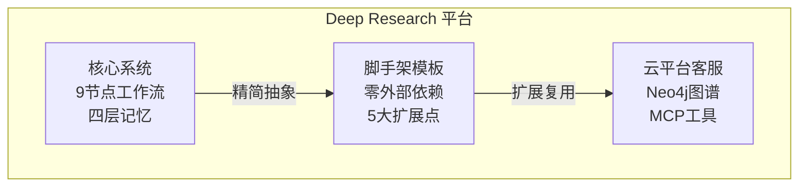

# Deep Research — 多智能体深度研究平台

> 从零构建企业级 AI Agent 系统 · 完整教程 + 源码 + 在线文档

📖 **在线教程**：[**cheshiping.github.io/deep_research**](https://cheshiping.github.io/deep_research/)

---

## 项目全景

本仓库包含三个子项目，覆盖从生产级应用到可复用脚手架的多智能体系统完整学习路径。



| 项目 | 定位 | 核心技术 |
|------|------|----------|
| **deep_research** | 核心多智能体研究系统 | LangGraph · Milvus · PostgreSQL · Redis |
| **deep_research_scaffold** | 零依赖脚手架模板 | LangGraph · Protocol 抽象 · 5 大扩展点 |
| **cloud_agent** | 云平台智能客服 | Neo4j · MCP · 语义缓存 · 5 Agent 路由 |

---

## 技术栈

| 层级 | 技术 | 版本 | 用途 |
|------|------|------|------|
| **AI 框架** | LangGraph | ≥ 1.0 | 多智能体工作流编排 |
| **LLM** | DashScope (Qwen) | — | 大语言模型推理 |
| **后端** | FastAPI + Uvicorn | ≥ 0.123 | REST API + SSE 流式 |
| **前端** | Vue 3 + Vite | 3.5+ | 单页应用 |
| **向量库** | Milvus | 2.6+ | 语义检索 + 记忆存储 |
| **关系库** | PostgreSQL | 14+ | 结构化记忆 + 检查点 |
| **图库** | Neo4j | 5+ | 知识图谱 (cloud_agent) |
| **缓存** | Redis | 7+ | 短期记忆 + 语义缓存 |

---

## 快速开始

### 1. 脚手架（零依赖，5 分钟体验）

```bash
cd deep_research_scaffold
pip install -r requirements.txt

# 启动后端
python -m app.app_main

# 启动前端
cd front && npm install && npm run dev
```

> 脚手架开箱即用，无需 API Key，使用内置 stub 实现。

### 2. 核心系统

```bash
cd deep_research
# 创建 .env，配置 DashScope API Key + 数据库连接
cp .env.example .env
pip install -r requirements.txt

# 交互模式
python main.py
```

### 3. 云平台客服

```bash
cd cloud_agent/agent
pip install -r requirements.txt

# 交互模式
python main.py
```

---

## 仓库结构

```text
deep_research/
├── deep_research/              # 核心多智能体研究系统
│   ├── main.py                 # CLI 入口
│   ├── app/
│   │   ├── app_main.py         # FastAPI 入口
│   │   ├── mult_agents/        # LangGraph 工作流引擎
│   │   │   ├── graph.py        # 9 节点状态图
│   │   │   ├── nodes.py        # 节点实现
│   │   │   ├── memory/         # 四层记忆系统
│   │   │   └── rag/            # Milvus RAG
│   │   └── backend/            # FastAPI 后端
│   └── front/agent_front/      # Vue 3 前端
│
├── deep_research_scaffold/     # 零依赖脚手架
│   ├── app/
│   │   ├── research_agents/    # 可扩展 Agent 骨架
│   │   │   ├── adapters/llm.py     # LLM 适配器（Protocol 抽象）
│   │   │   └── memory/store.py     # 记忆存储（可替换实现）
│   │   └── backend/            # FastAPI 后端
│   └── front/                  # Vue 3 前端
│
├── cloud_agent/                # 云平台智能客服
│   ├── agent/
│   │   ├── agents/             # 5 个专业 Agent
│   │   ├── mcp_servers/        # MCP 工具服务器
│   │   ├── core/
│   │   │   ├── workflow/       # 工作流编排
│   │   │   ├── memory/         # 记忆系统
│   │   │   └── graph/          # Neo4j 知识图谱
│   │   └── tools/              # 工具函数
│   ├── app/                    # FastAPI 后端
│   └── front/cloud_agent/      # Vue 3 前端
│
└── docs/                       # VitePress 文档站点
    ├── deep-research/          # Part 1 教程（9 章）
    ├── scaffold/               # Part 2 教程（4 章）
    ├── cloud-agent/            # Part 3 教程（7 章）
    └── appendix/               # 附录
```

---

## 在线教程

📖 **[cheshiping.github.io/deep_research](https://cheshiping.github.io/deep_research/)**

包含 20+ 章完整教程：

| 部分 | 内容 | 章节 |
|------|------|------|
| **Part 1** | deep_research — 多智能体深度研究平台 | 项目架构 · 环境搭建 · 工作流引擎 · 记忆系统 · RAG · FastAPI · Vue 3 · 部署运维 · 最佳实践 |
| **Part 2** | deep_research_scaffold — 可复用脚手架 | 设计哲学 · 扩展点 · 生产迁移 · LLM 适配器 |
| **Part 3** | cloud_agent — 云平台智能客服 | 系统架构 · 多 Agent 路由 · 知识图谱 · MCP 工具 · 语义缓存 · 全栈 · 部署 |
| **附录** | 参考文档 | 术语表 · 配置参考 · VitePress 部署指南 |

---

## 学习路径

| 路径 | 时长 | 说明 |
|------|------|------|
| **快速上手** | 1-2 天 | 先看 Scaffold 教程理解核心架构，运行脚手架体验工作流 |
| **深度学习** | 1-2 周 | Part 1 完整学习 → Part 2 对比理解抽象设计 → Part 3 进阶 |
| **按需查阅** | — | 记忆系统 / RAG / MCP 工具 / 部署运维等专项主题 |

---

## License

MIT

---

> 本项目来自小滴课堂（xdclass.net），已整理为在线文档站点并部署至 GitHub Pages。
