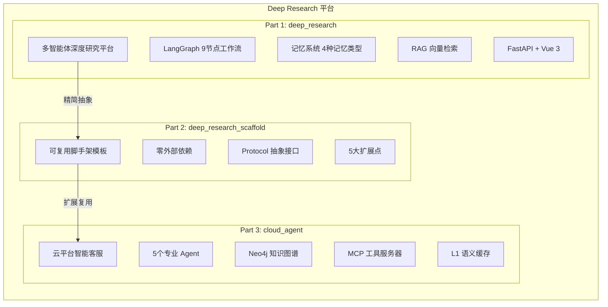

# Deep Research 多智能体平台 — 企业级技术教程

> 📅 创建日期：2026-06-23
> 📝 版本：v1.0
> 🏷️ 技术栈：LangGraph · FastAPI · Vue 3 · Milvus · Neo4j · Redis · PostgreSQL

---

## 项目全景

本教程覆盖 Deep Research 多智能体平台的三个子项目，从生产级应用到可复用脚手架，提供完整的学习路径。



---

## 技术栈总览

| 层级 | 技术 | 版本 | 用途 |
|------|------|------|------|
| **AI 框架** | LangGraph | ≥ 1.0 | 多智能体工作流编排 |
| **LLM** | DashScope (Qwen) | - | 大语言模型推理 |
| **后端** | FastAPI + Uvicorn | ≥ 0.123 | REST API + SSE 流式 |
| **前端** | Vue 3 + Vite | 3.5+ / 7+ | 单页应用 |
| **向量数据库** | Milvus | 2.6+ | 语义检索 + 记忆存储 |
| **关系数据库** | PostgreSQL | 14+ | 结构化记忆 + 检查点 |
| **图数据库** | Neo4j | 5+ | 知识图谱（cloud_agent） |
| **缓存** | Redis | 7+ | 短期记忆 + 语义缓存 |
| **嵌入模型** | DashScope text-embedding-v1/v2 | - | 文本向量化 |

---

## 教程目录

### 第一部分：deep_research — 多智能体深度研究平台

> 核心项目，包含完整的生产级多智能体研究系统。

| 章节 | 文件 | 主题 | 核心内容 |
|------|------|------|---------|
| 1 | [项目概述与架构设计](./part1-deep-research/01-项目概述与架构设计.md) | 架构 | 系统分层、9节点工作流、技术栈详解 |
| 2 | [环境搭建与依赖管理](./part1-deep-research/02-环境搭建与依赖管理.md) | 环境 | Python/Node 安装、外部服务配置 |
| 3 | [多智能体工作流引擎](./part1-deep-research/03-多智能体工作流引擎.md) | 核心 | LangGraph StateGraph、节点实现、条件路由 |
| 4 | [记忆系统设计与实现](./part1-deep-research/04-记忆系统设计与实现.md) | 核心 | 4种记忆类型、MemoryManager、跨会话持久化 |
| 5 | [RAG 检索增强生成](./part1-deep-research/05-RAG检索增强生成.md) | 核心 | Milvus 向量库、文档分块、相似度检索 |
| 6 | [FastAPI 后端服务](./part1-deep-research/06-FastAPI后端服务.md) | 后端 | 路由设计、SSE 流式、WorkflowService |
| 7 | [Vue 3 前端开发](./part1-deep-research/07-Vue3前端开发.md) | 前端 | Composition API、SSE 消费、Markdown 渲染 |
| 8 | [部署与运维指南](./part1-deep-research/08-部署与运维指南.md) | 运维 | Docker Compose、环境变量、健康检查 |
| 9 | [最佳实践与常见问题](./part1-deep-research/09-最佳实践与常见问题.md) | 实践 | 性能优化、安全建议、FAQ |

### 第二部分：deep_research_scaffold — 可复用脚手架模板

> 从核心项目抽象而来的零依赖脚手架，适合快速搭建研究类 Agent 系统。

| 章节 | 文件 | 主题 | 核心内容 |
|------|------|------|---------|
| 1 | [脚手架概述与设计哲学](./part2-scaffold/01-脚手架概述与设计哲学.md) | 概述 | 与主项目对比、零依赖设计原则 |
| 2 | [核心架构与扩展点](./part2-scaffold/02-核心架构与扩展点.md) | 架构 | 5大扩展点、Protocol 抽象、节点实现 |
| 3 | [从脚手架到生产级项目](./part2-scaffold/03-从脚手架到生产级项目.md) | 实战 | 逐步替换 stub 为真实实现 |
| 4 | [自定义 LLM 适配器](./part2-scaffold/04-自定义LLM适配器.md) | 进阶 | LLMClient Protocol、接入 OpenAI/DashScope |

### 第三部分：cloud_agent — 云平台智能客服系统

> 基于多 Agent 架构的云平台客服系统，集成知识图谱、MCP 工具和语义缓存。

| 章节 | 文件 | 主题 | 核心内容 |
|------|------|------|---------|
| 1 | [项目概述与系统架构](./part3-cloud-agent/01-项目概述与系统架构.md) | 架构 | 5个 Agent、4种数据库、系统架构图 |
| 2 | [多智能体路由与编排](./part3-cloud-agent/02-多智能体路由与编排.md) | 核心 | Orchestrator、Agent 详解、FinOps 工作流 |
| 3 | [知识图谱与 RAG 系统](./part3-cloud-agent/03-知识图谱与RAG系统.md) | 核心 | Neo4j KG 构建、GraphCypherQAChain、降级策略 |
| 4 | [MCP 工具服务器](./part3-cloud-agent/04-MCP工具服务器.md) | 核心 | FastMCP、7个工具、stdio 传输 |
| 5 | [记忆与语义缓存](./part3-cloud-agent/05-记忆与语义缓存.md) | 核心 | Redis 短期记忆、Milvus 长期记忆、L1 缓存 |
| 6 | [FastAPI 后端与前端](./part3-cloud-agent/06-FastAPI后端与前端.md) | 全栈 | SSE Chat API、Vue 3 + Element Plus |
| 7 | [部署与运维](./part3-cloud-agent/07-部署与运维.md) | 运维 | 环境搭建、Mock 数据、Docker 部署 |

### 附录

| 文件 | 主题 |
|------|------|
| [术语表](./appendix/glossary.md) | LangGraph、RAG、MCP、Neo4j、Milvus 等术语解释 |
| [配置参考](./appendix/configuration-reference.md) | 三个项目的完整配置项参考 |

---

## 学习路径建议

### 路径 A：快速上手（1-2 天）

1. 阅读 Part 2 脚手架教程 → 理解核心架构
2. 运行 scaffold 项目 → 体验工作流
3. 按需查阅 Part 1 或 Part 3 的具体章节

### 路径 B：深度学习（1-2 周）

1. Part 1 完整学习 → 掌握生产级多智能体系统
2. Part 2 对比学习 → 理解抽象与扩展设计
3. Part 3 进阶学习 → 掌握知识图谱和 MCP

### 路径 C：特定主题

- **记忆系统**：Part 1 第 4 章 → Part 3 第 5 章
- **RAG 系统**：Part 1 第 5 章 → Part 3 第 3 章
- **MCP 工具**：Part 3 第 4 章
- **部署运维**：Part 1 第 8 章 → Part 3 第 7 章

---

## 项目源码结构

```text
deep_research/
├── deep_research/                  # Part 1: 核心项目
│   ├── main.py                     # CLI 入口
│   ├── app/
│   │   ├── app_main.py            # FastAPI 入口
│   │   ├── mult_agents/           # 多智能体核心
│   │   │   ├── config.py          # 配置管理
│   │   │   ├── state.py           # 工作流状态
│   │   │   ├── graph.py           # LangGraph 图
│   │   │   ├── nodes.py           # 节点实现
│   │   │   ├── prompts.py         # 提示词模板
│   │   │   ├── tools.py           # 工具函数
│   │   │   ├── memory/            # 记忆系统
│   │   │   └── rag/               # RAG 系统
│   │   └── backend/               # FastAPI 后端
│   ├── front/agent_front/         # Vue 3 前端
│   ├── config.json                # 运行配置
│   └── requirements.txt           # Python 依赖
├── deep_research_scaffold/         # Part 2: 脚手架
│   ├── app/
│   │   ├── app_main.py            # FastAPI 入口
│   │   ├── research_agents/       # 研究 Agent
│   │   │   ├── adapters/llm.py   # LLM 适配器
│   │   │   └── memory/store.py   # 记忆存储
│   │   └── backend/               # 后端服务
│   └── front/                     # Vue 3 前端
└── cloud_agent/                    # Part 3: 云客服
    ├── agent/
    │   ├── agents/                # 5 个 Agent
    │   ├── core/                  # 核心模块
    │   │   ├── workflow/          # 工作流
    │   │   ├── memory/            # 记忆系统
    │   │   └── graph/             # 知识图谱
    │   ├── tools/                 # 工具函数
    │   └── mcp_servers/           # MCP 服务器
    ├── app/                       # FastAPI 后端
    └── front/cloud_agent/         # Vue 3 前端
```

---

> 📖 **开始阅读**：建议从 [第一部分第 1 章：项目概述与架构设计](./part1-deep-research/01-项目概述与架构设计.md) 开始。
