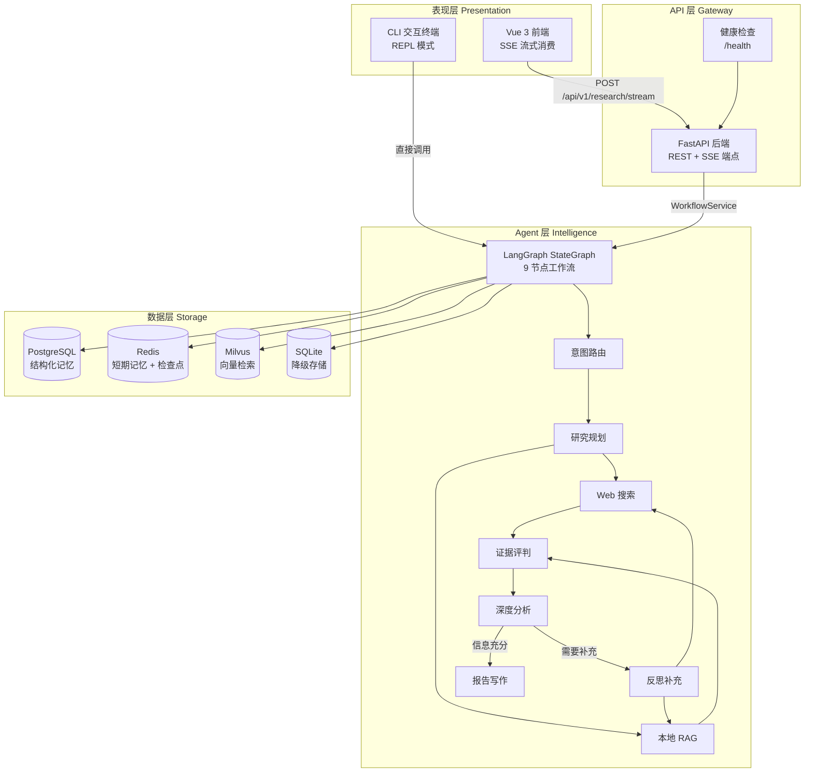
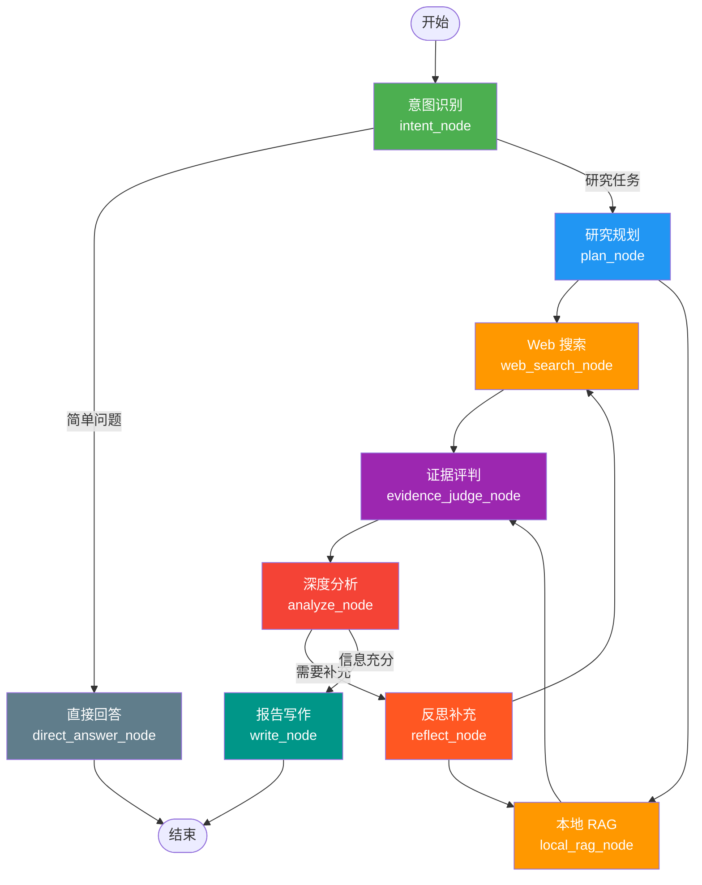
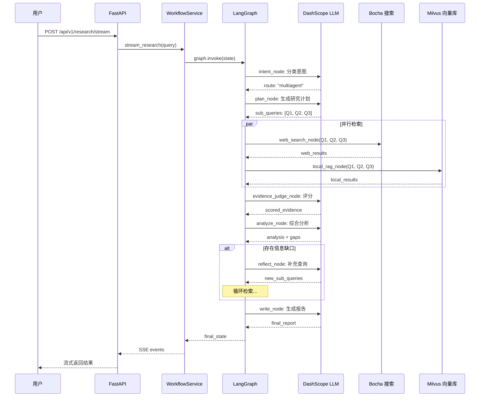
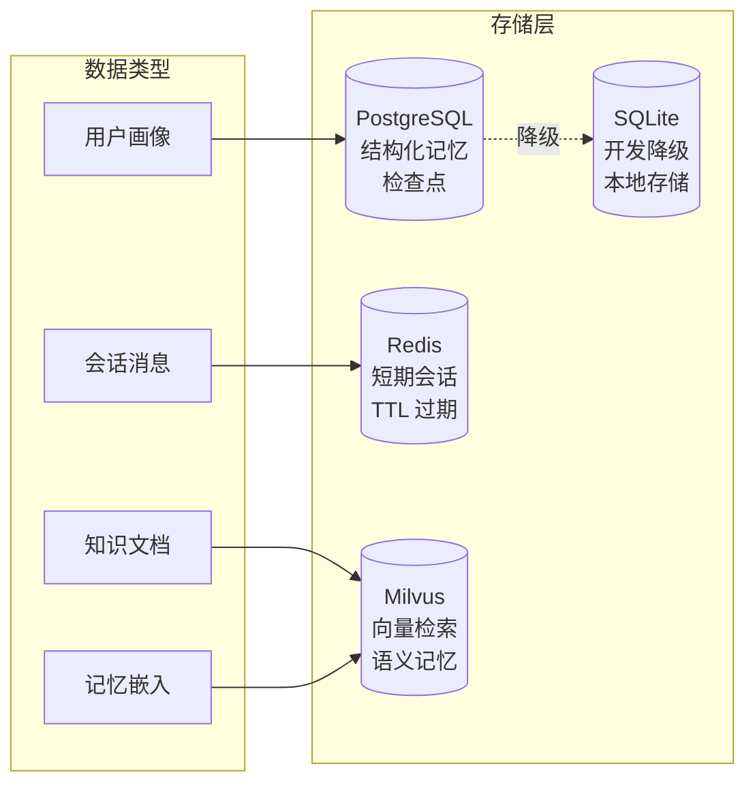

# 第 1 章：项目概述与架构设计

## 1. 概述

### 1.1 背景与目标

在大语言模型（LLM）驱动的智能应用中，单一 Agent 往往难以应对复杂的研究型任务。**Deep Research** 项目采用多智能体协作架构，将深度研究任务拆解为意图识别、规划、检索、分析、反思、写作等阶段，由 9 个专业节点协同完成。

**学习目标**：
1. 理解 Deep Research 项目的定位与核心价值
2. 掌握系统的分层架构设计
3. 理解 LangGraph 9 节点工作流的执行逻辑
4. 了解项目的技术栈选型与依赖关系

### 1.2 核心概念

| 概念 | 说明 |
|------|------|
| **多智能体（Multi-Agent）** | 多个具有不同职责的 AI Agent 协作完成复杂任务 |
| **LangGraph** | LangChain 生态的状态图编排框架，用于定义 Agent 工作流 |
| **RAG（检索增强生成）** | 结合外部知识库检索与 LLM 生成，提升回答准确性 |
| **SSE（Server-Sent Events）** | 服务端向客户端的单向流式推送协议 |
| **StateGraph** | LangGraph 中定义节点和边的状态机图结构 |

---

## 2. 系统架构设计

### 2.1 整体分层架构



**架构说明**：
- **表现层**：Vue 3 单页应用和 CLI 终端，分别通过 SSE 和直接调用与后端交互
- **API 层**：FastAPI 提供 RESTful 和 SSE 端点，WorkflowService 负责桥接 HTTP 请求与 LangGraph 工作流
- **Agent 层**：LangGraph StateGraph 编排 9 个节点，形成有向图执行流
- **数据层**：4 种存储后端分别承担不同粒度的记忆和检索职责

### 2.2 模块划分

| 模块 | 职责 | 关键文件 | 依赖关系 |
|------|------|---------|---------|
| **多智能体核心** | 工作流编排、节点实现 | `mult_agents/graph.py`, `nodes.py` | LangGraph, LangChain |
| **配置管理** | 统一配置加载 | `mult_agents/config.py` | pydantic-settings |
| **提示词系统** | 15 个 Agent 角色提示词 | `mult_agents/prompts.py` | 无 |
| **工具系统** | 20+ 工具函数 | `mult_agents/tools.py` | Bocha API, 计算器 |
| **记忆系统** | 4 种记忆类型管理 | `mult_agents/memory/` | Redis, PostgreSQL, Milvus |
| **RAG 系统** | 文档检索增强 | `mult_agents/rag/` | Milvus, DashScope |
| **后端服务** | HTTP API + SSE | `app/backend/` | FastAPI, Uvicorn |
| **前端应用** | 用户界面 | `front/agent_front/` | Vue 3, Vite |

---

## 3. LangGraph 9 节点工作流

### 3.1 工作流全景



### 3.2 节点职责说明

| 节点 | 职责 | 输入 | 输出 |
|------|------|------|------|
| **intent_node** | 规则 + LLM 双重分类，判断用户意图 | 用户查询 | `route`: "direct" 或 "multiagent" |
| **direct_answer_node** | 处理简单问题（问候、天气等） | 用户查询 | 直接回答文本 |
| **plan_node** | 生成研究计划，拆解子问题 | 用户查询 | `sub_queries` 列表 |
| **web_search_node** | 调用 Bocha API 搜索互联网 | 子查询 | `web_results` 文档列表 |
| **local_rag_node** | 从 Milvus 向量库检索本地知识 | 子查询 | `local_results` 文档列表 |
| **evidence_judge_node** | 对检索结果进行可信度评分 | 检索结果 | `scored_evidence` 列表 |
| **analyze_node** | 综合分析，识别信息缺口 | 评分后的证据 | `analysis` + `missing_gaps` |
| **reflect_node** | 生成补充查询，填补信息缺口 | 信息缺口 | 新的 `sub_queries` |
| **write_node** | 渲染最终报告，验证引用 | 分析结果 | 最终研究报告 |

### 3.3 数据流图



---

## 4. 技术栈详解

### 4.1 后端技术栈

| 技术 | 版本 | 用途 | 选型理由 |
|------|------|------|---------|
| **Python** | ≥ 3.10 | 运行环境 | LangGraph 生态要求 |
| **LangGraph** | ≥ 0.2.0 | Agent 工作流编排 | 状态图模型，支持条件路由和循环 |
| **LangChain** | ≥ 1.0 | LLM 抽象层 | 统一的工具和 Agent 接口 |
| **FastAPI** | ≥ 0.123 | Web 框架 | 原生异步、自动 OpenAPI 文档 |
| **Uvicorn** | ≥ 0.35 | ASGI 服务器 | 高性能异步 HTTP 服务 |
| **DashScope** | - | LLM 提供商 | 阿里云通义千问，国内访问稳定 |
| **psycopg** | ≥ 3.3 | PostgreSQL 驱动 | 异步支持，连接池 |
| **redis** | ≥ 7.3 | Redis 客户端 | 短期记忆和检查点存储 |
| **pymilvus** | ≥ 2.6 | Milvus 客户端 | 向量数据库交互 |
| **pydantic-settings** | ≥ 2.0 | 配置管理 | 类型安全的环境变量加载 |

### 4.2 前端技术栈

| 技术 | 版本 | 用途 |
|------|------|------|
| **Vue 3** | ≥ 3.5 | UI 框架（Composition API） |
| **TypeScript** | ≥ 5.9 | 类型安全 |
| **Vite** | ≥ 7.3 | 构建工具 + 开发服务器 |

### 4.3 数据存储选型



---

## 5. 项目源码结构

### 5.1 核心目录

| 目录 | 说明 | 关键文件 |
|------|------|---------|
| `app/mult_agents/` | 多智能体核心 | `graph.py`, `nodes.py`, `state.py`, `prompts.py`, `tools.py` |
| `app/mult_agents/memory/` | 记忆系统 | `manager.py`, `short_term.py`, `long_term.py`, `base.py` |
| `app/mult_agents/rag/` | RAG 系统 | `core.py`, `ingest.py` |
| `app/backend/` | FastAPI 后端 | `app_main.py`, `router/`, `schemas/`, `service/` |
| `front/agent_front/` | Vue 3 前端 | `App.vue`, `vite.config.ts` |

### 5.2 配置文件

| 文件 | 说明 |
|------|------|
| `config.json` | 运行时配置（模型、记忆后端、集合名） |
| `.env` | 环境变量（API 密钥、数据库连接） |
| `pyproject.toml` | Python 项目元数据和依赖 |
| `requirements.txt` | 精确的 Python 依赖锁定（111 个包） |

---

## 6. 运行模式

### 6.1 CLI 交互模式

```bash
# 启动交互式 REPL
python main.py

# 单次查询模式
python main.py --once-query "对比 GPT-4 和 Claude 3 的技术架构"
```

**适用场景**：本地开发调试、终端用户直接使用

### 6.2 Web API 模式

```bash
# 启动 FastAPI 服务
uvicorn app.app_main:app --host 0.0.0.0 --port 8000

# 启动前端开发服务器
cd front/agent_front && npm run dev
```

**适用场景**：团队协作、浏览器访问、API 集成

---

## 7. 总结

### 7.1 核心要点

1. **多智能体协作**：9 个专业节点各司其职，通过 LangGraph StateGraph 编排为有向图工作流
2. **双源检索**：Web 搜索（Bocha API）+ 本地 RAG（Milvus）并行执行，提升信息覆盖率
3. **迭代研究**：通过 analyze → reflect → search 的循环机制，自动识别并填补信息缺口
4. **四层存储**：PostgreSQL、Redis、Milvus、SQLite 分别承担不同粒度的记忆职责
5. **双模运行**：支持 CLI 交互和 Web API 两种使用模式

### 7.2 扩展阅读

- [LangGraph 官方文档](https://langchain-ai.github.io/langgraph/)
- [LangChain 文档](https://python.langchain.com/)
- [FastAPI 文档](https://fastapi.tiangolo.com/)
- [Vue 3 文档](https://vuejs.org/)

---

> 📖 **下一章**：[第 2 章：环境搭建与依赖管理](./02-环境搭建与依赖管理.md)
