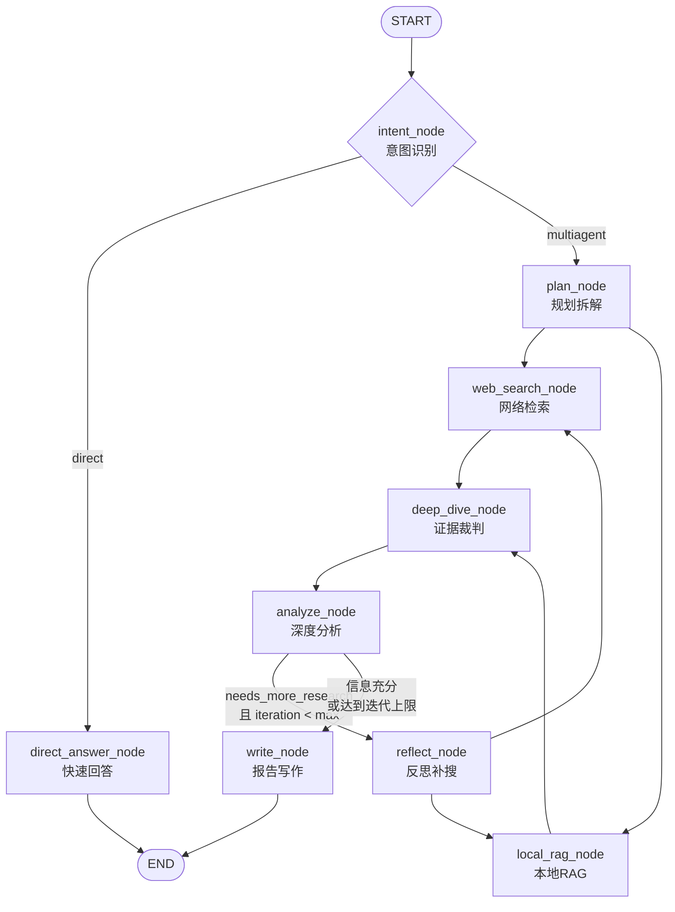
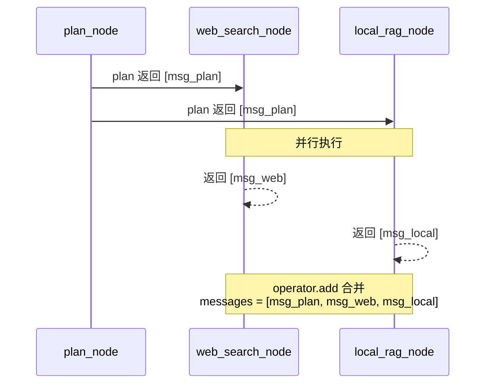
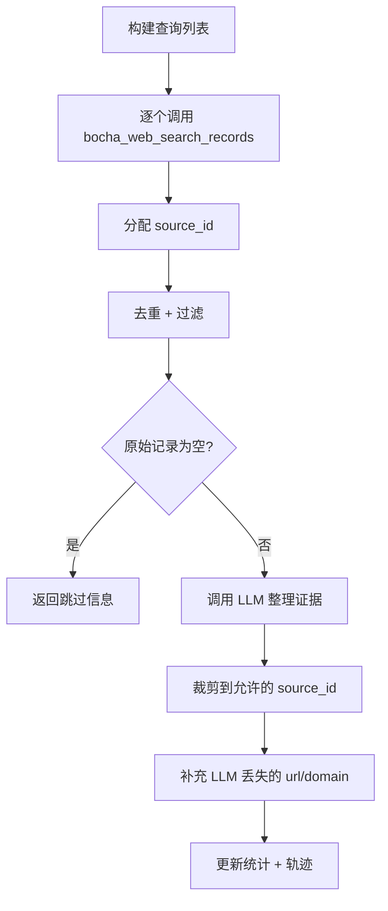

# 第 3 章：多智能体工作流引擎

## 1. 问题背景与设计动机

单一 LLM Agent 在面对复杂研究任务时存在明显局限：

1. **上下文窗口瓶颈**：将所有信息塞入一个 Prompt 会导致关键信息被稀释
2. **职责模糊**：同一个 Agent 同时负责检索、分析、写作，输出质量不稳定
3. **缺乏自校验**：没有"反思"机制，无法发现信息缺口并补充检索
4. **不可追溯**：结论没有绑定来源，无法审计

Deep Research 采用 LangGraph StateGraph 编排 9 个专业节点，形成"规划→检索→评判→分析→反思"的闭环工作流。

---

## 2. 方案对比

| 方案 | 优点 | 缺点 | 适用场景 |
|------|------|------|----------|
| **单 Agent ReAct** | 实现简单，延迟低 | 复杂任务质量差，无自校验 | 简单问答 |
| **DAG 多 Agent** | 并行度高 | 编排复杂，调试困难 | 流水线任务 |
| **LangGraph StateGraph** | 状态透明、条件路由、支持循环 | 需要理解图模型 | **研究型任务（本项目）** |
| **AutoGen/CrewAI** | 社区活跃 | 黑盒程度高，定制性差 | 快速原型 |

---

## 3. LangGraph StateGraph 设计

### 3.1 工作流全图



**执行逻辑**：
- **直接路径**：intent → direct_answer → END（简单问答，秒级响应）
- **深度路径**：intent → plan → [web_search, local_rag] → deep_dive → analyze → write → END
- **反思循环**：analyze → reflect → [web_search, local_rag] → deep_dive → analyze（最多 `max_iterations` 轮）

### 3.2 图构建代码

源码 `app/mult_agents/graph.py:52-93`：

```python
def build_app(agents, checkpointer):
    # 创建状态图，状态类型为 ResearchState
    workflow = StateGraph(ResearchState)
    
    # 注册 9 个节点（通过 bind_agent 将 agent 实例绑定到节点函数）
    workflow.add_node("intent", bind_agent(intent_node, agents.intent_router, "intent_router"))
    workflow.add_node("direct_answer", bind_agent(direct_answer_node, agents.direct_responder, "direct_responder"))
    workflow.add_node("plan", bind_agent(plan_node, agents.planner, "planner"))
    workflow.add_node("web_search", bind_agent(web_search_node, agents.scout_web, "scout_web"))
    workflow.add_node("local_rag", bind_agent(local_rag_node, agents.scout_local, "scout_local"))
    workflow.add_node("deep_dive", bind_agent(deep_dive_node, agents.evidence_judge, "evidence_judge"))
    workflow.add_node("analyze", bind_agent(analyze_node, agents.analyst, "analyst"))
    workflow.add_node("reflect", bind_agent(reflect_node, agents.planner, "planner"))
    workflow.add_node("write", bind_agent(write_node, agents.writer, "writer"))
    
    # 定义边
    workflow.add_edge(START, "intent")                    # 入口 → 意图识别
    workflow.add_conditional_edges(                       # 意图路由
        "intent",
        route_after_intent,
        {"direct_answer": "direct_answer", "plan": "plan"},
    )
    workflow.add_edge("plan", "web_search")               # 规划 → 网络检索（并行）
    workflow.add_edge("plan", "local_rag")                # 规划 → 本地RAG（并行）
    workflow.add_edge("web_search", "deep_dive")          # 网络检索 → 证据裁判
    workflow.add_edge("local_rag", "deep_dive")           # 本地RAG → 证据裁判
    workflow.add_edge("deep_dive", "analyze")             # 证据裁判 → 分析
    workflow.add_conditional_edges(                       # 分析后路由
        "analyze",
        should_continue_research,
        {"reflect": "reflect", "write": "write"}
    )
    workflow.add_edge("reflect", "web_search")            # 反思 → 重新检索
    workflow.add_edge("reflect", "local_rag")
    workflow.add_edge("direct_answer", END)
    workflow.add_edge("write", END)
    
    return workflow.compile(checkpointer=checkpointer)
```

---

## 4. ResearchState 状态设计

### 4.1 状态字段全览

源码 `app/mult_agents/state.py:9-46`，共 36+ 个字段：

```python
class ResearchState(TypedDict):
    # ====== 用户输入 ======
    query: str                          # 用户原始问题
    user_id: str                        # 用户标识
    tenant_id: str                      # 租户标识
    memory_context: str                 # 记忆系统注入的上下文
    
    # ====== 消息累积（LangGraph 自动 merge） ======
    messages: Annotated[List[BaseMessage], operator.add]  # 使用 reducer 追加而非覆盖
    
    # ====== 意图识别阶段 ======
    intent: str                         # "direct" | "multiagent"
    phase: str                          # 当前阶段标记
    
    # ====== 规划阶段 ======
    plan: str                           # 规划摘要
    outline: list[dict]                 # 大纲结构
    sub_questions: list[str]            # 子问题列表
    research_questions: list[str]       # 研究问题
    search_plan: list[dict]             # 搜索计划
    budget: dict                        # 资源预算
    
    # ====== 检索阶段 ======
    web_search: str                     # 网络检索摘要
    local_rag: str                      # 本地检索摘要
    web_evidence: list[dict]            # 网络证据列表
    local_evidence: list[dict]          # 本地证据列表
    
    # ====== 证据裁判阶段 ======
    evidence_pool: list[dict]           # 合并后的证据池
    deep_dive: str                      # 深潜摘要
    audit: str                          # 审计摘要
    audit_flags: list[dict]             # 审计标记（低可信、冲突等）
    
    # ====== 分析阶段 ======
    analysis: str                       # 分析结论
    needs_more_research: bool           # 是否需要补充检索
    missing_gaps: list[str]             # 信息缺口
    supplementary_queries: list[dict]   # 补搜计划
    findings: list[dict]                # 结论列表
    claim_map: list[dict]               # 结论-来源映射
    source_index: list[dict]            # 来源索引
    
    # ====== 统计与追踪 ======
    web_retrieval_stats: dict           # 网络检索统计
    local_retrieval_stats: dict         # 本地检索统计
    web_search_trace: list[dict]        # 网络检索轨迹
    local_rag_trace: list[dict]         # 本地检索轨迹
    
    # ====== 输出阶段 ======
    code: str                           # 代码输出
    draft: str                          # 草稿
    final: str                          # 最终报告
    
    # ====== 迭代控制 ======
    iteration: int                      # 当前迭代轮次
    max_iterations: int                 # 最大迭代轮次
```

### 4.2 messages 字段的 Reducer 机制

```python
messages: Annotated[List[BaseMessage], operator.add]
```

`Annotated[..., operator.add]` 是 LangGraph 的 **reducer** 语法。当多个节点并行执行并返回 `messages` 字段时，LangGraph 会使用 `operator.add`（列表拼接）而非直接覆盖，保证并行节点的消息都能保留。



---

## 5. 九大节点实现详解

### 5.1 intent_node — 意图识别

**设计动机**：简单问题（问候、闲聊）无需走完整研究链路，应快速回答。

**双重判定机制**（`nodes.py:79-127, 942-962`）：

```python
def detect_intent(query: str) -> str:
    """规则引擎：基于关键词的快速判定"""
    normalized_query = query.strip()
    # 强制走多智能体的关键词
    force_multiagent_keywords = [
        "调查", "调研", "来源", "证据", "检索统计", "趋势", "新闻", "最新", "盘点",
    ]
    if re.search(r"20\d{2}年", normalized_query) and any(
        word in normalized_query for word in ["趋势", "新闻", "调研", "调查", "盘点"]
    ):
        return "multiagent"
    # ... 更多关键词匹配
    return "multiagent" if any(word in query for word in keywords) else "direct"
```

节点函数调用 LLM 进行二次确认：

```python
def intent_node(state: ResearchState, agent, agent_name: str) -> ResearchState:
    rule_route = detect_intent(state["query"])           # 规则初判
    prompt = (
        f"用户问题：{state['query']}\n"
        f"规则引擎初判：{rule_route}\n"
        "请输出 JSON：{\"route\":\"direct|multiagent\",\"reason\":\"...\"}"
    )
    payload, content, messages = _invoke_json_agent(...)  # LLM 确认
    route = str(payload.get("route", rule_route)).strip().lower()
    if route not in {"direct", "multiagent"}:
        route = rule_route                                 # 兜底使用规则结果
    return {"intent": route, "draft": content, "messages": messages}
```

### 5.2 plan_node — 问题规划

**职责**：将用户的一句话 Query 拆解为结构化的研究计划。

输出 JSON 结构（由 `prompts.py` 中的 `plan` prompt 约束）：

```json
{
  "objective": "研究目标",
  "sub_questions": ["核心问题", "扩展子问题1", "扩展子问题2"],
  "outline": [
    {
      "id": "sec_1",
      "title": "章节标题",
      "description": "章节描述",
      "section_type": "mixed",
      "requires_data": true,
      "search_queries": ["检索词1", "检索词2"]
    }
  ],
  "budget": {
    "max_rounds": 2,
    "max_sources": 12,
    "max_tokens": 12000,
    "max_seconds": 45
  }
}
```

搜索计划生成逻辑（`nodes.py:258-287`）：

```python
def _derive_search_plan(outline, sub_questions, _research_questions, query):
    plan = []
    # 1. 从用户原始问题派生直接检索词
    for direct_query in _derive_direct_search_queries(query):
        plan.append({"section_id": "user_query", "query": direct_query, ...})
    # 2. 从大纲章节提取检索词
    for section in outline:
        for item in section.get("search_queries", []):
            if _is_query_grounded(item, query):  # 相关性校验
                plan.append({...})
    return _dedupe_sources(plan, ["query"])[:6]  # 去重，最多 6 条
```

### 5.3 web_search_node — 网络检索

**职责**：调用博查 API 搜索网络证据，经 LLM 整理后输出结构化证据。

执行流程（`nodes.py:1014-1106`）：



关键优化（`nodes.py:1029-1030`）：

```python
# 减少单词请求返回的数量，从 count=6 降至 count=4，大幅减少无用 Token 消耗
records = bocha_web_search_records(query_text, count=4)
```

### 5.4 local_rag_node — 本地知识库检索

与 `web_search_node` 结构对称，调用 `search_knowledge_base_records` 查询 Milvus 向量库。

### 5.5 deep_dive_node — 证据裁判

**职责**：对所有证据进行可信度评分、冲突审计、去重。

**评分体系**（`nodes.py:546-557`）：

| 来源类型 | 可信度分数 | 说明 |
|----------|-----------|------|
| 本地知识库 (local) | **0.92** | 企业内部知识库，默认高可信 |
| 官方域名 (.gov, .edu) | **0.88** | 政府、教育机构 |
| 主流媒体 (news, reuters) | **0.72** | 主流新闻媒体 |
| 普通互联网 | **0.58** | 需要交叉验证 |
| 来源不完整 | **0.45** | 无法判断 |

```python
def _score_evidence(record: dict) -> tuple[float, str]:
    source_type = record.get("source_type")
    if source_type == "local":
        return 0.92, "企业内部知识库证据，默认高可信"
    domain = str(record.get("domain", "")).lower()
    if _is_official_domain(domain):
        return 0.88, "官方或权威机构域名"
    if any(word in domain for word in ["news", "finance", "reuters", "bloomberg", "people", "xinhuanet"]):
        return 0.72, "主流媒体域名"
    if domain:
        return 0.58, "普通互联网来源，需要交叉验证"
    return 0.45, "来源信息不完整"
```

### 5.6 analyze_node — 深度分析

**职责**：从证据池中形成结论，评估证据完备性，决定是否需要补充检索。

输出 `needs_more_research: true` 时触发反思循环。

### 5.7 reflect_node — 反思补搜

**职责**：基于分析师指出的 `missing_gaps`，生成新的、更有针对性的搜索词。

```python
def reflect_node(state: ResearchState, agent, agent_name: str) -> ResearchState:
    prompt = (
        f"分析师指出当前证据不足以完全回答问题，存在以下信息缺口：\n{json.dumps(missing_gaps)}\n\n"
        f"原问题：{state['query']}\n"
        f"已执行过的搜索计划：\n{json.dumps(state.get('search_plan', []))}\n"
        "请生成新的补搜计划以填补缺口。"
    )
    # ...
    return {
        "iteration": state.get("iteration", 0) + 1,  # 递增迭代计数
        "supplementary_queries": payload.get("supplementary_queries", ...),
    }
```

### 5.8 write_node — 报告写作

**职责**：将 findings、source_index 等信息整合为 Markdown 研报。

**引用校验机制**（`nodes.py:739-754`）：

```python
def _validate_and_fix_citations(content: str, valid_source_ids: set[str]) -> tuple[str, list[str]]:
    """校验正文中的引用ID，移除非法引用"""
    pattern = r'\[([A-Z]+\d+_\d+-\d+)\]'
    
    def replace_citation(match):
        citation_id = match.group(1)
        if citation_id in valid_source_ids:
            return f"[{citation_id}]"     # 合法引用，保留
        else:
            return ""                      # 非法引用，移除
    
    fixed_content = re.sub(pattern, replace_citation, content)
    used_ids = [cid for cid in _extract_citation_ids(fixed_content) if cid in valid_source_ids]
    return fixed_content, used_ids
```

### 5.9 direct_answer_node — 快速回答

**职责**：简单问题直接回答，不走研究链路。

---

## 6. 条件路由

### 6.1 意图路由（`graph.py:30-33`）

```python
def route_after_intent(state: ResearchState) -> str:
    if state.get("intent") == "direct":
        return "direct_answer"
    return "plan"
```

### 6.2 研究循环路由（`graph.py:36-49`）

```python
def should_continue_research(state: ResearchState) -> str:
    iteration = state.get("iteration", 0)
    max_iter = state.get("max_iterations", 2)
    
    if iteration >= max_iter:           # 达到迭代上限，强制写报告
        return "write"
    if state.get("needs_more_research", False):
        return "reflect"                # 需要补搜，进入反思
    return "write"                      # 信息充分，写报告
```

---

## 7. 工具系统

`tools.py` 定义了 20+ 个工具函数，分为以下几类：

| 类别 | 工具 | 用途 |
|------|------|------|
| **检索** | `search_knowledge_base` | Milvus 向量检索 |
| **检索** | `web_search_stub` | 网络搜索 |
| **计算** | `simple_calculator` | 安全算术计算 |
| **时间** | `get_current_time` | 获取当前时间 |
| **文件** | `safe_list_dir`, `safe_read_file`, `safe_write_file` | 工作目录内安全文件操作 |
| **数据** | `sql_inter`, `extract_data_stub` | 数据库操作（Stub） |
| **地理** | `amap_weather`, `amap_geocode`, `amap_poi_search` | 高德地图服务（Stub） |

---

## 8. Prompt 体系

`prompts.py` 集中管理 15 个 Agent 的 System Prompt：

```python
PROMPTS = {
    "intent_router": "你是 IntentRouter，负责把用户问题路由到 direct 或 multiagent...",
    "plan": "你是 ChiefArchitect，总架构师...",
    "web_search": "你是 WebScout，负责网络取证与相关性过滤...",
    "local_rag": "你是 LocalRAGScout，负责本地知识库取证...",
    "deep_dive": "你是 EvidenceJudge，负责证据裁判...",
    "analyze": "你是 Analyst，负责从证据池中形成结论...",
    "reflect": "你是 ResearchPlanner，负责基于分析师的反馈生成补搜计划...",
    "write": "你是资深研究员与高级智库撰稿人...",
    "direct_answer": "你是 DeepResearch 助手...",
    # ... 更多 Agent
}
```

**关键约束**：所有 JSON 输出型 Agent 的 Prompt 都包含"你必须只输出 JSON，不要输出 markdown"的强制约束。

---

## 9. 关键点说明

### 9.1 性能优化

1. **Token 控制**：每个节点只传入当前所需数据，不累积历史 messages（`nodes.py:167-169`）
2. **检索量控制**：web_search 每次返回 4 条（从 6 条优化），总计最多 6 个查询
3. **并行检索**：web_search 和 local_rag 通过 LangGraph 并行执行

### 9.2 容错设计

1. **LLM 输出容错**：`_load_json` 解析失败时使用 fallback 值
2. **引用校验**：write_node 自动移除不存在的引用 ID
3. **域名过滤**：屏蔽低质量来源（datasheet, doc88 等）

### 9.3 最佳实践

1. **max_iterations 设置**：生产环境建议 2-3，过高会导致延迟和 Token 爆炸
2. **search_plan 去重**：基于 query 字段去重，避免重复检索
3. **证据评分阈值**：relevance_score < 0.2 的非官方来源会被丢弃
