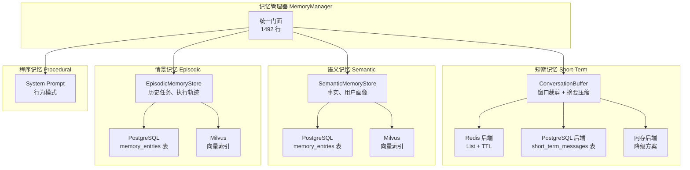
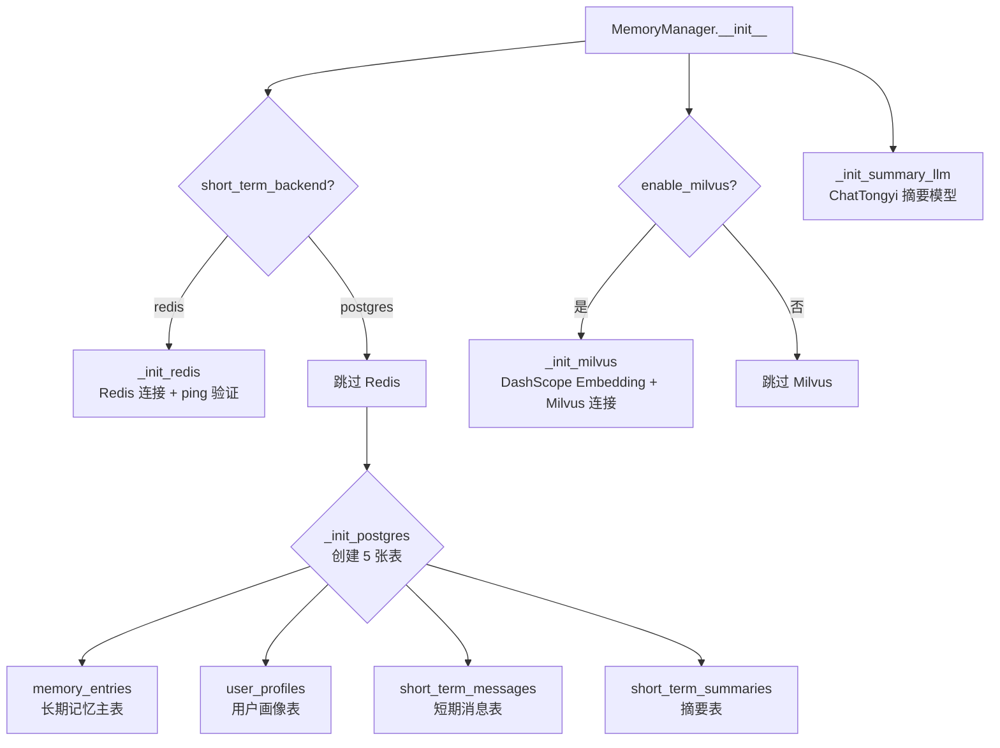
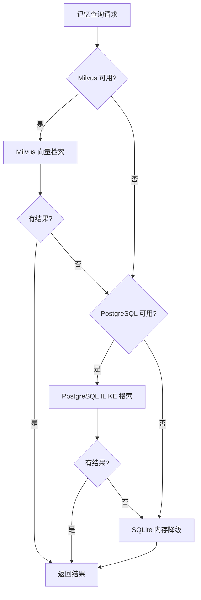

# 第 4 章：记忆系统设计与实现

## 1. 问题背景与设计动机

LLM 驱动的对话系统存在"失忆"问题——每次对话都是独立的，无法记住用户偏好、历史任务和上下文。Deep Research 的记忆系统需要解决：

1. **跨轮次连续性**：用户在第 3 轮提到"上次的结论"时，系统需要理解
2. **个性化**：记住用户的偏好（如"我喜欢表格输出"）
3. **多租户隔离**：不同用户/租户的记忆互不干扰
4. **性能与成本平衡**：高频访问的短期记忆用 Redis，低频的长期记忆用 PostgreSQL
5. **语义检索**：基于含义而非关键词匹配历史记忆

---

## 2. 方案对比

| 方案 | 优点 | 缺点 | 本项目使用 |
|------|------|------|-----------|
| **纯内存 (dict)** | 零延迟 | 重启丢失，无法扩展 | 开发测试降级 |
| **Redis** | 高性能，支持 TTL | 内存成本高，不适合大量数据 | 短期记忆后端 |
| **PostgreSQL** | 持久化，支持 JSONB 查询 | 延迟高于 Redis | 长期记忆 + 短期记忆后端 |
| **SQLite** | 零依赖，文件存储 | 并发能力弱 | 开发环境降级 |
| **Milvus** | 向量语义检索 | 需要额外部署 | 长期记忆向量索引 |

---

## 3. 四层记忆模型



### 3.1 记忆类型枚举

源码 `app/mult_agents/memory/base.py:13-18`：

```python
class MemoryType(Enum):
    SHORT_TERM = "short_term"      # 短期记忆 - 当前对话上下文
    SEMANTIC = "semantic"          # 语义记忆 - 事实、知识、用户画像
    EPISODIC = "episodic"          # 情景记忆 - 历史任务、执行轨迹
    PROCEDURAL = "procedural"      # 程序记忆 - 系统提示、行为模式
```

### 3.2 MemoryEntry 数据结构

```python
@dataclass
class MemoryEntry:
    content: Union[str, Dict[str, Any]]    # 记忆内容
    memory_type: MemoryType                # 记忆类型
    user_id: Optional[str] = None          # 用户标识
    thread_id: Optional[str] = None        # 线程标识
    namespace: Optional[str] = None        # 命名空间
    metadata: Dict[str, Any] = field(default_factory=dict)
    embedding: Optional[List[float]] = None # 向量嵌入
    created_at: datetime = field(default_factory=datetime.now)
    expires_at: Optional[datetime] = None   # 过期时间
    access_count: int = 0                   # 访问次数
    id: str = field(default_factory=lambda: str(uuid4()))
```

---

## 4. MemoryManager 门面模式

### 4.1 初始化流程

源码 `app/mult_agents/memory/manager.py:44-101`：



### 4.2 PostgreSQL 表结构

```sql
-- 长期记忆主表
CREATE TABLE IF NOT EXISTS memory_entries (
    id TEXT PRIMARY KEY,
    tenant_id TEXT NOT NULL,
    user_id TEXT NOT NULL,
    thread_id TEXT,
    memory_type TEXT NOT NULL,          -- "semantic" | "episodic"
    namespace TEXT,                      -- "user_profile" | "facts/general" | "tasks/research"
    content JSONB NOT NULL,
    summary TEXT,                        -- 内容摘要（用于 ILIKE 搜索）
    metadata JSONB NOT NULL DEFAULT '{}'::jsonb,
    created_at TIMESTAMPTZ NOT NULL DEFAULT NOW(),
    updated_at TIMESTAMPTZ NOT NULL DEFAULT NOW()
);

-- 查询索引
CREATE INDEX IF NOT EXISTS idx_memory_entries_lookup
ON memory_entries (tenant_id, user_id, memory_type, created_at DESC);

-- 用户画像表
CREATE TABLE IF NOT EXISTS user_profiles (
    tenant_id TEXT NOT NULL,
    user_id TEXT NOT NULL,
    profile JSONB NOT NULL,
    updated_at TIMESTAMPTZ NOT NULL DEFAULT NOW(),
    PRIMARY KEY (tenant_id, user_id)
);

-- 短期消息表
CREATE TABLE IF NOT EXISTS short_term_messages (
    id TEXT PRIMARY KEY,
    tenant_id TEXT NOT NULL,
    user_id TEXT NOT NULL,
    thread_id TEXT NOT NULL,
    role TEXT NOT NULL,                  -- "human" | "ai" | "system"
    content TEXT NOT NULL,
    created_at TIMESTAMPTZ NOT NULL DEFAULT NOW()
);

-- 短期摘要表
CREATE TABLE IF NOT EXISTS short_term_summaries (
    tenant_id TEXT NOT NULL,
    user_id TEXT NOT NULL,
    thread_id TEXT NOT NULL,
    summary TEXT NOT NULL,
    updated_at TIMESTAMPTZ NOT NULL DEFAULT NOW(),
    PRIMARY KEY (tenant_id, user_id, thread_id)
);
```

---

## 5. 短期记忆实现

### 5.1 ConversationBuffer

源码 `app/mult_agents/memory/short_term.py:19-121`：

```python
class ConversationBuffer:
    def __init__(self, max_messages: int = 20, max_tokens: int = 4000, summary_threshold: int = 10):
        self.max_messages = max_messages
        self.messages: List[BaseMessage] = []
        self.summary: Optional[str] = None
    
    def add_message(self, message: BaseMessage) -> None:
        self.messages.append(message)
        if len(self.messages) > self.max_messages:
            self._compress_messages()    # 触发压缩
    
    def _compress_messages(self) -> None:
        """保留最近消息，旧消息生成摘要"""
        messages_to_summarize = self.messages[:-self.summary_threshold]
        self.messages = self.messages[-self.summary_threshold:]
        # 简化版本：拼接摘要
        new_summary = "\n".join(f"{'用户' if isinstance(m, HumanMessage) else 'AI'}: {str(m.content)[:100]}..." for m in messages_to_summarize)
        self.summary = f"{self.summary}\n\n[更早的对话]\n{new_summary}" if self.summary else new_summary
```

### 5.2 Redis 短期记忆

使用 Redis List 存储消息，支持 TTL 自动过期：

```python
def add_short_term_message(self, thread_id, message, ...):
    if self.short_term_backend == "redis" and self._redis_client is not None:
        key = self._redis_thread_key(tenant, user_id, thread_id)  # "ma:short:{tenant}:{user}:{thread}"
        self._redis_client.rpush(key, json.dumps(payload))
        self._redis_client.expire(key, self.short_term_ttl)       # TTL 默认 7 天
        self._compress_redis_thread(tenant, user_id, thread_id)   # 超限压缩
```

### 5.3 PostgreSQL 短期记忆

```python
def _save_pg_short_term_message(self, tenant_id, user_id, thread_id, payload):
    with psycopg.connect(self._postgres_dsn) as conn:
        with conn.cursor() as cur:
            cur.execute(
                "INSERT INTO short_term_messages (id, tenant_id, user_id, thread_id, role, content, created_at) "
                "VALUES (%s, %s, %s, %s, %s, %s, NOW())",
                (str(uuid4()), tenant_id, user_id, thread_id, payload["role"], payload["content"]),
            )
            conn.commit()
```

### 5.4 压缩机制

当消息数超过 `short_term_max_messages`（默认 30）时，保留最近 `short_term_summary_threshold`（默认 20）条，旧消息调用 LLM 生成摘要：

```python
def _summarize_text(self, existing_summary, history_slice):
    if self._summary_llm is None:
        # 降级：截断拼接
        return f"{existing_summary}\n{history_text}"[-4000:]
    prompt = (
        "你是对话压缩引擎。请在保留事实、偏好、结论、待办和约束的前提下进行递归摘要。\n"
        f"已有摘要：{existing_summary or '无'}\n"
        f"新增历史：\n{history_text}\n"
        "输出要求：100-300字，中文，结构紧凑。"
    )
    response = self._summary_llm.invoke([HumanMessage(content=prompt)])
    return str(response.content).strip()
```

---

## 6. 长期记忆实现

### 6.1 语义记忆 (SemanticMemoryStore)

存储用户画像、事实知识：

```python
class SemanticMemoryStore(SQLiteLongTermMemory):
    def save_profile(self, user_id, profile_data, merge=True):
        if merge:
            existing = self.get_profile(user_id)
            if existing:
                existing.update(profile_data)
                profile_data = existing
        entry = MemoryEntry(
            content=profile_data,
            memory_type=MemoryType.SEMANTIC,
            user_id=user_id,
            namespace="user_profile",
        )
        return self.save(entry)
```

### 6.2 情景记忆 (EpisodicMemoryStore)

存储历史任务执行记录：

```python
class EpisodicMemoryStore(SQLiteLongTermMemory):
    def save_task_record(self, user_id, task_type, task_data, outcome=None):
        content = {"task_type": task_type, "data": task_data, "outcome": outcome}
        entry = MemoryEntry(
            content=content,
            memory_type=MemoryType.EPISODIC,
            user_id=user_id,
            namespace=f"tasks/{task_type}",
        )
        return self.save(entry)
```

### 6.3 Milvus 向量检索

```python
def _search_milvus(self, tenant_id, user_id, query, memory_type=None, limit=5):
    docs = self._milvus_store.similarity_search(query, k=max(limit * 4, 20))  # 多取，后过滤
    entries = []
    for doc in docs:
        metadata = doc.metadata or {}
        # 租户/用户隔离过滤
        if metadata.get("tenant_id") != tenant_id or metadata.get("user_id") != user_id:
            continue
        # 类型过滤
        if memory_type and metadata.get("memory_type") != memory_type:
            continue
        entries.append(MemoryEntry(...))
        if len(entries) >= limit:
            break
    return entries
```

---

## 7. 个性化 Prompt 注入

### 7.1 build_personalized_prompt_context

源码 `app/mult_agents/memory/manager.py:1225-1322`：

```python
def build_personalized_prompt_context(self, user_id, thread_id, query, tenant_id=None, max_memories=8):
    # 1. 获取用户画像
    context = self.get_context_for_agent(user_id, thread_id, query, max_memories, tenant_id)
    
    # 2. 格式化各段内容
    profile_text = json.dumps(context.get("user_profile", {}), ensure_ascii=False)
    recent_text = "\n".join(f"- {role}: {text}" for msg in recent_messages)
    summary_text = context.get("conversation_summary", "")
    memory_text = format_memories_for_prompt(memory_entries, max_length=1800)
    
    # 3. 拼接注入文本
    sections = []
    if profile_text:
        sections.append(f"## 用户画像\n{profile_text}")
    if recent_text:
        sections.append(f"## 最近对话\n{recent_text}")
    if summary_text:
        sections.append(f"## 对话摘要\n{summary_text}")
    if memory_text:
        sections.append(memory_text)
    
    return "\n\n".join(sections)
```

注入效果示意：

```
## 用户画像
{"preferences": ["喜欢表格输出", "关注AI领域"]}

## 最近对话
- 用户: 帮我调研 LangGraph 的最新动态
- 助手: 已完成 LangGraph 调研报告...

## 相关记忆
- [semantic] 用户偏好表格格式输出 (2024-01-15)
- [episodic] 上次调研 LangChain 生态，结论是... (2024-01-14)
```

---

## 8. 跨会话持久化

### 8.1 persist_turn

每次对话结束后自动保存（`manager.py:1327-1418`）：

```python
def persist_turn(self, tenant_id, user_id, thread_id, query, answer):
    # 1. 保存到短期记忆
    self.add_short_term_messages(thread_id, [HumanMessage(query), AIMessage(answer)], user_id, tenant_id)
    
    # 2. 检测是否包含"记住"类指令
    remember_markers = ["记住", "请记住", "记一下", "我叫", "我是", "我的偏好", ...]
    should_extract_long_term = any(marker in query.lower() for marker in remember_markers)
    
    # 3. 提取并保存长期记忆
    if should_extract_long_term:
        extracted = extract_memory_from_messages([HumanMessage(query)])
        for fact in extracted.get("facts", []):
            self.save_fact(user_id, fact, "user_fact", tenant_id, thread_id)
        for pref in extracted.get("preferences", []):
            self.save_user_profile(user_id, {"preferences": [pref]}, merge=True, tenant_id)
```

---

## 9. 多后端降级策略



---

## 10. 关键点说明

### 10.1 性能指标

| 操作 | Redis | PostgreSQL | Milvus |
|------|-------|-----------|--------|
| 写入延迟 | < 1ms | 5-10ms | 50-100ms |
| 读取延迟 | < 1ms | 5-20ms | 20-50ms |
| 存储容量 | 内存限制 | 磁盘无限 | 磁盘无限 |

### 10.2 安全设计

1. **租户隔离**：所有查询都带 `tenant_id` 过滤
2. **用户隔离**：记忆按 `user_id` 分组
3. **SQL 注入防护**：使用参数化查询（`%s` 占位符）

### 10.3 最佳实践

1. **short_term_ttl_seconds**：生产环境建议 604800（7 天），过短会丢失上下文
2. **short_term_max_messages**：建议 30，过高会增加 Token 消耗
3. **memory_top_k**：建议 6，过多会稀释当前问题的信息
4. **enable_milvus**：生产环境必须开启，否则语义检索退化为关键词匹配
5. **long_term_scope**：`"user"` 模式跨线程共享记忆，`"thread"` 模式线程隔离
