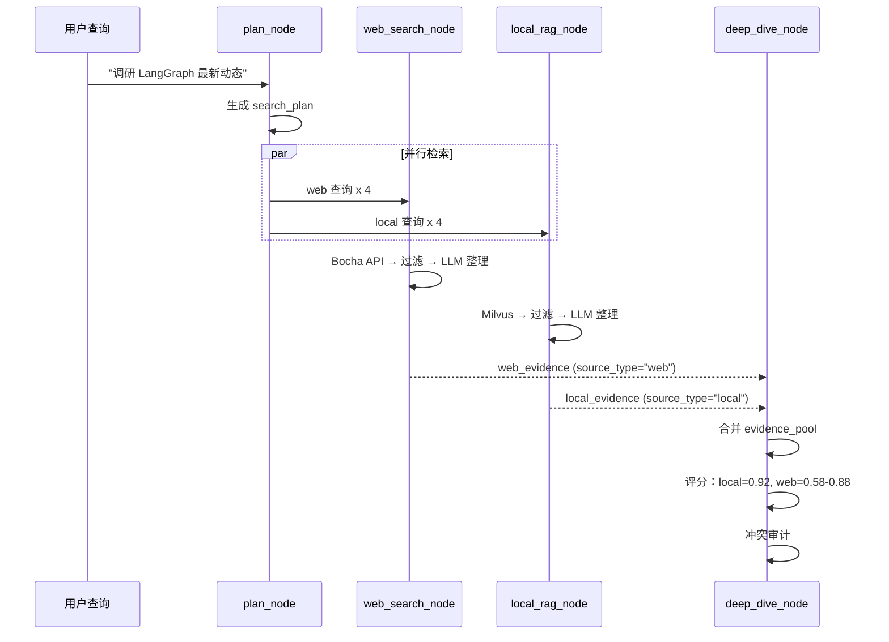

# 第 5 章：RAG 检索增强生成

## 1. 问题背景与设计动机

LLM 的知识截止于训练数据，无法获取企业私有文档和最新信息。RAG（Retrieval-Augmented Generation）通过"先检索、再生成"的方式解决这一问题：

1. **知识时效性**：网页搜索提供最新信息，弥补 LLM 训练数据的滞后
2. **私有知识**：企业内部文档、产品手册等无法通过公开训练获得
3. **可追溯性**：每个结论都绑定来源文档，支持审计
4. **降低幻觉**：基于真实文档生成，减少 LLM 编造内容

Deep Research 的 RAG 系统位于 `local_rag_node`，与 `web_search_node` 并行执行，共同构成双源检索架构。

---

## 2. 方案对比

| 方案 | 检索方式 | 优点 | 缺点 | 本项目使用 |
|------|----------|------|------|-----------|
| **BM25 关键词** | 倒排索引 | 精确匹配快 | 无法理解语义 | 降级方案 |
| **Embedding 向量** | 余弦相似度 | 语义理解强 | 需要 GPU/向量库 | **Milvus + DashScope** |
| **Hybrid 混合** | BM25 + 向量 | 兼顾精确与语义 | 复杂度高 | 计划中 |
| **全文搜索 (PostgreSQL)** | tsvector | 无需额外服务 | 中文分词弱 | PostgreSQL 降级 |

---

## 3. RAG 系统架构

```mermaid
flowchart LR
    subgraph "文档摄入 Ingestion"
        A[原始文档] --> B[RecursiveCharacterTextSplitter<br/>500字/块, 50字重叠]
        B --> C[DashScope Embedding<br/>text-embedding-v1]
        C --> D[(Milvus<br/>向量存储)]
    end
    
    subgraph "查询检索 Retrieval"
        E[用户查询] --> F[DashScope Embedding]
        F --> G[相似度搜索<br/>cosine_similarity]
        G --> H[Top-K 结果]
    end
    
    subgraph "后处理 Post-Processing"
        H --> I[相关性过滤<br/>relevance_score >= 0.2]
        I --> J[来源标注<br/>source_id, doc_id]
        J --> K[结构化输出<br/>list[dict]]
    end
    
    D --> G
```

---

## 4. RAGConfig 配置

源码 `app/mult_agents/rag/core.py:23-30`：

```python
@dataclass(frozen=True)
class RAGConfig:
    milvus_host: str = "127.0.0.1"         # Milvus 地址
    milvus_port: int = 19530                # Milvus 端口
    collection_name: str = "mult_agent_knowledge"  # 集合名称
    embedding_model: str = "text-embedding-v1"     # DashScope Embedding 模型
    chunk_size: int = 500                   # 文档分块大小（字符数）
    chunk_overlap: int = 50                 # 块间重叠（字符数）
```

**关键参数说明**：
- `chunk_size=500`：中文约 250-300 字，适合单个段落级别的信息
- `chunk_overlap=50`：确保跨块的上下文连续性
- `text-embedding-v1`：DashScope 的中文文本向量模型，1536 维

---

## 5. RAGSystem 核心实现

### 5.1 初始化

源码 `app/mult_agents/rag/core.py:33-54`：

```python
class RAGSystem:
    def __init__(self, api_key: str, config: Optional[RAGConfig] = None):
        self.config = config or RAGConfig()
        
        # 1. 初始化 Embedding 模型
        self.embeddings = DashScopeEmbeddings(
            model=self.config.embedding_model,
            dashscope_api_key=self.api_key,
        )
        
        # 2. 初始化文本分割器（中文感知）
        self.text_splitter = RecursiveCharacterTextSplitter(
            chunk_size=self.config.chunk_size,
            chunk_overlap=self.config.chunk_overlap,
            length_function=len,
            separators=["\n\n", "\n", "。", "！", "？", "；", "，", " ", ""],
        )
        
        # 3. 连接 Milvus
        self._connect_to_milvus()
        
        # 4. 初始化向量存储
        self.vectorstore = MilvusVectorStore(
            embedding_function=self.embeddings,
            collection_name=self.config.collection_name,
            connection_args={"uri": f"http://{self.config.milvus_host}:{self.config.milvus_port}"},
            auto_id=True,
        )
```

### 5.2 中文感知的文本分割

分隔符优先级（`core.py:45`）：

```python
separators=["\n\n", "\n", "。", "！", "？", "；", "，", " ", ""]
```

| 优先级 | 分隔符 | 说明 |
|--------|--------|------|
| 1 | `\n\n` | 段落分隔 |
| 2 | `\n` | 行分隔 |
| 3 | `。` | 中文句号 |
| 4 | `！` | 中文感叹号 |
| 5 | `？` | 中文问号 |
| 6 | `；` | 中文分号 |
| 7 | `，` | 中文逗号 |
| 8 | ` ` | 空格 |
| 9 | `` | 字符级（最后手段） |

**设计意图**：优先在语义边界（段落→句子→短语）分割，避免在词语中间切断。

### 5.3 文档摄入

```python
def ingest_text(self, text: str, source: str) -> int:
    """摄入单个文本"""
    docs = self.text_splitter.create_documents([text], metadatas=[{"source": source}])
    return self.add_documents(docs)

def ingest_paths(self, paths: Iterable[Path]) -> int:
    """批量摄入文件"""
    total = 0
    for path in paths:
        text = path.read_text(encoding="utf-8")
        total += self.ingest_text(text, source=str(path))
    return total

def add_documents(self, documents: list[Document]) -> int:
    """写入 Milvus"""
    self.vectorstore.add_documents(documents)
    return len(documents)
```

### 5.4 相似度检索

```python
def search(self, query: str, k: int = 3) -> str:
    """检索并格式化返回"""
    records = self.search_records(query, k=k)
    if not records:
        return "未找到相关信息。"
    lines = ["检索到的相关信息："]
    for idx, record in enumerate(records, 1):
        lines.append(f"{idx}. {record['snippet']}")
        lines.append(f"   (来源: {record['doc_id']})")
    return "\n".join(lines)

def search_records(self, query: str, k: int = 5) -> list[dict]:
    """检索并返回结构化记录"""
    if not utility.has_collection(self.config.collection_name):
        return []
    docs = self.vectorstore.similarity_search(query, k=k)
    records = []
    for idx, doc in enumerate(docs, 1):
        metadata = doc.metadata or {}
        source = str(metadata.get("source") or "").strip()
        title = Path(source).name if source else f"本地知识片段-{idx}"
        records.append({
            "source_id": f"LOC-{idx}",
            "doc_id": source,
            "title": title,
            "snippet": doc.page_content,
            "source_type": "local",
            "metadata": metadata,
        })
    return records
```

---

## 6. Embedding 模型集成

### 6.1 DashScope Embeddings

```python
from langchain_community.embeddings import DashScopeEmbeddings

embeddings = DashScopeEmbeddings(
    model="text-embedding-v1",           # 1536 维
    dashscope_api_key="sk-xxx",
)
```

**模型参数**：
| 参数 | 值 |
|------|-----|
| 模型名 | `text-embedding-v1` |
| 维度 | 1536 |
| 最大输入 | 2048 tokens |
| 支持语言 | 中文、英文 |

### 6.2 Milvus 向量存储

```python
from langchain_milvus import Milvus

vectorstore = Milvus(
    embedding_function=embeddings,
    collection_name="mult_agent_knowledge",
    connection_args={"uri": "http://127.0.0.1:19530"},
    auto_id=True,                         # 自动生成主键
)
```

---

## 7. 与 tools.py 的集成

`tools.py` 中的全局 RAG 实例管理（`tools.py:19-38`）：

```python
_RAG_SYSTEM: Optional[RAGSystem] = None

def init_rag_system(api_key: str, config: Optional[RAGConfig] = None):
    """初始化全局 RAG 系统"""
    global _RAG_SYSTEM
    if _RAG_SYSTEM is None:
        try:
            _RAG_SYSTEM = RAGSystem(api_key, config)
        except Exception as e:
            print(f"RAG 系统初始化失败: {e}")

def search_knowledge_base_records(query: str, limit: int = 5) -> list[dict]:
    """供 local_rag_node 调用"""
    if _RAG_SYSTEM is None:
        return []
    return _RAG_SYSTEM.search_records(query, k=limit)
```

LangChain Tool 装饰器版本（供 Agent 直接调用）：

```python
@tool
def search_knowledge_base(query: str) -> str:
    """查询本地知识库/向量数据库。"""
    if _RAG_SYSTEM is None:
        return "错误：RAG 系统未初始化或连接失败。"
    return _RAG_SYSTEM.search(query)
```

---

## 8. 双源检索融合



---

## 9. 关键点说明

### 9.1 性能优化

1. **分块大小**：500 字符平衡了检索精度和上下文完整性
2. **Top-K 数量**：`search_knowledge_base_records` 默认 `limit=4`，减少 Token 消耗
3. **多取后滤**：Milvus 检索时取 `limit * 4` 条，过滤后保留 `limit` 条
4. **全局单例**：`_RAG_SYSTEM` 避免重复初始化 Embedding 模型和 Milvus 连接

### 9.2 安全设计

1. **Collection 隔离**：不同租户可使用不同的 `collection_name`
2. **Metadata 过滤**：检索结果通过 `tenant_id`、`user_id` 过滤
3. **API Key 管理**：DashScope Key 通过环境变量传递，不硬编码

### 9.3 常见问题

| 问题 | 原因 | 解决方案 |
|------|------|----------|
| Milvus 连接失败 | Milvus 未启动或端口错误 | `docker compose up -d milvus` |
| 检索结果为空 | Collection 不存在或未摄入文档 | 先执行 `ingest_paths` |
| Embedding 失败 | API Key 无效或额度用尽 | 检查 `DASHSCOPE_API_KEY` |
| 检索延迟高 | Milvus 索引未创建 | 在 Milvus 中创建 IVF_FLAT 索引 |

### 9.4 最佳实践

1. **文档预处理**：摄入前去除无意义内容（页眉页脚、广告等）
2. **分块策略**：技术文档按段落分割，代码文件按函数分割
3. **增量更新**：使用 `doc_id` 作为 Metadata，支持按文档维度更新
4. **监控**：记录每次检索的 `raw_count` 和 `kept_count`，评估检索质量
