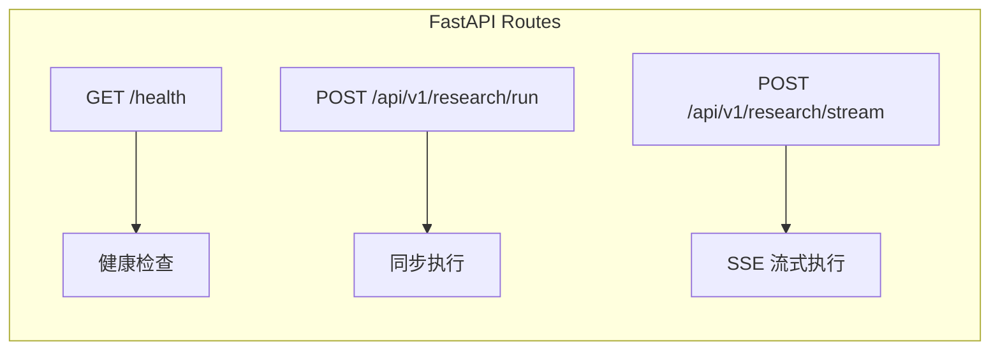
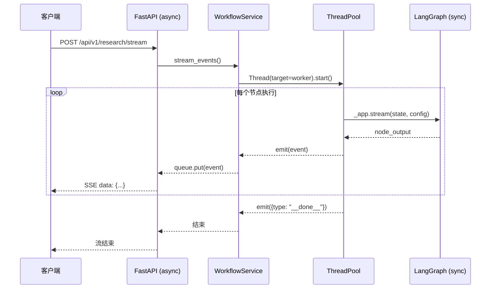

# 第 6 章：FastAPI 后端服务

## 1. 问题背景与设计动机

多智能体工作流引擎（LangGraph）是同步阻塞的 Python 代码，无法直接对外提供服务。需要一个 HTTP 层解决：

1. **协议转换**：将 HTTP 请求转换为 LangGraph 调用
2. **流式推送**：研究报告生成耗时 30-120 秒，需要 SSE（Server-Sent Events）实时推送进度
3. **异步桥接**：LangGraph 是同步的，FastAPI 是异步的，需要线程桥接
4. **参数校验**：使用 Pydantic 校验请求参数
5. **跨域支持**：前端 Vue 开发服务器在 5173 端口，后端在 8000 端口

---

## 2. 方案对比

| 方案 | 优点 | 缺点 | 适用场景 |
|------|------|------|----------|
| **REST 同步** | 实现简单 | 客户端长时间等待，超时风险 | 快速任务 |
| **WebSocket** | 全双工通信 | 实现复杂，连接管理困难 | 实时聊天 |
| **SSE（Server-Sent Events）** | 单向流式，HTTP 原生，实现简单 | 仅支持服务端→客户端 | **研究进度推送（本项目）** |
| **gRPC Streaming** | 高性能，强类型 | 浏览器支持差 | 服务间通信 |

---

## 3. FastAPI 应用工厂

### 3.1 应用创建

源码 `app/app_main.py:24-39`：

```python
def create_app() -> FastAPI:
    settings = AppSettings()
    app = FastAPI(title=settings.app_name)
    
    # CORS 中间件：允许前端跨域访问
    app.add_middleware(
        CORSMiddleware,
        allow_origins=settings.cors_origins(),
        allow_credentials=True,
        allow_methods=["*"],
        allow_headers=["*"],
    )
    
    # 注册路由
    app.include_router(health_router)      # /health
    app.include_router(research_router)    # /api/v1/research/*
    return app

app = create_app()
```

### 3.2 日志配置

```python
logging.basicConfig(
    level=logging.INFO,
    format="%(asctime)s | %(levelname)s | %(message)s",
)
logging.getLogger("mult_agents").setLevel(logging.INFO)
logging.getLogger("backend").setLevel(logging.INFO)
```

---

## 4. 路由设计

### 4.1 路由结构



### 4.2 research_router

源码 `app/backend/router/research_router.py`：

```python
router = APIRouter(prefix="/api/v1/research", tags=["research"])

@router.post("/run", response_model=ResearchResponse)
async def run_research(
    payload: ResearchRequest,
    workflow_service: WorkflowService = Depends(get_workflow_service),
) -> ResearchResponse:
    """同步接口：等待完整报告后返回"""
    final = await workflow_service.run(
        query=payload.query,
        user_id=payload.user_id,
        thread_id=payload.thread_id,
        tenant_id=payload.tenant_id,
        max_iterations=payload.max_iterations,
        enable_memory=payload.enable_memory,
    )
    return ResearchResponse(query=payload.query, ..., final=final)

@router.post("/stream")
async def stream_research(
    payload: ResearchRequest,
    workflow_service: WorkflowService = Depends(get_workflow_service),
) -> StreamingResponse:
    """流式接口：SSE 逐事件推送"""
    async def event_stream():
        start_event = {"type": "status", "message": "任务已接收，正在初始化多智能体链路"}
        yield f"data: {json.dumps(start_event, ensure_ascii=False)}\n\n"
        async for event in workflow_service.stream_events(...):
            yield f"data: {json.dumps(event, ensure_ascii=False)}\n\n"
    
    return StreamingResponse(event_stream(), media_type="text/event-stream")
```

---

## 5. Pydantic 请求/响应模型

源码 `app/backend/schemas/research.py`：

```python
class ResearchRequest(BaseModel):
    query: str = Field(..., min_length=1)                    # 必填，非空
    user_id: str = Field(default="default_user", min_length=1)
    thread_id: str = Field(default="default_thread", min_length=1)
    tenant_id: str = Field(default="default_tenant", min_length=1)
    max_iterations: int | None = Field(default=None, ge=1, le=6)  # 1-6 之间
    enable_memory: bool | None = None

class ResearchResponse(BaseModel):
    query: str
    user_id: str
    thread_id: str
    tenant_id: str
    final: str
```

**字段说明**：
- `max_iterations`：控制反思循环次数，`None` 时使用 config.json 默认值
- `enable_memory`：`None` 时使用配置默认值，`False` 可关闭记忆（调试用）

---

## 6. SSE 事件协议

### 6.1 事件类型

| type | 说明 | 关键字段 | 示例 |
|------|------|----------|------|
| `status` | 系统状态 | `message` | `{"type":"status","message":"任务已接收"}` |
| `phase` | 节点进度 | `node`, `message` | `{"type":"phase","node":"plan","message":"Planner 正在拆解问题"}` |
| `route` | 路由结果 | `message` | `{"type":"route","message":"已走多智能体研究路径"}` |
| `final` | 最终报告 | `final`, `query` | `{"type":"final","final":"# 研究报告\n..."}` |
| `error` | 错误信息 | `message` | `{"type":"error","message":"Milvus 连接失败"}` |

### 6.2 客户端消费示例

```javascript
const response = await fetch('/api/v1/research/stream', {
  method: 'POST',
  headers: { 'Content-Type': 'application/json' },
  body: JSON.stringify({ query: '...', user_id: 'user01' }),
})

const reader = response.body.getReader()
const decoder = new TextDecoder('utf-8')
let buffer = ''

while (true) {
  const { done, value } = await reader.read()
  if (done) break
  buffer += decoder.decode(value, { stream: true })
  const parts = buffer.split('\n\n')
  buffer = parts.pop() || ''
  
  for (const part of parts) {
    if (!part.startsWith('data: ')) continue
    const event = JSON.parse(part.slice(6))
    
    if (event.type === 'phase') {
      showProgress(event.message)
    }
    if (event.type === 'final') {
      renderReport(event.final)
    }
  }
}
```

---

## 7. WorkflowService 异步桥接

### 7.1 核心设计

源码 `app/backend/service/workflow_service.py:11-268`：

LangGraph 的 `invoke` 和 `stream` 是同步阻塞调用，而 FastAPI 是异步框架。解决方案：`asyncio.to_thread` 将同步调用放到线程池执行。



### 7.2 延迟初始化

```python
class WorkflowService:
    def __init__(self, config_path: str):
        self._lock = Lock()
        self._initialized = False
    
    def _ensure_initialized(self) -> None:
        if self._initialized:
            return
        with self._lock:                          # 双重检查锁
            if self._initialized:
                return
            base_config = AppConfig.from_file(self._config_path)
            self._memory_manager = build_memory_manager(base_config)
            agents = build_agents(base_config.model, base_config.api_key, base_config)
            checkpointer = build_checkpointer(base_config)
            self._app = build_workflow_app(agents, checkpointer)
            self._base_config = base_config
            self._initialized = True
```

**设计意图**：首次请求时才初始化 LangGraph 应用，避免启动时加载所有依赖。

### 7.3 线程桥接的 stream_events

```python
async def stream_events(self, query, user_id, thread_id, ...) -> AsyncIterator[dict]:
    queue: asyncio.Queue[dict] = asyncio.Queue()
    loop = asyncio.get_running_loop()
    
    def emit(event: dict) -> None:
        """线程安全的事件发射器"""
        asyncio.run_coroutine_threadsafe(queue.put(event), loop)
    
    def worker() -> None:
        try:
            final, route = self._run_sync_with_events(
                query=query, ..., emit=emit,
            )
            emit({"type": "route", "message": "已走多智能体研究路径"})
            emit({"type": "final", "final": final, ...})
        except Exception as exc:
            emit({"type": "error", "message": str(exc)})
        finally:
            emit({"type": "__done__"})
    
    Thread(target=worker, daemon=True).start()
    
    while True:
        event = await queue.get()
        if event.get("type") == "__done__":
            break
        yield event
```

### 7.4 运行时配置覆盖

```python
def _build_runtime_config(self, user_id, thread_id, tenant_id, max_iterations, enable_memory):
    overrides = {
        "user_id": user_id,
        "thread_id": thread_id,
        "tenant_id": tenant_id,
        "max_iterations": max_iterations if max_iterations is not None else self._base_config.max_iterations,
    }
    if enable_memory is not None:
        overrides["enable_memory"] = enable_memory
    return self._base_config.with_overrides(**overrides)
```

`with_overrides` 使用 `dataclasses.replace` 实现不可变配置的局部覆盖。

---

## 8. 节点消息映射

```python
@staticmethod
def _node_message(node_name: str) -> str:
    mapping = {
        "intent": "Intent Router 正在识别问题意图",
        "direct_answer": "Direct Responder 正在快速作答",
        "plan": "Planner 正在拆解问题",
        "web_search": "Web Scout 正在检索网络证据",
        "local_rag": "Local Scout 正在检索本地知识库",
        "deep_dive": "Evidence Judge 正在进行证据裁判",
        "analyze": "Analyst 正在生成结论",
        "reflect": "Reflect 正在生成补搜计划",
        "write": "Writer 正在撰写最终报告",
    }
    return mapping.get(node_name, f"{node_name} 正在执行")
```

---

## 9. 记忆持久化集成

每次请求结束后自动调用 `persist_turn`：

```python
# workflow_service.py:93-100
if self._memory_manager and runtime_config.enable_memory:
    self._memory_manager.persist_turn(
        tenant_id=runtime_config.tenant_id,
        user_id=runtime_config.user_id,
        thread_id=runtime_config.thread_id,
        query=query,
        answer=final,
    )
```

---

## 10. 关键点说明

### 10.1 性能指标

| 指标 | 值 | 说明 |
|------|-----|------|
| 首个 SSE 事件延迟 | < 100ms | status 事件立即返回 |
| 单节点执行延迟 | 2-15s | 取决于 LLM 响应速度 |
| 完整研究链路 | 30-120s | 包含 2-3 轮检索迭代 |
| 并发能力 | 中等 | 线程池 + 同步 LangGraph |

### 10.2 安全设计

1. **CORS 配置**：`allow_origins` 应限制为实际前端域名
2. **参数校验**：Pydantic 自动校验 `min_length`、`ge`、`le` 约束
3. **超时控制**：`budget.max_seconds` 限制单次研究的最大耗时
4. **错误处理**：SSE 流中的异常通过 `error` 事件返回，不会导致连接挂起

### 10.3 最佳实践

1. **使用 `/stream` 而非 `/run`**：用户体验更好，可以实时看到进度
2. **线程安全**：`emit` 函数通过 `asyncio.run_coroutine_threadsafe` 跨线程安全写入队列
3. **守护线程**：`Thread(target=worker, daemon=True)` 确保主进程退出时线程自动终止
4. **延迟初始化**：避免 import 时就连接数据库，首次请求才初始化
