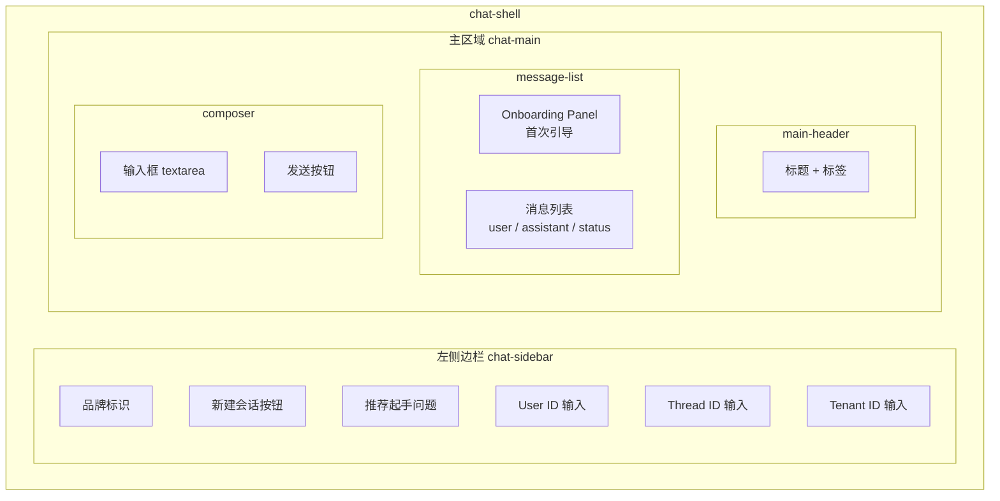

# 第 7 章：Vue 3 前端开发

## 1. 问题背景与设计动机

Deep Research 的前端需要解决以下用户体验问题：

1. **长等待体验**：研究报告生成需 30-120 秒，必须有实时进度反馈
2. **Markdown 渲染**：后端返回 Markdown 格式的研报，前端需要渲染为 HTML
3. **流式消费**：使用 SSE（Server-Sent Events）逐事件接收进度和结果
4. **引导式交互**：新用户不知道如何提问，需要 Starter Prompts 引导
5. **会话管理**：支持新建会话、切换用户/线程/租户

---

## 2. 技术选型

| 组件 | 选择 | 理由 |
|------|------|------|
| 框架 | Vue 3.5 | Composition API + `<script setup>` 语法糖 |
| 构建工具 | Vite 7 | 极速 HMR，原生 ESM |
| 类型检查 | TypeScript 5.9 + vue-tsc | 编译时类型安全 |
| HTTP | 原生 fetch API | SSE 需要 ReadableStream，axios 不支持 |
| Markdown | 自实现 `markdownToHtml()` | 轻量，无额外依赖 |

---

## 3. 项目结构

```
front/agent_front/
├── src/
│   ├── App.vue              # 单文件组件（393 行）
│   ├── main.ts              # 入口
│   └── assets/              # 样式资源
├── vite.config.ts           # Vite 配置
├── package.json             # 依赖声明
└── tsconfig.json            # TypeScript 配置
```

---

## 4. Vite 配置

源码 `front/agent_front/vite.config.ts`：

```typescript
import { defineConfig } from 'vite'
import vue from '@vitejs/plugin-vue'
import vueDevTools from 'vite-plugin-vue-devtools'

export default defineConfig({
  plugins: [vue(), vueDevTools()],
  server: {
    host: '0.0.0.0',
    port: 5173,
    proxy: {
      '/api': {                              // 代理 API 请求
        target: 'http://127.0.0.1:8000',
        changeOrigin: true,
      },
      '/health': {                           // 代理健康检查
        target: 'http://127.0.0.1:8000',
        changeOrigin: true,
      },
    },
  },
  resolve: {
    alias: {
      '@': fileURLToPath(new URL('./src', import.meta.url)),
    },
  },
})
```

**代理配置说明**：开发模式下，`/api/v1/research/stream` 请求会被 Vite 代理到 `http://127.0.0.1:8000`，避免跨域问题。

---

## 5. App.vue 核心实现

### 5.1 类型定义

```typescript
type StreamEvent = {
  type: 'status' | 'phase' | 'route' | 'final' | 'error'
  message?: string
  final?: string
  node?: string
}

type ChatMessage = {
  id: string
  role: 'user' | 'assistant' | 'status'
  content: string
}
```

### 5.2 响应式状态

```typescript
const userId = ref('user01')
const threadId = ref('thread01')
const tenantId = ref('default_tenant')
const query = ref('')
const loading = ref(false)
const errorMessage = ref('')
const progressLogs = ref<string[]>([])
const messages = ref<ChatMessage[]>([
  {
    id: `m-${Date.now()}`,
    role: 'assistant',
    content: '你好，我是 DeepResearch。你可以直接提问...',
  },
])
```

### 5.3 Starter Prompts

```typescript
const starterPrompts = [
  {
    title: '深度调研',
    prompt: '请调研"企业知识库 Agent 平台"市场，按市场规模、主要竞品、收费模式三部分输出...',
  },
  {
    title: '方案对比',
    prompt: '我们要做多 Agent 研究助手，请对比"纯大模型直答""RAG 单 Agent""多 Agent 协作"三种方案...',
  },
  // ...
]
```

---

## 6. SSE 流式消费

### 6.1 核心实现

源码 `App.vue:186-267`：

```typescript
const runResearch = async () => {
  const userText = query.value.trim()
  if (!userText || loading.value) return
  
  loading.value = true
  query.value = ''
  messages.value.push({ id: `u-${Date.now()}`, role: 'user', content: userText })
  
  // 添加状态消息
  const statusId = `s-${Date.now()}`
  messages.value.push({ id: statusId, role: 'status', content: '正在初始化执行链路...' })
  
  try {
    // 1. 发起 SSE 请求
    const response = await fetch('/api/v1/research/stream', {
      method: 'POST',
      headers: { 'Content-Type': 'application/json' },
      body: JSON.stringify({
        query: userText,
        user_id: userId.value.trim() || 'default_user',
        thread_id: threadId.value.trim() || 'default_thread',
        tenant_id: tenantId.value.trim() || 'default_tenant',
      }),
    })
    
    // 2. 获取 ReadableStream
    const reader = response.body.getReader()
    const decoder = new TextDecoder('utf-8')
    let buffer = ''
    
    // 3. 循环读取流数据
    while (true) {
      const { done, value } = await reader.read()
      if (done) break
      
      buffer += decoder.decode(value, { stream: true })
      const parts = buffer.split('\n\n')    // SSE 以 \n\n 分隔事件
      buffer = parts.pop() || ''
      
      for (const part of parts) {
        if (!part.startsWith('data: ')) continue
        const jsonText = part.slice(6).trim()
        if (!jsonText) continue
        
        const event = JSON.parse(jsonText) as StreamEvent
        
        // 4. 处理不同事件类型
        if (event.type === 'status' || event.type === 'phase' || event.type === 'route') {
          const prefix = event.type === 'phase' && event.node ? `[${event.node}] ` : ''
          pushProgress(`${prefix}${event.message || ''}`)
        }
        if (event.type === 'final') {
          messages.value = messages.value.filter((item) => item.id !== statusId)
          messages.value.push({
            id: `a-${Date.now()}`,
            role: 'assistant',
            content: event.final || '已完成，但未返回正文。',
          })
        }
        if (event.type === 'error') {
          throw new Error(event.message || '服务端执行异常')
        }
      }
      await scrollToBottom()
    }
  } catch (error) {
    errorMessage.value = error instanceof Error ? error.message : '请求失败'
  } finally {
    loading.value = false
  }
}
```

### 6.2 SSE 协议格式

```
data: {"type":"status","message":"任务已接收，正在初始化多智能体链路"}

data: {"type":"phase","node":"intent","message":"Intent Router 正在识别问题意图"}

data: {"type":"phase","node":"plan","message":"Planner 正在拆解问题"}

data: {"type":"phase","node":"web_search","message":"Web Scout 正在检索网络证据"}

data: {"type":"route","message":"已走多智能体研究路径"}

data: {"type":"final","final":"# 研究报告\n\n## 核心摘要\n..."}
```

---

## 7. Markdown 渲染

### 7.1 自实现 markdownToHtml()

源码 `App.vue:81-137`：

```typescript
const markdownToHtml = (markdown: string): string => {
  // 1. 提取代码块
  const codeBlocks: string[] = []
  let text = markdown.replace(/```([\s\S]*?)```/g, (_, block) => {
    const index = codeBlocks.length
    codeBlocks.push(`<pre><code>${escapeHtml(String(block).trim())}</code></pre>`)
    return `@@CODE_BLOCK_${index}@@`
  })
  
  // 2. 逐行处理
  const lines = text.split('\n')
  const out: string[] = []
  let inList = false
  
  for (const rawLine of lines) {
    const line = rawLine.trim()
    if (!line) { closeList(); continue }
    
    // 标题
    if (line.startsWith('# ')) { out.push(`<h1>${escapeHtml(line.slice(2))}</h1>`); continue }
    if (line.startsWith('## ')) { out.push(`<h2>${escapeHtml(line.slice(3))}</h2>`); continue }
    if (line.startsWith('### ')) { out.push(`<h3>${escapeHtml(line.slice(4))}</h3>`); continue }
    
    // 列表
    if (line.startsWith('- ') || line.startsWith('* ')) {
      if (!inList) { out.push('<ul>'); inList = true }
      out.push(`<li>${escapeHtml(line.slice(2))}</li>`)
      continue
    }
    
    // 段落
    out.push(`<p>${escapeHtml(line)}</p>`)
  }
  
  // 3. 内联样式
  let html = out.join('')
  html = html.replace(/\*\*(.+?)\*\*/g, '<strong>$1</strong>')   // 粗体
  html = html.replace(/\*(.+?)\*/g, '<em>$1</em>')               // 斜体
  html = html.replace(/`([^`]+)`/g, '<code>$1</code>')           // 行内代码
  html = html.replace(/\[([^[\]]+)\]\((https?:\/\/[^)]+)\)/g,   // 链接
    '<a href="$2" target="_blank" rel="noreferrer">$1</a>')
  html = html.replace(/@@CODE_BLOCK_(\d+)@@/g,                   // 还原代码块
    (_, idx) => codeBlocks[Number(idx)] || '')
  
  return html
}
```

### 7.2 XSS 防护

```typescript
const escapeHtml = (value: string): string =>
  value
    .replaceAll('&', '&amp;')
    .replaceAll('<', '&lt;')
    .replaceAll('>', '&gt;')
    .replaceAll('"', '&quot;')
    .replaceAll("'", '&#39;')
```

所有用户输入和 LLM 输出都经过 `escapeHtml` 处理后再渲染。

---

## 8. UI 布局

### 8.1 整体结构



### 8.2 消息角色样式

| role | 头像 | 样式 |
|------|------|------|
| `user` | "你" | 右对齐，蓝色气泡 |
| `assistant` | "AI" | 左对齐，灰色气泡 |
| `status` | "..." | 左对齐，进度条样式 |

---

## 9. 进度追踪

```typescript
const pushProgress = (message: string) => {
  const msg = message.trim()
  if (!msg) return
  const last = progressLogs.value[progressLogs.value.length - 1]
  if (last === msg) return                          // 去重
  progressLogs.value.push(msg)
  if (progressLogs.value.length > 6) {
    progressLogs.value = progressLogs.value.slice(-6)  // 只保留最近 6 条
  }
}

const renderStatusText = () => {
  const statusMessage = messages.value.find((item) => item.id === statusId)
  if (!statusMessage) return
  const latest = progressLogs.value.slice(-8)
  statusMessage.content = ['正在处理中...', ...latest]
    .map((line) => `- ${line}`)
    .join('\n')
}
```

---

## 10. 关键点说明

### 10.1 性能优化

1. **自实现 Markdown**：避免引入 `marked` 或 `markdown-it` 等重量级库
2. **进度去重**：相同进度消息不重复显示
3. **自动滚动**：每次更新后自动滚动到底部
4. **状态消息替换**：final 事件到达后替换 status 消息，而非追加

### 10.2 安全设计

1. **XSS 防护**：所有文本经过 `escapeHtml` 处理
2. **v-html 使用**：仅对经过处理的 Markdown 使用，不对原始用户输入使用
3. **链接安全**：`target="_blank" rel="noreferrer"` 防止 tabnapping

### 10.3 最佳实践

1. **SSE 优于 WebSocket**：HTTP 原生支持，无需额外连接管理
2. **Starter Prompts**：降低用户使用门槛，展示系统能力
3. **会话管理**：通过 userId/threadId/tenantId 三元组隔离上下文
4. **Enter 发送**：`@keydown.enter.exact.prevent` 精确绑定回车键
