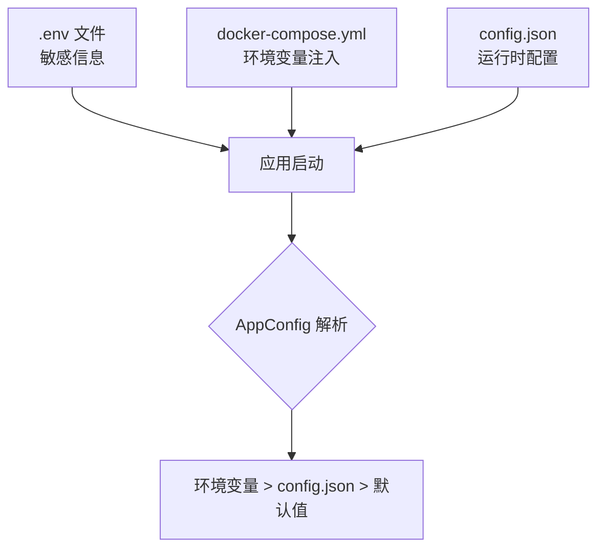

# 第 8 章：部署与运维指南

## 1. 问题背景与设计动机

Deep Research 是一个包含 5 个服务（FastAPI、Vue、PostgreSQL、Redis、Milvus）的分布式系统，部署需要解决：

1. **服务编排**：多个服务的启动顺序和依赖关系
2. **配置管理**：环境变量在不同环境（开发/测试/生产）的差异
3. **健康监控**：服务是否正常运行
4. **日志收集**：多服务日志的统一管理
5. **数据持久化**：数据库和向量库的数据备份

---

## 2. 环境要求总览

| 组件 | 最低配置 | 推荐配置 | 说明 |
|------|----------|----------|------|
| CPU | 2 核 | 4 核 | LLM 调用是 I/O 密集型 |
| 内存 | 4 GB | 8 GB | Milvus 需要 2-4 GB |
| 磁盘 | 20 GB | 50 GB | PostgreSQL + Milvus 数据 |
| Python | 3.10 | 3.12 | 后端运行时 |
| Node.js | 20.x | 22.x | 前端构建 |
| Docker | 24.0+ | 最新 | 容器化部署 |
| Docker Compose | 2.20+ | 最新 | 服务编排 |

---

## 3. Docker Compose 全栈部署

### 3.1 完整 docker-compose.yml

```yaml
version: "3.9"

services:
  # ====== 基础设施 ======
  
  postgres:
    image: postgres:16-alpine
    container_name: dr-postgres
    environment:
      POSTGRES_USER: deepresearch
      POSTGRES_PASSWORD: ${POSTGRES_PASSWORD:-dr_password_2024}
      POSTGRES_DB: deepresearch
    ports:
      - "5432:5432"
    volumes:
      - pg_data:/var/lib/postgresql/data
    healthcheck:
      test: ["CMD-SHELL", "pg_isready -U deepresearch"]
      interval: 5s
      timeout: 5s
      retries: 5
    restart: unless-stopped

  redis:
    image: redis:7-alpine
    container_name: dr-redis
    command: redis-server --requirepass ${REDIS_PASSWORD:-}
    ports:
      - "6379:6379"
    volumes:
      - redis_data:/data
    healthcheck:
      test: ["CMD", "redis-cli", "-a", "${REDIS_PASSWORD:-}", "ping"]
      interval: 5s
      timeout: 5s
      retries: 5
    restart: unless-stopped

  etcd:
    image: quay.io/coreos/etcd:v3.5.18
    container_name: dr-etcd
    environment:
      ETCD_AUTO_COMPACTION_MODE: revision
      ETCD_AUTO_COMPACTION_RETENTION: "1000"
      ETCD_QUOTA_BACKEND_BYTES: "4294967296"
    volumes:
      - etcd_data:/etcd
    command: >
      etcd
      --advertise-client-urls=http://127.0.0.1:2379
      --listen-client-urls=http://0.0.0.0:2379
      --data-dir=/etcd

  minio:
    image: minio/minio:RELEASE.2023-03-20T20-16-18Z
    container_name: dr-minio
    environment:
      MINIO_ACCESS_KEY: minioadmin
      MINIO_SECRET_KEY: minioadmin
    ports:
      - "9001:9001"
      - "9000:9000"
    volumes:
      - minio_data:/minio_data
    command: minio server /minio_data --console-address ":9001"

  milvus:
    image: milvusdb/milvus:v2.6.0
    container_name: dr-milvus
    environment:
      ETCD_ENDPOINTS: etcd:2379
      MINIO_ADDRESS: minio:9000
    ports:
      - "19530:19530"
      - "9091:9091"
    volumes:
      - milvus_data:/var/lib/milvus
    command: ["milvus", "run", "standalone"]
    healthcheck:
      test: ["CMD", "curl", "-f", "http://localhost:9091/healthz"]
      interval: 30s
      timeout: 20s
      retries: 3
    depends_on:
      - etcd
      - minio
    restart: unless-stopped

  # ====== 应用服务 ======
  
  backend:
    build:
      context: ./deep_research
      dockerfile: Dockerfile
    container_name: dr-backend
    ports:
      - "8000:8000"
    environment:
      DASHSCOPE_API_KEY: ${DASHSCOPE_API_KEY}
      BOCHA_API_KEY: ${BOCHA_API_KEY:-}
      MODEL: ${MODEL:-qwen-plus}
      POSTGRES_DSN: postgresql://deepresearch:${POSTGRES_PASSWORD:-dr_password_2024}@postgres:5432/deepresearch
      REDIS_URL: redis://:${REDIS_PASSWORD:-}@redis:6379
      MILVUS_HOST: milvus
      MILVUS_PORT: 19530
      ENABLE_MEMORY: "true"
      SHORT_TERM_BACKEND: postgres
      LONG_TERM_BACKEND: postgres
    depends_on:
      postgres:
        condition: service_healthy
      redis:
        condition: service_healthy
      milvus:
        condition: service_healthy
    restart: unless-stopped

  frontend:
    build:
      context: ./deep_research/front/agent_front
      dockerfile: Dockerfile
    container_name: dr-frontend
    ports:
      - "80:80"
    depends_on:
      - backend
    restart: unless-stopped

volumes:
  pg_data:
  redis_data:
  etcd_data:
  minio_data:
  milvus_data:
```

### 3.2 后端 Dockerfile

```dockerfile
# deep_research/Dockerfile
FROM python:3.12-slim

WORKDIR /app

# 安装系统依赖
RUN apt-get update && apt-get install -y --no-install-recommends \
    gcc libpq-dev && \
    rm -rf /var/lib/apt/lists/*

# 安装 Python 依赖
COPY pyproject.toml .
RUN pip install --no-cache-dir -e .

# 复制源码
COPY . .

# 健康检查
HEALTHCHECK --interval=30s --timeout=10s --retries=3 \
    CMD curl -f http://localhost:8000/health || exit 1

EXPOSE 8000

CMD ["uvicorn", "app.app_main:app", "--host", "0.0.0.0", "--port", "8000"]
```

### 3.3 前端 Dockerfile

```dockerfile
# deep_research/front/agent_front/Dockerfile
FROM node:22-alpine AS builder

WORKDIR /app
COPY package.json package-lock.json ./
RUN npm ci
COPY . .
RUN npm run build

FROM nginx:alpine
COPY --from=builder /app/dist /usr/share/nginx/html
COPY nginx.conf /etc/nginx/conf.d/default.conf

EXPOSE 80
```

Nginx 配置（`nginx.conf`）：

```nginx
server {
    listen 80;
    root /usr/share/nginx/html;
    index index.html;

    # API 代理
    location /api/ {
        proxy_pass http://backend:8000;
        proxy_set_header Host $host;
        proxy_set_header X-Real-IP $remote_addr;
    }

    # 健康检查代理
    location /health {
        proxy_pass http://backend:8000;
    }

    # SPA 路由
    location / {
        try_files $uri $uri/ /index.html;
    }
}
```

---

## 4. 环境变量管理

### 4.1 分层配置



### 4.2 .env.production

```bash
# ====== 必填 ======
DASHSCOPE_API_KEY=sk-xxxxxxxxxxxxxxxxxxxxxxxx

# ====== 可选 ======
BOCHA_API_KEY=sk-xxxxxxxxxxxxxxxxxxxxxxxx
MODEL=qwen-plus
POSTGRES_PASSWORD=strong_password_here
REDIS_PASSWORD=strong_password_here

# ====== 高级 ======
MAX_ITERATIONS=3
ENABLE_MEMORY=true
SHORT_TERM_BACKEND=postgres
LONG_TERM_BACKEND=postgres
```

---

## 5. 健康检查

### 5.1 端点定义

```python
# app/backend/router/__init__.py
health_router = APIRouter(tags=["health"])

@health_router.get("/health")
async def health():
    return {"status": "ok"}
```

### 5.2 Docker 健康检查

```yaml
# 后端
healthcheck:
  test: ["CMD", "curl", "-f", "http://localhost:8000/health"]
  interval: 30s
  timeout: 10s
  retries: 3

# PostgreSQL
healthcheck:
  test: ["CMD-SHELL", "pg_isready -U deepresearch"]
  interval: 5s
  timeout: 5s
  retries: 5

# Redis
healthcheck:
  test: ["CMD", "redis-cli", "ping"]
  interval: 5s
  timeout: 5s
  retries: 5

# Milvus
healthcheck:
  test: ["CMD", "curl", "-f", "http://localhost:9091/healthz"]
  interval: 30s
  timeout: 20s
  retries: 3
```

---

## 6. 日志与监控

### 6.1 日志格式

```python
logging.basicConfig(
    level=logging.INFO,
    format="%(asctime)s | %(levelname)s | %(message)s",
)
```

输出示例：

```
2024-01-15 10:30:15 | INFO | [intent] 开始 | agent=intent_router
2024-01-15 10:30:16 | INFO | [intent] 路由: multiagent
2024-01-15 10:30:16 | INFO | [plan] 开始 | agent=planner
2024-01-15 10:30:18 | INFO | [web_search] 开始 | agent=scout_web
2024-01-15 10:30:20 | INFO | [web_search_node] 查询 1 返回 | 记录数=4
```

### 6.2 关键日志点

| 日志标签 | 含义 | 关注指标 |
|----------|------|----------|
| `[memory] milvus search raw` | Milvus 原始检索 | `raw_hits` 数量 |
| `[memory] milvus search filtered` | 过滤后结果 | `accepted` / `rejected` 比例 |
| `[memory] prompt injection` | 记忆注入 | `injected_chars` 大小 |
| `[memory] turn persisted` | 记忆持久化 | `facts` / `prefs` 数量 |
| `[web_search_node] 查询` | 网络检索 | `记录数` 返回量 |
| `[bocha_web_search] API Key` | API Key 状态 | `是否配置` |

---

## 7. 数据备份

### 7.1 PostgreSQL 备份

```bash
# 定时备份（crontab）
0 2 * * * docker exec dr-postgres pg_dump -U deepresearch deepresearch | gzip > /backup/pg_$(date +\%Y\%m\%d).sql.gz

# 恢复
gunzip < /backup/pg_20240115.sql.gz | docker exec -i dr-postgres psql -U deepresearch deepresearch
```

### 7.2 Milvus 备份

```bash
# Milvus 数据在 minio_data 卷中，备份整个卷
docker run --rm -v dr-deep_research_minio_data:/data -v /backup:/backup alpine \
    tar czf /backup/milvus_$(date +%Y%m%d).tar.gz /data
```

---

## 8. 生产环境检查清单

### 8.1 部署前检查

- [ ] `DASHSCOPE_API_KEY` 已配置且有效
- [ ] `POSTGRES_PASSWORD` 已修改为强密码
- [ ] `REDIS_PASSWORD` 已配置
- [ ] CORS `allow_origins` 已限制为实际域名
- [ ] HTTPS 已配置（Nginx/Caddy 反向代理）
- [ ] 日志级别已设置为 `INFO` 或 `WARNING`
- [ ] 数据备份策略已就位

### 8.2 运行时检查

```bash
# 检查所有服务状态
docker compose ps

# 检查后端健康
curl http://localhost:8000/health

# 检查 Milvus
curl http://localhost:9091/healthz

# 检查 PostgreSQL
docker exec dr-postgres pg_isready -U deepresearch

# 检查 Redis
docker exec dr-redis redis-cli ping

# 查看日志
docker compose logs -f backend --tail 100
```

---

## 9. 常见运维问题

| 问题 | 原因 | 解决方案 |
|------|------|----------|
| 容器启动失败 | 端口冲突 | `netstat -tlnp` 检查端口占用 |
| Milvus 启动慢 | etcd/MinIO 未就绪 | 增加 `depends_on` 和健康检查 |
| 内存不足 | Milvus 占用过多 | 限制 Milvus 内存：`MEM_LIMIT=2147483648` |
| 磁盘满 | 日志/数据增长 | 配置日志轮转，定期清理 |
| API 超时 | LLM 响应慢 | 调整 `max_iterations` 和 `budget.max_seconds` |
