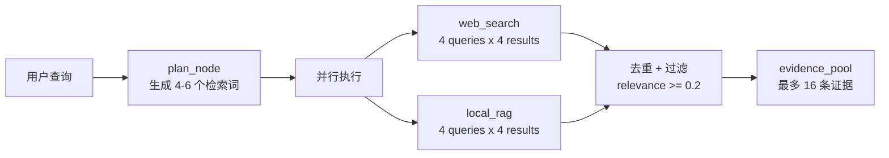

# 第 9 章：最佳实践与常见问题

## 1. 问题背景与设计动机

本章汇总 Deep Research 项目在开发、部署和运维过程中的最佳实践，以及常见错误的排查指南。内容基于实际项目经验整理，覆盖性能优化、安全加固、调试技巧和 FAQ。

---

## 2. 性能优化

### 2.1 LLM Token 控制

**问题**：多节点累积 messages 导致 Token 暴涨，成本失控。

**解决方案**（`nodes.py:167-169`）：

```python
def _invoke_json_agent(state, prompt, agent, agent_name, node, fallback):
    human = HumanMessage(content=with_memory_context(state, prompt))
    # 关键优化：不传入 state["messages"]，避免 Token 累积
    result = agent.invoke({"messages": [human]})
```

**最佳实践**：

| 优化点 | 措施 | 效果 |
|--------|------|------|
| 不累积历史 messages | 每个节点只传当前指令 | Token 减少 60-80% |
| web_search count=4 | 从 6 降到 4 | 每次请求减少 2 条记录 |
| search_plan 最多 6 条 | 去重 + 截断 | 控制检索总量 |
| memory_top_k=6 | 限制记忆注入量 | 控制 Prompt 长度 |
| short_term_summary_threshold=20 | 消息压缩阈值 | 控制短期记忆大小 |

### 2.2 检索性能



**关键指标**：

| 阶段 | 典型延迟 | 优化手段 |
|------|----------|----------|
| intent_node | 1-2s | 规则引擎初判，减少 LLM 调用 |
| plan_node | 3-5s | 限制 outline 和 search_plan 数量 |
| web_search_node | 5-15s | count=4，并行查询 |
| local_rag_node | 2-5s | Milvus Top-K=4 |
| deep_dive_node | 3-8s | 评分算法优先本地来源 |
| write_node | 5-15s | 限制 findings 和 source_index 大小 |

### 2.3 记忆系统性能

```python
# 1. Milvus 多取后滤
docs = self._milvus_store.similarity_search(query, k=max(limit * 4, 20))

# 2. PostgreSQL 索引
CREATE INDEX idx_memory_entries_lookup
ON memory_entries (tenant_id, user_id, memory_type, created_at DESC);

# 3. Redis TTL 自动清理
self._redis_client.expire(key, self.short_term_ttl)

# 4. 短期记忆压缩
if len(raw_messages) > self.short_term_max_messages:
    self._compress_redis_thread(...)
```

---

## 3. 安全最佳实践

### 3.1 API Key 管理

| 密钥 | 存储方式 | 注意事项 |
|------|----------|----------|
| `DASHSCOPE_API_KEY` | `.env` 文件 | **绝不提交到 Git** |
| `BOCHA_API_KEY` | `.env` 文件 | 可选，无则跳过网页检索 |
| `POSTGRES_PASSWORD` | `.env` 或 Docker Secret | 生产环境必须强密码 |
| `REDIS_PASSWORD` | `.env` 或 Docker Secret | 生产环境必须配置 |

```bash
# .gitignore 中必须包含
.env
*.env.local
```

### 3.2 SQL 注入防护

```python
# 正确：参数化查询
cur.execute(
    "SELECT * FROM memory_entries WHERE tenant_id = %s AND user_id = %s",
    (tenant_id, user_id),
)

# 错误：字符串拼接（绝对禁止）
# cur.execute(f"SELECT * FROM memory_entries WHERE tenant_id = '{tenant_id}'")
```

### 3.3 XSS 防护

```typescript
// 前端：所有文本输出经过 escapeHtml
const escapeHtml = (value: string): string =>
  value
    .replaceAll('&', '&amp;')
    .replaceAll('<', '&lt;')
    .replaceAll('>', '&gt;')
    .replaceAll('"', '&quot;')
    .replaceAll("'", '&#39;')
```

### 3.4 路径遍历防护

```python
# tools.py:299-304
def _safe_path(path: str) -> Path:
    root = _workspace_root()
    target = (root / path).resolve()
    if root not in target.parents and target != root:
        raise ValueError("路径超出工作目录")    # 阻止 ../../../etc/passwd 攻击
    return target
```

### 3.5 CORS 配置

```python
# 开发环境
allow_origins=["*"]

# 生产环境（必须限制）
allow_origins=["https://your-domain.com"]
```

---

## 4. 调试技巧

### 4.1 日志级别控制

```python
# 仅看节点执行
logging.getLogger("mult_agents").setLevel(logging.INFO)

# 看详细工具调用
logging.getLogger("mult_agents").setLevel(logging.DEBUG)

# 看记忆系统细节
logging.getLogger("mult_agents.memory").setLevel(logging.DEBUG)
```

### 4.2 关键日志解读

```
[memory] milvus search raw | tenant=default_tenant user=user01 raw_hits=20
[memory] milvus search filtered | accepted=5 rejected=15 rejected_reason_count={"tenant_or_user_mismatch": 12, "memory_type_mismatch": 3}
```

**含义**：Milvus 返回 20 条，过滤后保留 5 条。12 条因租户/用户不匹配被拒绝（可能是共享集群中的数据），3 条因记忆类型不匹配。

### 4.3 禁用颜色输出

```bash
# .env
NO_COLOR=1
```

或：

```bash
NO_COLOR=1 python main.py
```

### 4.4 单独测试节点

```python
from mult_agents.config import AppConfig
from mult_agents.state import create_initial_state

config = AppConfig.from_file()
state = create_initial_state(
    query="测试问题",
    max_iterations=1,
    user_id="test_user",
    tenant_id="test_tenant",
)

# 直接调用节点函数
from mult_agents.nodes import detect_intent
result = detect_intent("帮我调研 LangGraph")
print(result)  # "multiagent"
```

---

## 5. 常见错误 FAQ

### 5.1 启动类错误

| 错误信息 | 原因 | 解决方案 |
|----------|------|----------|
| `ModuleNotFoundError: No module named 'langgraph'` | 依赖未安装 | `pip install -e .` |
| `TypeError: unsupported operand type(s) for \|` | Python < 3.10 | 升级到 3.10+ |
| `FileNotFoundError: 配置文件不存在` | config.json 路径错误 | 检查工作目录 |
| `ValueError: 缺少 DASHSCOPE_API_KEY` | API Key 未配置 | 在 `.env` 中填写 |

### 5.2 连接类错误

| 错误信息 | 原因 | 解决方案 |
|----------|------|----------|
| `ConnectionRefusedError: Milvus` | Milvus 未启动 | `docker compose up -d milvus` |
| `Redis 初始化失败` | Redis 未启动或密码错误 | 检查 `REDIS_URL` |
| `PostgreSQL 初始化失败` | DSN 错误或服务未启动 | 检查 `POSTGRES_DSN` |
| `RAG 系统初始化失败` | Milvus + API Key 同时缺失 | 配置 `MILVUS_HOST` 和 `DASHSCOPE_API_KEY` |

### 5.3 运行时错误

| 错误信息 | 原因 | 解决方案 |
|----------|------|----------|
| `JSONDecodeError` | LLM 输出非法 JSON | `_load_json` 会使用 fallback，通常可自愈 |
| `bocha_web_search 未配置 BOCHA_API_KEY` | 网络检索不可用 | 配置 `BOCHA_API_KEY` 或忽略（仅影响网页检索） |
| `Milvus 检索失败` | Milvus 连接中断 | 自动降级到 PostgreSQL 检索 |
| `摘要模型初始化失败` | DashScope 额度用尽 | 充值或降级到规则压缩 |

### 5.4 前端错误

| 错误信息 | 原因 | 解决方案 |
|----------|------|----------|
| `ECONNREFUSED 127.0.0.1:8000` | 后端未启动 | `python app_main.py` |
| `流式响应不可用` | response.body 为 null | 检查浏览器兼容性 |
| `请求失败: 500` | 后端内部错误 | 查看后端日志 |

---

## 6. 配置调优指南

### 6.1 模型选择

| 模型 | 速度 | 质量 | 成本 | 推荐场景 |
|------|------|------|------|----------|
| `qwen-turbo` | 快 | 中 | 低 | 开发测试 |
| `qwen-plus` | 中 | 高 | 中 | **生产推荐** |
| `qwen-max` | 慢 | 最高 | 高 | 高质量研报 |

### 6.2 迭代次数调优

```python
# config.json
{
  "max_iterations": 2    # 简单场景：1 轮检索
  "max_iterations": 3    # 标准场景：2 轮检索 + 1 轮反思（推荐）
  "max_iterations": 5    # 复杂场景：4 轮检索（延迟高，Token 多）
}
```

### 6.3 记忆系统调优

```python
{
  "enable_memory": true,                    # 是否启用记忆
  "short_term_ttl_seconds": 604800,         # 短期记忆 TTL（7天）
  "short_term_max_messages": 30,            # 压缩阈值
  "short_term_summary_threshold": 20,       # 保留最近消息数
  "short_term_backend": "postgres",         # redis 更快，postgres 更持久
  "long_term_backend": "postgres",          # postgres 生产推荐
  "long_term_scope": "user",                # user 跨线程共享，thread 线程隔离
  "memory_top_k": 6,                        # 注入记忆数量
  "save_conversation_task": false           # 是否保存对话为情景记忆
}
```

---

## 7. 扩展开发指南

### 7.1 添加新节点

```python
# 1. 在 nodes.py 中实现节点函数
def new_node(state: ResearchState, agent, agent_name: str) -> ResearchState:
    # 节点逻辑
    return {"field": value, "messages": messages}

# 2. 在 graph.py 中注册节点
workflow.add_node("new_node", bind_agent(new_node, agents.new_agent, "new_agent"))

# 3. 添加边
workflow.add_edge("analyze", "new_node")
workflow.add_edge("new_node", "write")

# 4. 在 prompts.py 中添加 prompt
PROMPTS["new_agent"] = "你是 NewAgent，负责..."
```

### 7.2 添加新工具

```python
# 在 tools.py 中添加
@tool
def new_tool(param: str) -> str:
    """工具描述（会被 Agent 看到）"""
    # 工具逻辑
    return result
```

### 7.3 添加新 API 端点

```python
# 在 backend/router/ 中添加
from fastapi import APIRouter

new_router = APIRouter(prefix="/api/v1/new", tags=["new"])

@new_router.post("/action")
async def new_action(payload: NewRequest):
    # 端点逻辑
    return NewResponse(...)
```

---

## 8. 测试策略

### 8.1 单元测试

```python
# 测试意图识别
def test_detect_intent():
    from mult_agents.nodes import detect_intent
    assert detect_intent("你好") == "direct"
    assert detect_intent("帮我调研 LangGraph") == "multiagent"
    assert detect_intent("2024年AI趋势") == "multiagent"

# 测试配置解析
def test_config_resolve():
    import os
    os.environ["DASHSCOPE_API_KEY"] = "test-key"
    config = AppConfig.from_env()
    assert config.api_key == "test-key"
```

### 8.2 集成测试

```python
# 测试完整工作流
async def test_workflow():
    service = WorkflowService("config.json")
    final = await service.run(
        query="什么是 LangGraph？",
        user_id="test_user",
        thread_id="test_thread",
        tenant_id="test_tenant",
        max_iterations=1,
        enable_memory=False,
    )
    assert len(final) > 100
    assert "LangGraph" in final
```

---

## 9. 生产环境 Checklist

### 9.1 上线前

- [ ] Python 3.10+ 已验证
- [ ] 所有依赖已锁定版本（`pip freeze > requirements.txt`）
- [ ] `.env` 文件已配置且不在 Git 中
- [ ] PostgreSQL 已部署且表已创建
- [ ] Milvus 已部署且 Collection 已创建
- [ ] CORS 已限制为实际域名
- [ ] HTTPS 已配置
- [ ] 日志级别已设为 INFO
- [ ] 健康检查端点可访问
- [ ] 数据备份策略已就位

### 9.2 监控指标

| 指标 | 阈值 | 告警方式 |
|------|------|----------|
| API 响应时间 | P99 < 120s | 监控系统 |
| 错误率 | < 1% | 监控系统 |
| Milvus 检索延迟 | P95 < 100ms | 日志 |
| PostgreSQL 连接数 | < 80% | pg_stat |
| Redis 内存使用 | < 80% | redis-cli info |
| 磁盘使用率 | < 85% | 系统监控 |
