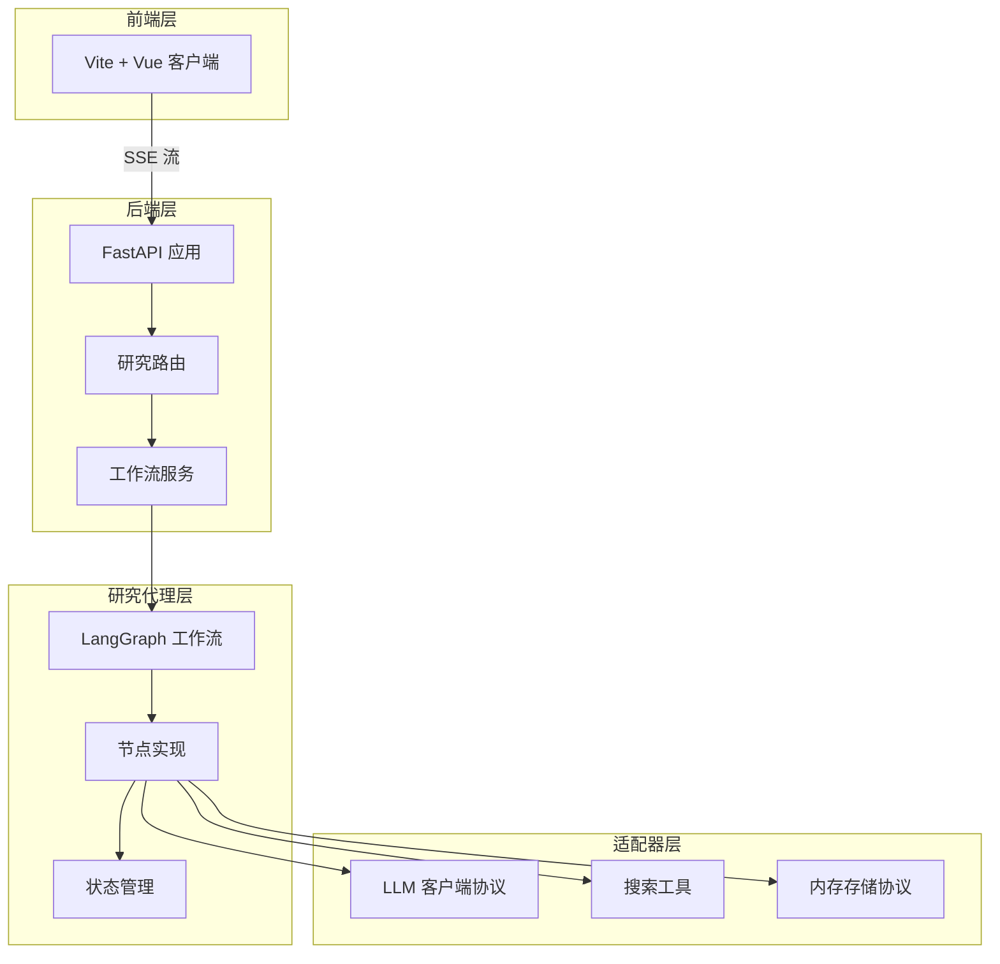
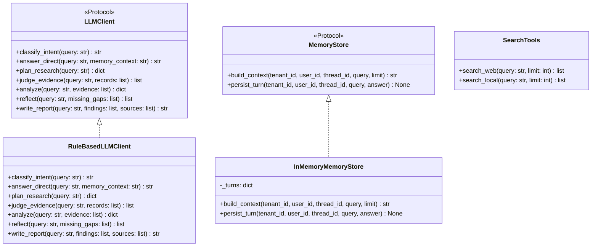
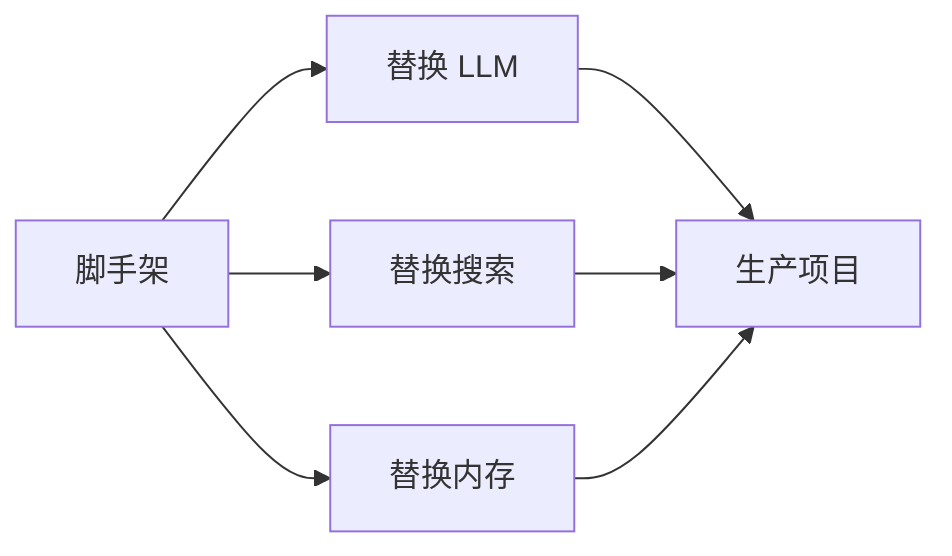

# 第1章 脚手架概述与设计哲学

## 1.1 问题背景与设计动机

### 1.1.1 为什么需要脚手架

在构建基于 LangGraph 的深度研究系统时，开发者面临一个核心矛盾：**主项目 `deep_research` 功能强大但依赖复杂**。主项目包含 110+ 个依赖包，涉及多个 LLM 提供商、25+ 个工具函数、21 个提示词模板、Redis/Postgres 检查点存储等，这对初学者和快速原型开发构成了巨大障碍。

**核心问题**：
- 如何在不引入外部 API 密钥的情况下学习 LangGraph 工作流？
- 如何快速验证自定义研究代理的架构设计？
- 如何在生产环境中逐步替换组件而不破坏整体架构？

### 1.1.2 设计动机

`deep_research_scaffold` 的设计动机源于三个核心需求：

1. **零外部依赖学习**：开发者可以在没有任何 API 密钥的情况下运行完整的工作流
2. **渐进式替换**：通过 Protocol 抽象，支持逐个替换组件
3. **架构可移植性**：从脚手架到生产项目的迁移路径清晰明确

## 1.2 方案对比表

### 1.2.1 脚手架 vs 主项目对比

| 维度 | deep_research_scaffold | deep_research |
|------|------------------------|---------------|
| **依赖包数量** | 5 个核心依赖 | 110+ 个依赖 |
| **LLM 客户端** | `RuleBasedLLMClient`（规则引擎） | `DashScopeLLMClient`（阿里云 DashScope） |
| **搜索工具** | `SearchTools`（存根实现） | 25+ 个 `@tool` 装饰器函数 |
| **内存存储** | `InMemoryMemoryStore`（31 行） | `MemoryManager`（1492 行） |
| **状态字段** | 21 个字段 | 36 个字段 |
| **提示词** | 无（硬编码逻辑） | 21 个提示词模板 |
| **检查点** | 无检查点 | Redis/Postgres 检查点 |
| **API 密钥** | 不需要 | 需要 DashScope、Tavily 等 |
| **启动时间** | < 1 秒 | 5-10 秒 |
| **适用场景** | 学习、原型、自定义代理 | 生产环境 |

### 1.2.2 依赖对比详情

**脚手架依赖**（`pyproject.toml`）：
```toml
dependencies = [
  "fastapi>=0.115.0",
  "uvicorn[standard]>=0.30.0",
  "pydantic>=2.8.0",
  "pydantic-settings>=2.4.0",
  "langgraph>=0.2.0"
]
```

**主项目依赖**（部分）：
- `dashscope`：阿里云 LLM 服务
- `tavily-python`：网络搜索
- `redis`：缓存和检查点
- `psycopg2-binary`：Postgres 检查点
- `langchain-*`：LangChain 生态
- 等 100+ 个包

## 1.3 架构图

### 1.3.1 整体架构



### 1.3.2 组件依赖关系



## 1.4 核心实现详解

### 1.4.1 项目结构

```
deep_research_scaffold/
├── app/
│   ├── app_main.py                    # FastAPI 应用入口
│   ├── backend/
│   │   ├── config/settings.py         # 应用配置
│   │   ├── router/research_router.py  # 研究 API 路由
│   │   ├── schemas/research.py        # 请求/响应模型
│   │   └── service/workflow_service.py # 工作流服务
│   └── research_agents/
│       ├── config.py                  # 工作流配置
│       ├── state.py                   # LangGraph 状态定义
│       ├── graph.py                   # 节点连接和路由
│       ├── nodes.py                   # 节点实现
│       ├── tools.py                   # 搜索工具
│       ├── adapters/llm.py            # LLM 适配器
│       └── memory/store.py            # 内存存储
├── front/                             # Vue 前端
├── config.example.json                # 配置示例
└── .env.example                       # 环境变量示例
```

### 1.4.2 配置系统

**配置文件** `config.example.json`：
```json
{
  "app_name": "Deep Research Scaffold",
  "model": "stub",
  "max_iterations": 2,
  "enable_memory": true,
  "memory_top_k": 6,
  "web_search_enabled": true,
  "local_rag_enabled": true
}
```

**配置加载逻辑** `research_agents/config.py`：
```python
@dataclass(frozen=True)
class ResearchConfig:
    app_name: str = "Deep Research Scaffold"
    model: str = "stub"
    max_iterations: int = 2
    enable_memory: bool = True
    memory_top_k: int = 6
    web_search_enabled: bool = True
    local_rag_enabled: bool = True

    @classmethod
    def from_file(cls, path: str | Path) -> "ResearchConfig":
        """从 JSON 文件加载配置，支持环境变量覆盖"""
        config_path = Path(path).resolve()
        data: dict = {}
        if config_path.exists():
            data = json.loads(config_path.read_text(encoding="utf-8"))
        return cls(
            app_name=_str(data, "app_name", "APP_NAME", cls.app_name),
            model=_str(data, "model", "MODEL", cls.model),
            max_iterations=_int(data, "max_iterations", "MAX_ITERATIONS", cls.max_iterations),
            enable_memory=_bool(data, "enable_memory", "ENABLE_MEMORY", cls.enable_memory),
            memory_top_k=_int(data, "memory_top_k", "MEMORY_TOP_K", cls.memory_top_k),
            web_search_enabled=_bool(data, "web_search_enabled", "WEB_SEARCH_ENABLED", cls.web_search_enabled),
            local_rag_enabled=_bool(data, "local_rag_enabled", "LOCAL_RAG_ENABLED", cls.local_rag_enabled),
        )
```

**关键点说明**：
1. **配置优先级**：环境变量 > JSON 文件 > 默认值
2. **不可变配置**：使用 `frozen=True` 确保配置在运行时不可修改
3. **类型安全**：所有配置项都有明确的类型定义

### 1.4.3 状态定义

**状态结构** `research_agents/state.py`：
```python
class ResearchState(TypedDict):
    # 基础信息
    query: str                    # 用户查询
    user_id: str                  # 用户 ID
    tenant_id: str                # 租户 ID
    memory_context: str           # 内存上下文
    
    # 消息和意图
    messages: Annotated[list[str], operator.add]  # 消息列表（可追加）
    intent: str                   # 意图分类（direct/research）
    phase: str                    # 当前阶段
    
    # 研究计划
    plan: str                     # 研究计划摘要
    sub_questions: list[str]      # 子问题列表
    search_plan: list[dict]       # 搜索计划
    
    # 证据收集
    web_evidence: list[dict]      # 网络证据
    local_evidence: list[dict]    # 本地证据
    evidence_pool: list[dict]     # 证据池
    
    # 分析结果
    findings: list[dict]          # 发现列表
    missing_gaps: list[str]       # 缺失信息
    supplementary_queries: list[dict]  # 补充查询
    source_index: list[dict]      # 来源索引
    
    # 输出
    draft: str                    # 草稿
    final: str                    # 最终报告
    
    # 迭代控制
    iteration: int                # 当前迭代次数
    max_iterations: int           # 最大迭代次数
```

**关键点说明**：
1. **状态合并**：`messages` 字段使用 `Annotated[list[str], operator.add]` 支持状态追加
2. **多租户支持**：包含 `tenant_id`、`user_id`、`thread_id` 支持多租户隔离
3. **迭代控制**：通过 `iteration` 和 `max_iterations` 控制反思循环

## 1.5 关键点说明

### 1.5.1 Protocol 抽象的优势

脚手架使用 Python 的 `Protocol` 类实现接口抽象，这带来了以下优势：

1. **静态类型检查**：mypy 等工具可以在编译时检查接口实现
2. **鸭子类型支持**：不需要显式继承，只要方法签名匹配即可
3. **IDE 支持**：自动补全和代码导航更准确

```python
class LLMClient(Protocol):
    def classify_intent(self, query: str) -> str: ...
    def answer_direct(self, query: str, memory_context: str = "") -> str: ...
    # ... 其他方法
```

### 1.5.2 零外部依赖设计

脚手架的核心设计原则是**零外部依赖**：

1. **LLM 客户端**：使用 `RuleBasedLLMClient` 实现规则引擎，不需要 API 密钥
2. **搜索工具**：使用 `SearchTools` 返回存根数据，不需要真实搜索服务
3. **内存存储**：使用 `InMemoryMemoryStore` 存储在内存中，不需要 Redis/Postgres

### 1.5.3 渐进式替换路径

脚手架提供了清晰的渐进式替换路径：



## 1.6 最佳实践

### 1.6.1 何时使用脚手架

**适用场景**：
1. **学习 LangGraph**：不需要 API 密钥即可运行完整工作流
2. **原型开发**：快速验证自定义研究代理的架构设计
3. **自定义代理**：基于脚手架构建特定领域的研究代理
4. **教学演示**：展示 LangGraph 工作流的核心概念

**不适用场景**：
1. **生产环境**：需要替换所有存根实现
2. **高性能需求**：内存存储不适合大规模数据
3. **复杂业务逻辑**：需要扩展状态和节点

### 1.6.2 快速启动指南

**后端启动**：
```powershell
cd deep_research_scaffold
python -m venv .venv
.\.venv\Scripts\Activate.ps1
pip install -r requirements.txt
cd app
uvicorn app_main:app --reload --port 8000
```

**前端启动**：
```powershell
cd deep_research_scaffold/front
npm install
npm run dev
```

**测试请求**：
```powershell
curl -X POST http://127.0.0.1:8000/api/v1/research/run `
  -H "Content-Type: application/json" `
  -d "{\"query\":\"Compare RAG and multi-agent research workflows\"}"
```

### 1.6.3 开发建议

1. **先理解架构**：在替换组件之前，先理解整体架构设计
2. **逐个替换**：每次只替换一个组件，确保系统稳定
3. **编写测试**：为每个替换的组件编写单元测试
4. **保持兼容**：确保替换后的组件与原有接口兼容

## 1.7 总结

`deep_research_scaffold` 是一个精心设计的脚手架项目，它通过以下方式解决了学习和原型开发的痛点：

1. **零依赖设计**：不需要任何外部 API 密钥即可运行
2. **Protocol 抽象**：支持渐进式替换组件
3. **架构可移植**：从脚手架到生产项目的迁移路径清晰

通过本章的学习，你应该已经理解了脚手架的设计哲学和整体架构。在接下来的章节中，我们将深入探讨核心架构和扩展点，以及如何将脚手架升级为生产级项目。
