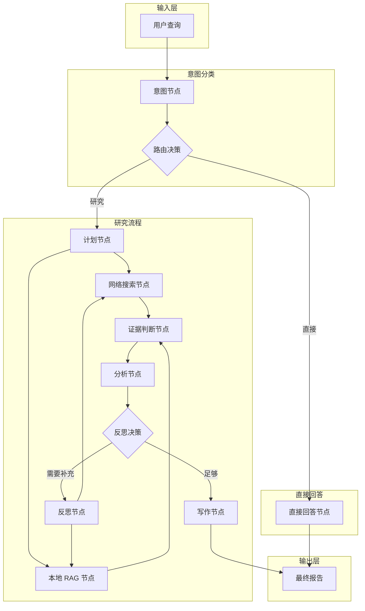
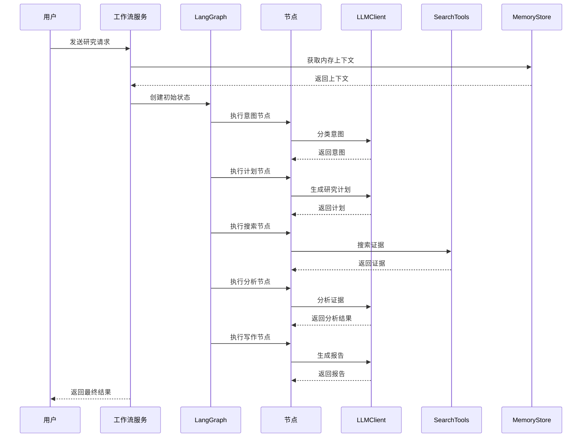

# 第2章 核心架构与扩展点

## 2.1 问题背景与设计动机

### 2.1.1 为什么需要扩展点

在构建可复用的研究代理框架时，核心挑战是**如何在不修改框架代码的情况下支持不同的实现**。`deep_research_scaffold` 通过定义 5 个核心扩展点解决了这个问题：

1. **LLM 客户端**：支持不同的 LLM 提供商（DashScope、OpenAI、本地模型等）
2. **搜索工具**：支持不同的搜索服务（Tavily、Bing、本地向量库等）
3. **内存存储**：支持不同的存储后端（Redis、Postgres、向量数据库等）
4. **研究状态**：支持扩展状态字段以满足特定需求
5. **路由条件**：支持自定义工作流路由逻辑

### 2.1.2 设计动机

扩展点的设计动机源于以下需求：

1. **关注点分离**：每个组件只负责单一职责
2. **可测试性**：可以独立测试每个组件
3. **可替换性**：可以在运行时替换组件实现
4. **可扩展性**：可以通过添加新组件扩展功能

## 2.2 方案对比表

### 2.2.1 扩展点对比

| 扩展点 | 文件位置 | Protocol 定义 | 默认实现 | 替换难度 |
|--------|----------|---------------|----------|----------|
| **LLMClient** | `adapters/llm.py` | 7 个方法 | `RuleBasedLLMClient` | 中等 |
| **SearchTools** | `tools.py` | 2 个方法 | `SearchTools`（存根） | 简单 |
| **MemoryStore** | `memory/store.py` | 2 个方法 | `InMemoryMemoryStore` | 中等 |
| **ResearchState** | `state.py` | TypedDict | 21 个字段 | 复杂 |
| **RouteConditions** | `graph.py` | 函数 | 2 个路由函数 | 简单 |

### 2.2.2 组件职责对比

| 组件 | 职责 | 输入 | 输出 |
|------|------|------|------|
| **LLMClient** | 自然语言处理 | 查询、证据 | 分类、分析、报告 |
| **SearchTools** | 信息检索 | 查询字符串 | 证据列表 |
| **MemoryStore** | 上下文管理 | 租户、用户、线程 | 上下文字符串 |
| **ResearchState** | 状态管理 | 所有中间结果 | 状态字典 |
| **RouteConditions** | 流程控制 | 当前状态 | 下一节点 |

## 2.3 架构图

### 2.3.1 工作流架构



### 2.3.2 组件交互图



## 2.4 核心实现详解

### 2.4.1 LLMClient Protocol

**Protocol 定义** `research_agents/adapters/llm.py`：
```python
from typing import Protocol

# 使用 Protocol 定义 LLM 客户端接口，支持鸭子类型
class LLMClient(Protocol):
    """LLM 客户端协议，定义了 7 个核心方法"""
    
    def classify_intent(self, query: str) -> str:
        # 分类用户意图为 "direct" 或 "research"
        ...
    
    def answer_direct(self, query: str, memory_context: str = "") -> str:
        # 直接回答简单问题，不需要走研究流程
        ...
    
    def plan_research(self, query: str) -> dict:
        # 生成研究计划，返回 summary、sub_questions、search_plan
        ...
    
    def judge_evidence(self, query: str, records: list[dict]) -> list[dict]:
        # 判断证据相关性，返回带 relevance_score 的列表
        ...
    
    def analyze(self, query: str, evidence: list[dict]) -> dict:
        # 综合分析证据，返回 findings 和 missing_gaps
        ...
    
    def reflect(self, query: str, missing_gaps: list[str]) -> list[dict]:
        # 根据缺失信息生成补充查询
        ...
    
    def write_report(self, query: str, findings: list[dict], sources: list[dict]) -> str:
        # 基于分析结果和来源生成最终报告
        ...
```

**为什么使用 Protocol 而不是 ABC？**
- **鸭子类型**：不需要显式继承，任何实现相同方法签名的类都自动满足协议
- **静态检查**：mypy/pyright 可以在编译时验证实现是否符合协议
- **零运行时开销**：Protocol 只用于类型检查，不影响运行时性能

**关键点说明**：
1. **Protocol 类**：使用 Python 的 Protocol 实现结构化子类型
2. **方法签名**：每个方法都有明确的输入输出类型
3. **文档字符串**：每个方法都有详细的文档说明

### 2.4.2 RuleBasedLLMClient 实现

**规则引擎实现** `research_agents/adapters/llm.py`：
```python
class RuleBasedLLMClient:
    """基于规则的 LLM 客户端，不需要 API 密钥"""
    
    def classify_intent(self, query: str) -> str:
        # 使用关键词集合匹配，命中任一关键词则判定为研究意图
        lowered = query.lower()
        research_markers = {
            "research", "compare", "market", "trend",
            "evidence", "sources", "report", "analysis", "strategy"
        }
        return "research" if any(marker in lowered for marker in research_markers) else "direct"
    
    def plan_research(self, query: str) -> dict:
        # 返回固定模板的研究计划，包含 3 个子问题和 3 个搜索步骤
        return {
            "summary": f"Research plan for: {query}",
            "sub_questions": [
                f"What is the current context for {query}?",
                f"What evidence supports the main claims about {query}?",
                f"What risks or tradeoffs should be considered for {query}?",
            ],
            "search_plan": [
                {"query": query, "source": "hybrid", "reason": "original user question"},
                {"query": f"{query} evidence sources", "source": "web", "reason": "external evidence"},
                {"query": f"{query} internal notes", "source": "local", "reason": "local knowledge"},
            ],
        }
    
    def analyze(self, query: str, evidence: list[dict]) -> dict:
        # 基于证据数量生成分析：有证据时置信度为 medium，无证据时标记缺失
        findings = [
            {
                "claim": f"Initial scaffold finding for: {query}",
                "supporting_source_ids": [item.get("source_id") for item in evidence[:3]],
                "confidence": "medium" if evidence else "low",
            }
        ]
        missing_gaps = [] if evidence else ["No evidence was collected"]
        return {"findings": findings, "missing_gaps": missing_gaps}
```

**为什么选择规则引擎作为默认实现？**
- **零依赖**：不需要 API 密钥或网络连接，下载即可运行
- **确定性**：相同输入始终产生相同输出，便于单元测试和调试
- **教学价值**：清晰展示了每个方法的输入输出契约，方便开发者理解接口语义

**关键点说明**：
1. **确定性输出**：相同输入总是产生相同输出，便于测试
2. **无外部依赖**：不需要任何 API 密钥或网络请求
3. **完整实现**：实现了 LLMClient 协议的所有方法

### 2.4.3 SearchTools 实现

**搜索工具存根** `research_agents/tools.py`：
```python
@dataclass
class SearchTools:
    """默认存根工具，返回占位数据，替换为真实搜索实现"""
    
    def search_web(self, query: str, limit: int = 5) -> list[dict]:
        # 网络搜索存根：返回 3 条模拟的 Web 证据
        if not query.strip():
            return []
        return [
            {
                "source_id": f"WEB-{idx}",       # 唯一标识符，用于引用验证
                "source_type": "web",             # 来源类型，影响可信度评分
                "title": f"Stub web source {idx}: {query}",
                "url": f"https://example.com/research/{idx}",
                "snippet": f"Placeholder web evidence for: {query}",
            }
            for idx in range(1, min(limit, 3) + 1)
        ]
    
    def search_local(self, query: str, limit: int = 5) -> list[dict]:
        # 本地搜索存根：返回 2 条模拟的本地文档证据
        if not query.strip():
            return []
        return [
            {
                "source_id": f"LOC-{idx}",        # 本地文档 ID
                "source_type": "local",            # 本地来源可信度最高(0.92)
                "title": f"Stub local document {idx}",
                "doc_id": f"doc-{idx}",
                "snippet": f"Placeholder local knowledge for: {query}",
            }
            for idx in range(1, min(limit, 2) + 1)
        ]
```

**为什么存根返回固定格式？**
- **接口契约**：定义了证据的标准数据结构（source_id, source_type, title, snippet），真实实现必须遵循
- **下游兼容**：evidence_judge_node 依赖这些字段进行评分，格式不一致会导致工作流失败

**关键点说明**：
1. **存根实现**：返回固定格式的测试数据
2. **数据结构**：每个证据包含 source_id、source_type、title、snippet 等字段
3. **可替换性**：可以轻松替换为真实的搜索实现

### 2.4.4 MemoryStore Protocol

**内存存储协议** `research_agents/memory/store.py`：
```python
from typing import Protocol

# 定义记忆存储接口，支持多租户隔离
class MemoryStore(Protocol):
    """内存存储协议"""
    
    def build_context(self, tenant_id: str, user_id: str, thread_id: str, query: str, limit: int) -> str:
        # 从历史对话中构建上下文字符串，limit 控制返回的轮次数
        ...
    
    def persist_turn(self, tenant_id: str, user_id: str, thread_id: str, query: str, answer: str) -> None:
        # 将一轮对话持久化存储，供下次 build_context 调用时检索
        ...
```

**内存实现** `research_agents/memory/store.py`：
```python
class InMemoryMemoryStore:
    """内存存储实现，仅 31 行代码，进程重启后数据丢失"""
    
    def __init__(self) -> None:
        # 使用三层元组作为键，实现租户-用户-线程三级隔离
        self._turns: dict[tuple[str, str, str], list[tuple[str, str]]] = defaultdict(list)
    
    def build_context(self, tenant_id: str, user_id: str, thread_id: str, query: str, limit: int) -> str:
        # 取最近 limit 轮对话，每轮回答截断到 500 字符以控制 token 用量
        key = (tenant_id, user_id, thread_id)
        turns = self._turns.get(key, [])[-limit:]
        if not turns:
            return ""
        lines = []
        for previous_query, previous_answer in turns:
            lines.append(f"User: {previous_query}")
            lines.append(f"Assistant: {previous_answer[:500]}")
        return "\n".join(lines)
    
    def persist_turn(self, tenant_id: str, user_id: str, thread_id: str, query: str, answer: str) -> None:
        # 追加到内存列表，不做去重和压缩
        key = (tenant_id, user_id, thread_id)
        self._turns[key].append((query, answer))
```

**为什么使用 defaultdict 而不是普通 dict？**
- **自动初始化**：首次访问新键时自动创建空列表，避免 KeyError
- **代码简洁**：不需要在 persist_turn 中判断键是否存在

**关键点说明**：
1. **多租户支持**：使用 `(tenant_id, user_id, thread_id)` 作为键
2. **历史限制**：`limit` 参数控制返回的历史记录数量
3. **内存存储**：数据存储在内存中，进程重启后丢失

### 2.4.5 LangGraph 工作流

**图构建** `research_agents/graph.py`：
```python
from langgraph.graph import END, START, StateGraph

def build_graph(context: NodeContext):
    """构建 LangGraph 工作流，定义 9 个节点和条件路由"""
    graph = StateGraph(ResearchState)
    
    # 注册所有节点，使用 lambda 包装以注入 context 依赖
    graph.add_node("intent", lambda state: intent_node(state, context))
    graph.add_node("direct_answer", lambda state: direct_answer_node(state, context))
    graph.add_node("plan", lambda state: plan_node(state, context))
    graph.add_node("web_search", lambda state: web_search_node(state, context))
    graph.add_node("local_rag", lambda state: local_rag_node(state, context))
    graph.add_node("evidence_judge", lambda state: evidence_judge_node(state, context))
    graph.add_node("analyze", lambda state: analyze_node(state, context))
    graph.add_node("reflect", lambda state: reflect_node(state, context))
    graph.add_node("write", lambda state: write_node(state, context))
    
    # 定义边：START → intent 是固定入口
    graph.add_edge(START, "intent")
    graph.add_conditional_edges(
        "intent",
        _route_after_intent,                     # 路由函数返回 "direct" 或 "research"
        {
            "direct": "direct_answer",
            "research": "plan",
        },
    )
    graph.add_edge("plan", "web_search")         # plan 之后并行执行搜索
    graph.add_edge("plan", "local_rag")
    graph.add_edge("web_search", "evidence_judge")
    graph.add_edge("local_rag", "evidence_judge")  # 两个搜索结果汇合到证据评判
    graph.add_edge("evidence_judge", "analyze")
    graph.add_conditional_edges(
        "analyze",
        _route_after_analysis,                   # 有缺口且未达上限则反思
        {
            "reflect": "reflect",
            "write": "write",
        },
    )
    graph.add_edge("reflect", "web_search")      # 反思后重新搜索
    graph.add_edge("reflect", "local_rag")
    graph.add_edge("direct_answer", END)
    graph.add_edge("write", END)
    
    return graph.compile()                       # 编译为可执行的应用

def _route_after_intent(state: ResearchState) -> str:
    # 意图路由：intent 字段由 intent_node 设置
    return "direct" if state.get("intent") == "direct" else "research"

def _route_after_analysis(state: ResearchState) -> str:
    # 分析后路由：有缺失信息且迭代次数未达上限则进入反思
    if state.get("missing_gaps") and state.get("iteration", 0) < state.get("max_iterations", 1):
        return "reflect"
    return "write"
```

**为什么使用 lambda 包装节点函数？**
- `add_node` 接受 `(state) -> state` 签名的函数，但节点实现需要额外的 `context` 参数
- lambda 闭包捕获了 `context`，实现了依赖注入而不改变节点函数签名
- 这种模式使得节点函数保持纯函数特性，便于独立测试

**关键点说明**：
1. **9 个节点**：intent、direct_answer、plan、web_search、local_rag、evidence_judge、analyze、reflect、write
2. **条件路由**：使用 `add_conditional_edges` 实现动态路由
3. **并行执行**：web_search 和 local_rag 可以并行执行
4. **反思循环**：通过 reflect 节点实现迭代改进

### 2.4.6 节点实现

**节点上下文** `research_agents/nodes.py`：
```python
# 使用 frozen dataclass 确保依赖注入后不可变，避免运行时意外修改
@dataclass(frozen=True)
class NodeContext:
    """节点上下文，包含所有依赖"""
    config: ResearchConfig    # 运行配置（模型、迭代次数等）
    llm: LLMClient            # LLM 客户端（可替换实现）
    tools: SearchTools         # 搜索工具（可替换实现）
    memory: MemoryStore        # 记忆存储（可替换实现）
```

**意图节点** `research_agents/nodes.py`：
```python
def intent_node(state: ResearchState, context: NodeContext) -> ResearchState:
    # 调用 LLM 的 classify_intent 方法，返回 "direct" 或 "research"
    intent = context.llm.classify_intent(state["query"])
    return {
        "intent": intent,                        # 路由决策依据
        "phase": "intent classified",            # 进度标记，前端可展示
        "messages": [f"intent={intent}"],        # 调试日志
    }
```

**计划节点** `research_agents/nodes.py`：
```python
def plan_node(state: ResearchState, context: NodeContext) -> ResearchState:
    # 调用 LLM 生成研究计划，提取子问题和搜索步骤
    plan = context.llm.plan_research(state["query"])
    sub_questions = plan.get("sub_questions", [state["query"]])      # 降级：使用原始查询
    search_plan = plan.get("search_plan", [{"query": state["query"], "source": "hybrid"}])
    return {
        "phase": "planning completed",
        "plan": plan.get("summary", state["query"]),
        "sub_questions": sub_questions,          # 供搜索节点使用
        "search_plan": search_plan,              # 定义搜索策略
        "messages": [f"planned {len(search_plan)} search steps"],
    }
```

**搜索节点** `research_agents/nodes.py`：
```python
def web_search_node(state: ResearchState, context: NodeContext) -> ResearchState:
    # 检查配置是否启用 Web 搜索，未启用则返回空列表
    if not context.config.web_search_enabled:
        return {"web_evidence": [], "messages": ["web search disabled"]}
    records = []
    # 遍历搜索计划中 source 为 "web" 的条目，逐个执行搜索
    for item in _queries_for_source(state, "web"):
        records.extend(context.tools.search_web(str(item.get("query", "")), limit=4))
    return {
        "web_evidence": _dedupe(records, "url"),  # 按 URL 去重
        "messages": [f"web evidence={len(records)}"],
    }
```

**为什么节点函数是纯函数？**
- **可测试性**：给定相同的 state 和 context，总是返回相同的结果
- **可组合性**：节点之间通过状态传递数据，无直接依赖
- **可恢复性**：配合 LangGraph 检查点，可以从任意节点恢复执行

**关键点说明**：
1. **纯函数**：每个节点都是纯函数，输入状态 + 上下文，输出状态更新
2. **依赖注入**：通过 `NodeContext` 注入所有依赖
3. **状态合并**：返回的状态字典会自动合并到主状态中

### 2.4.7 WorkflowService 桥接

**工作流服务** `backend/service/workflow_service.py`：
```python
class WorkflowService:
    """工作流服务，桥接 FastAPI HTTP 层和 LangGraph 工作流"""
    
    def __init__(self, config_path: str):
        self._config_path = config_path
        self._lock = Lock()                      # 线程锁，保护初始化过程
        self._initialized = False
        self._config: ResearchConfig | None = None
        self._app = None                         # 编译后的 LangGraph 应用
        self._memory = InMemoryMemoryStore()     # 默认使用内存存储
    
    def _ensure_initialized(self) -> None:
        # 双重检查锁定：先检查无锁状态，未初始化才加锁
        if self._initialized:
            return
        with self._lock:
            if self._initialized:                # 二次检查，防止并发重复初始化
                return
            self._config = ResearchConfig.from_file(self._config_path)
            context = NodeContext(
                config=self._config,
                llm=RuleBasedLLMClient(),        # 默认使用规则引擎
                tools=SearchTools(),             # 默认使用存根工具
                memory=self._memory,
            )
            self._app = build_graph(context)     # 编译 LangGraph 状态图
            self._initialized = True
    
    async def run(self, payload: ResearchRequest) -> str:
        # 将同步工作流放到线程池执行，避免阻塞事件循环
        final, _route = await asyncio.to_thread(self._run_sync, payload)
        return final
    
    async def stream_events(self, payload: ResearchRequest) -> AsyncIterator[dict]:
        # 使用队列 + 后台线程实现 SSE 事件流
        queue: asyncio.Queue[dict] = asyncio.Queue()
        loop = asyncio.get_running_loop()
        
        def emit(event: dict) -> None:
            # 从工作线程安全地将事件投递到异步事件循环
            asyncio.run_coroutine_threadsafe(queue.put(event), loop)
        
        def worker() -> None:
            try:
                final, route = self._run_sync_with_events(payload, emit)
                emit({"type": "route", "message": route})
                emit({"type": "final", "final": final})
            except Exception as exc:
                emit({"type": "error", "message": str(exc)})
            finally:
                emit({"type": "__done__"})       # 终止信号
        
        Thread(target=worker, daemon=True).start()
        while True:
            event = await queue.get()
            if event.get("type") == "__done__":
                break
            yield event
```

**为什么使用 asyncio.to_thread 而不是直接 await？**
- LangGraph 的 `invoke` 方法是同步的，直接调用会阻塞 FastAPI 的事件循环
- `to_thread` 将同步代码放到线程池执行，保持异步接口的响应性
- 配合 Queue 实现了从工作线程到事件循环的跨线程事件传递

**关键点说明**：
1. **延迟初始化**：使用双重检查锁定确保线程安全
2. **异步桥接**：使用 `asyncio.to_thread` 将同步工作流桥接到异步上下文
3. **事件流**：使用队列和线程实现 SSE 事件流

## 2.5 关键点说明

### 2.5.1 Protocol vs ABC

脚手架使用 `Protocol` 而不是 `ABC`（抽象基类）来定义接口：

```python
# 方式一：Protocol（推荐）— 结构化子类型，不需要显式继承
class LLMClient(Protocol):
    def classify_intent(self, query: str) -> str: ...

# 方式二：ABC（不推荐）— 需要显式继承，耦合度更高
from abc import ABC, abstractmethod
class LLMClient(ABC):
    @abstractmethod
    def classify_intent(self, query: str) -> str: ...
```

**为什么选择 Protocol？**
- **鸭子类型**：不需要显式继承，任何实现相同方法签名的类都自动满足协议
- **静态检查**：mypy/pyright 可以在编译时验证实现是否符合协议
- **更低耦合**：现有代码无需修改即可满足协议约束

**Protocol 的优势**：
1. **鸭子类型**：不需要显式继承
2. **静态检查**：mypy 可以在编译时检查
3. **更灵活**：可以与现有代码无缝集成

### 2.5.2 状态合并机制

LangGraph 使用 `Annotated` 类型实现状态合并：

```python
# operator.add 指示 LangGraph：当多个节点返回 messages 时，使用列表拼接而非替换
class ResearchState(TypedDict):
    messages: Annotated[list[str], operator.add]
```

**为什么需要状态合并？**
- web_search 和 local_rag 并行执行，各自产生 messages
- 如果使用覆盖策略，后完成的节点会丢失先完成节点的日志
- `operator.add` 确保所有节点的 messages 都被保留

### 2.5.3 条件路由模式

脚手架使用函数实现条件路由：

```python
# 路由函数：纯函数，只依赖状态，无副作用
def _route_after_intent(state: ResearchState) -> str:
    return "direct" if state.get("intent") == "direct" else "research"

# 注册条件边：返回值到目标节点的映射表
graph.add_conditional_edges(
    "intent",                                  # 源节点
    _route_after_intent,                       # 路由函数
    {
        "direct": "direct_answer",             # 返回 "direct" 则跳转到 direct_answer
        "research": "plan",                    # 返回 "research" 则跳转到 plan
    },
)
```

**为什么路由函数必须是纯函数？**
- **可预测性**：相同状态总是产生相同路由，确保工作流行为一致
- **可测试性**：可以独立测试路由逻辑，不需要启动整个图
- **无副作用**：路由函数不应修改状态，只做决策

**关键点**：
1. **纯函数**：路由函数只依赖状态，没有副作用
2. **映射表**：返回值到节点名的映射
3. **动态路由**：根据状态动态决定下一节点

## 2.6 最佳实践

### 2.6.1 扩展点设计原则

1. **单一职责**：每个扩展点只负责一个功能
2. **接口最小化**：Protocol 只定义必要的方法
3. **默认实现**：提供开箱即用的默认实现
4. **文档完整**：每个方法都有详细的文档

### 2.6.2 组件替换策略

1. **逐个替换**：每次只替换一个组件
2. **保持兼容**：新实现必须满足 Protocol 约束
3. **编写测试**：为新实现编写单元测试
4. **性能监控**：替换后监控性能变化

### 2.6.3 工作流调试技巧

1. **状态检查**：在节点中添加日志输出状态
2. **单步执行**：使用 `stream_mode="updates"` 逐步执行
3. **可视化**：使用 LangGraph Studio 可视化工作流
4. **错误处理**：在节点中添加 try-catch 处理异常

## 2.7 总结

本章详细介绍了 `deep_research_scaffold` 的核心架构和 5 个扩展点：

1. **LLMClient Protocol**：7 个方法，支持不同的 LLM 提供商
2. **SearchTools**：2 个方法，支持不同的搜索服务
3. **MemoryStore Protocol**：2 个方法，支持不同的存储后端
4. **ResearchState**：21 个字段，支持扩展状态
5. **RouteConditions**：2 个路由函数，支持自定义流程

通过理解这些扩展点，你可以：
- 替换默认实现为生产级组件
- 扩展状态字段以满足特定需求
- 自定义工作流路由逻辑
- 构建特定领域的研究代理

在下一章中，我们将介绍如何将脚手架逐步升级为生产级项目。
