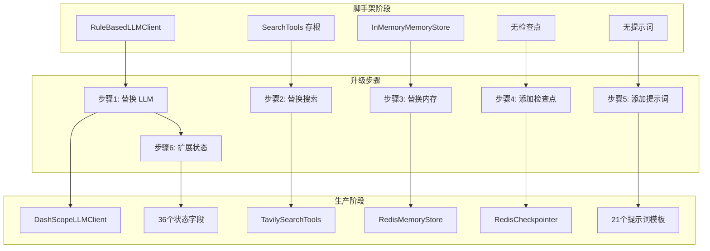
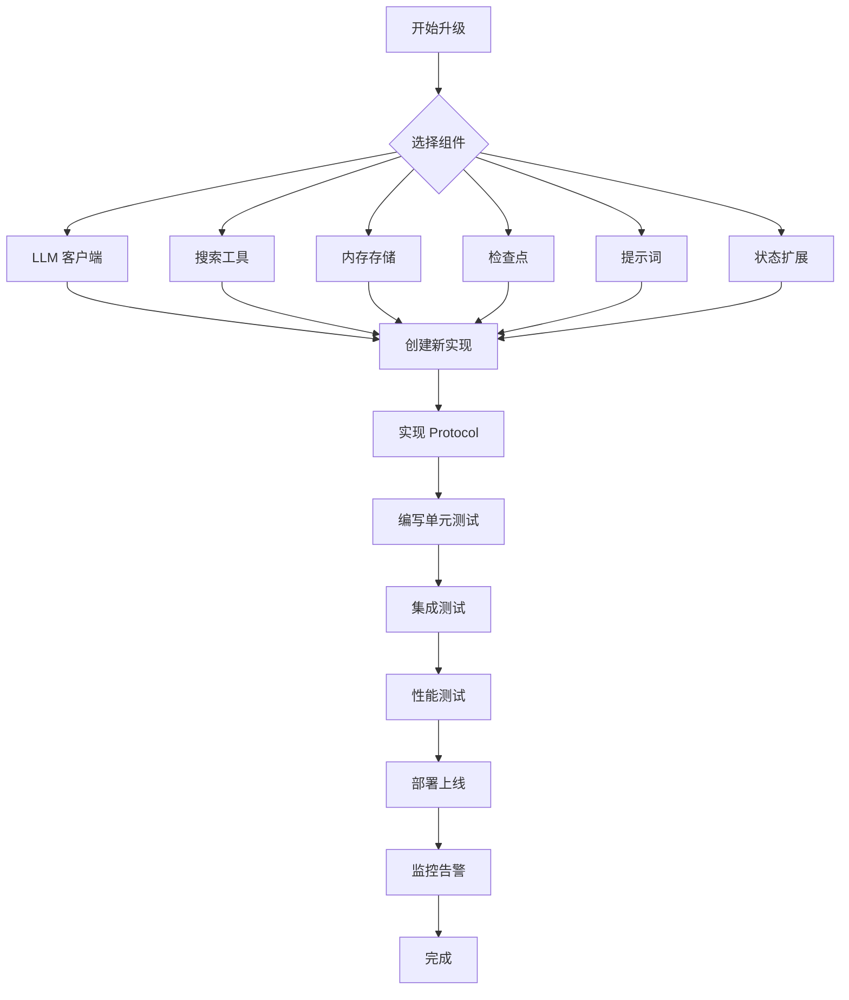

# 第3章 从脚手架到生产级项目

## 3.1 问题背景与设计动机

### 3.1.1 为什么需要升级

脚手架项目 `deep_research_scaffold` 设计用于学习和原型开发，但在生产环境中存在以下限制：

1. **LLM 能力有限**：`RuleBasedLLMClient` 使用规则引擎，无法处理复杂查询
2. **搜索结果存根**：`SearchTools` 返回固定数据，无法获取真实信息
3. **内存易失**：`InMemoryMemoryStore` 存储在内存中，进程重启后丢失
4. **无状态持久化**：没有检查点，无法恢复中断的工作流
5. **无提示词优化**：硬编码逻辑，无法优化 LLM 输出质量

### 3.1.2 升级目标

本章的目标是提供一个**渐进式升级指南**，将脚手架逐步升级为生产级项目：

1. **保持架构稳定**：不改变核心架构设计
2. **逐个替换组件**：每次只替换一个组件，确保系统稳定
3. **向后兼容**：新实现必须满足原有 Protocol 约束
4. **可测试性**：每个替换的组件都可以独立测试

## 3.2 方案对比表

### 3.2.1 升级路径对比

| 步骤 | 组件 | 脚手架实现 | 生产实现 | 复杂度 |
|------|------|------------|----------|--------|
| 1 | LLM 客户端 | `RuleBasedLLMClient` | `DashScopeLLMClient` | 中等 |
| 2 | 搜索工具 | `SearchTools`（存根） | `TavilySearchTools` | 简单 |
| 3 | 内存存储 | `InMemoryMemoryStore` | `RedisMemoryStore` | 中等 |
| 4 | 检查点 | 无 | `RedisCheckpointer` | 复杂 |
| 5 | 提示词 | 无 | 21 个提示词模板 | 中等 |
| 6 | 状态扩展 | 21 个字段 | 36 个字段 | 复杂 |

### 3.2.2 依赖对比

| 阶段 | 依赖包数量 | 新增依赖 |
|------|------------|----------|
| 脚手架 | 5 | - |
| 步骤 1 | 8 | `dashscope`, `httpx`, `tenacity` |
| 步骤 2 | 10 | `tavily-python`, `beautifulsoup4` |
| 步骤 3 | 12 | `redis`, `json` |
| 步骤 4 | 14 | `langgraph-checkpoint`, `langgraph-checkpoint-redis` |
| 步骤 5 | 16 | `jinja2`, `pyyaml` |
| 步骤 6 | 18 | `pydantic`, `typing-extensions` |

## 3.3 架构图

### 3.3.1 升级路径图



### 3.3.2 组件替换流程



## 3.4 核心实现详解

### 3.4.1 步骤 1：替换 RuleBasedLLMClient

**问题**：`RuleBasedLLMClient` 使用规则引擎，无法处理复杂查询。

**解决方案**：实现 `DashScopeLLMClient`，集成阿里云 DashScope 服务。

**实现代码** `adapters/dashscope_llm.py`：
```python
from __future__ import annotations

import os
from typing import Any

import dashscope
from dashscope import Generation

from .llm import LLMClient


class DashScopeLLMClient:
    """DashScope LLM 客户端实现"""
    
    def __init__(self, api_key: str | None = None, model: str = "qwen-turbo"):
        self.api_key = api_key or os.getenv("DASHSCOPE_API_KEY")
        if not self.api_key:
            raise ValueError("DASHSCOPE_API_KEY is required")
        self.model = model
        dashscope.api_key = self.api_key
    
    def classify_intent(self, query: str) -> str:
        """使用 LLM 分类意图"""
        prompt = f"""Classify the following query as either "direct" or "research".
        
        - "direct": Simple factual questions that can be answered directly
        - "research": Complex questions requiring research, comparison, or analysis
        
        Query: {query}
        
        Classification:"""
        
        response = self._call_llm(prompt)
        return "research" if "research" in response.lower() else "direct"
    
    def answer_direct(self, query: str, memory_context: str = "") -> str:
        """直接回答"""
        prompt = f"""Answer the following question directly and concisely.
        
        {f"Context: {memory_context}" if memory_context else ""}
        
        Question: {query}
        
        Answer:"""
        
        return self._call_llm(prompt)
    
    def plan_research(self, query: str) -> dict:
        """生成研究计划"""
        prompt = f"""Create a research plan for the following query.
        
        Query: {query}
        
        Return a JSON object with:
        - summary: Brief summary of the research plan
        - sub_questions: List of sub-questions to investigate
        - search_plan: List of search tasks with query, source (web/local/hybrid), and reason
        
        JSON:"""
        
        response = self._call_llm(prompt)
        try:
            import json
            return json.loads(response)
        except json.JSONDecodeError:
            return {
                "summary": f"Research plan for: {query}",
                "sub_questions": [query],
                "search_plan": [{"query": query, "source": "hybrid", "reason": "original question"}],
            }
    
    def judge_evidence(self, query: str, records: list[dict]) -> list[dict]:
        """判断证据相关性"""
        import json
        
        prompt = f"""Evaluate the relevance of the following evidence for the query.
        
        Query: {query}
        Evidence: {json.dumps(records[:10], ensure_ascii=False)}
        
        For each evidence item, add:
        - relevance_score: 0.0 to 1.0
        - supports: List of claims this evidence supports
        
        Return the enhanced evidence list as JSON:"""
        
        response = self._call_llm(prompt)
        try:
            return json.loads(response)
        except json.JSONDecodeError:
            # Fallback: add default scores
            for idx, record in enumerate(records):
                record["relevance_score"] = 0.75
                record["supports"] = [query]
            return records
    
    def analyze(self, query: str, evidence: list[dict]) -> dict:
        """分析证据"""
        import json
        
        prompt = f"""Analyze the following evidence and extract findings.
        
        Query: {query}
        Evidence: {json.dumps(evidence[:10], ensure_ascii=False)}
        
        Return a JSON object with:
        - findings: List of findings with claim, supporting_source_ids, and confidence
        - missing_gaps: List of information gaps that need to be filled
        
        JSON:"""
        
        response = self._call_llm(prompt)
        try:
            return json.loads(response)
        except json.JSONDecodeError:
            return {
                "findings": [{"claim": f"Analysis for: {query}", "supporting_source_ids": [], "confidence": "low"}],
                "missing_gaps": ["Failed to parse analysis"],
            }
    
    def reflect(self, query: str, missing_gaps: list[str]) -> list[dict]:
        """反思缺失信息"""
        if not missing_gaps:
            return []
        
        prompt = f"""Create follow-up search queries to fill the following information gaps.
        
        Query: {query}
        Missing gaps: {missing_gaps}
        
        Return a JSON array of search tasks with query, source, and reason:"""
        
        response = self._call_llm(prompt)
        try:
            import json
            return json.loads(response)
        except json.JSONDecodeError:
            return [{"query": f"{query} missing evidence", "source": "hybrid", "reason": "; ".join(missing_gaps)}]
    
    def write_report(self, query: str, findings: list[dict], sources: list[dict]) -> str:
        """生成最终报告"""
        import json
        
        prompt = f"""Write a comprehensive research report based on the following findings and sources.
        
        Query: {query}
        Findings: {json.dumps(findings, ensure_ascii=False)}
        Sources: {json.dumps(sources, ensure_ascii=False)}
        
        Structure the report with:
        - Title
        - Executive Summary
        - Key Findings
        - Analysis
        - Conclusion
        - References
        
        Report:"""
        
        return self._call_llm(prompt)
    
    def _call_llm(self, prompt: str) -> str:
        """调用 DashScope API"""
        try:
            response = Generation.call(
                model=self.model,
                prompt=prompt,
                max_tokens=2000,
                temperature=0.7,
            )
            if response.status_code == 200:
                return response.output.text
            else:
                raise RuntimeError(f"DashScope API error: {response.code} - {response.message}")
        except Exception as e:
            raise RuntimeError(f"Failed to call DashScope: {e}")
```

**关键点说明**：
1. **接口兼容**：实现了 `LLMClient` 协议的所有方法
2. **错误处理**：包含完善的错误处理和降级逻辑
3. **JSON 解析**：处理 LLM 输出的 JSON 解析失败情况
4. **配置灵活**：支持通过环境变量或构造函数配置

**对比表**：

| 特性 | RuleBasedLLMClient | DashScopeLLMClient |
|------|--------------------|--------------------|
| 依赖 | 无 | DashScope API |
| 输出 | 确定性 | 随机性 |
| 能力 | 简单规则 | 复杂推理 |
| 成本 | 免费 | 按量付费 |
| 延迟 | < 1ms | 100-1000ms |

### 3.4.2 步骤 2：替换 SearchTools

**问题**：`SearchTools` 返回存根数据，无法获取真实信息。

**解决方案**：实现 `TavilySearchTools`，集成 Tavily 搜索服务。

**实现代码** `tools/tavily_tools.py`：
```python
from __future__ import annotations

import os
from typing import Any

from tavily import TavilyClient

from .tools import SearchTools


class TavilySearchTools:
    """Tavily 搜索工具实现"""
    
    def __init__(self, api_key: str | None = None):
        self.api_key = api_key or os.getenv("TAVILY_API_KEY")
        if not self.api_key:
            raise ValueError("TAVILY_API_KEY is required")
        self.client = TavilyClient(api_key=self.api_key)
    
    def search_web(self, query: str, limit: int = 5) -> list[dict]:
        """使用 Tavily 搜索网页"""
        try:
            response = self.client.search(
                query=query,
                max_results=limit,
                search_depth="advanced",
                include_answer=True,
                include_raw_content=False,
            )
            
            results = []
            for idx, item in enumerate(response.get("results", []), 1):
                results.append({
                    "source_id": f"WEB-{idx}",
                    "source_type": "web",
                    "title": item.get("title", ""),
                    "url": item.get("url", ""),
                    "snippet": item.get("content", "")[:500],
                    "score": item.get("score", 0.0),
                })
            
            return results
        except Exception as e:
            print(f"Tavily search error: {e}")
            return []
    
    def search_local(self, query: str, limit: int = 5) -> list[dict]:
        """本地搜索（需要实现向量搜索）"""
        # TODO: 实现本地向量搜索
        return []
```

**关键点说明**：
1. **API 集成**：集成 Tavily 搜索 API
2. **结果转换**：将 Tavily 结果转换为标准格式
3. **错误处理**：搜索失败时返回空列表
4. **可扩展**：支持添加本地向量搜索

**对比表**：

| 特性 | SearchTools（存根） | TavilySearchTools |
|------|--------------------|--------------------|
| 数据来源 | 固定数据 | 实时网络 |
| 结果质量 | 测试数据 | 真实信息 |
| 延迟 | < 1ms | 100-500ms |
| 成本 | 免费 | 按量付费 |
| 依赖 | 无 | Tavily API |

### 3.4.3 步骤 3：替换 InMemoryMemoryStore

**问题**：`InMemoryMemoryStore` 存储在内存中，进程重启后丢失。

**解决方案**：实现 `RedisMemoryStore`，使用 Redis 持久化存储。

**实现代码** `memory/redis_store.py`：
```python
from __future__ import annotations

import json
import os
from typing import Any

import redis

from .store import MemoryStore


class RedisMemoryStore:
    """Redis 内存存储实现"""
    
    def __init__(self, redis_url: str | None = None):
        self.redis_url = redis_url or os.getenv("REDIS_URL", "redis://localhost:6379")
        self.client = redis.from_url(self.redis_url, decode_responses=True)
        self.prefix = "deep_research:memory:"
    
    def build_context(self, tenant_id: str, user_id: str, thread_id: str, query: str, limit: int) -> str:
        """从 Redis 构建上下文"""
        key = self._make_key(tenant_id, user_id, thread_id)
        
        # 获取历史记录
        history = self.client.lrange(key, -limit, -1)
        if not history:
            return ""
        
        # 解析历史记录
        lines = []
        for item in history:
            try:
                turn = json.loads(item)
                lines.append(f"User: {turn['query']}")
                lines.append(f"Assistant: {turn['answer'][:500]}")
            except (json.JSONDecodeError, KeyError):
                continue
        
        return "\n".join(lines)
    
    def persist_turn(self, tenant_id: str, user_id: str, thread_id: str, query: str, answer: str) -> None:
        """将对话轮次存储到 Redis"""
        key = self._make_key(tenant_id, user_id, thread_id)
        
        # 构建轮次数据
        turn = {
            "query": query,
            "answer": answer,
            "timestamp": self._get_timestamp(),
        }
        
        # 添加到列表
        self.client.rpush(key, json.dumps(turn, ensure_ascii=False))
        
        # 设置过期时间（7天）
        self.client.expire(key, 7 * 24 * 3600)
    
    def _make_key(self, tenant_id: str, user_id: str, thread_id: str) -> str:
        """生成 Redis 键"""
        return f"{self.prefix}{tenant_id}:{user_id}:{thread_id}"
    
    def _get_timestamp(self) -> str:
        """获取当前时间戳"""
        from datetime import datetime
        return datetime.now().isoformat()
```

**关键点说明**：
1. **Redis 集成**：使用 Redis 持久化存储对话历史
2. **键设计**：使用 `prefix:tenant_id:user_id:thread_id` 格式
3. **过期策略**：设置 7 天过期时间，自动清理旧数据
4. **JSON 序列化**：使用 JSON 序列化对话轮次

**对比表**：

| 特性 | InMemoryMemoryStore | RedisMemoryStore |
|------|--------------------|--------------------|
| 存储位置 | 内存 | Redis |
| 持久化 | 否 | 是 |
| 性能 | 极快 | 快 |
| 容量限制 | 内存大小 | Redis 容量 |
| 多进程 | 不支持 | 支持 |
| 依赖 | 无 | Redis |

### 3.4.4 步骤 4：添加检查点

**问题**：没有检查点，无法恢复中断的工作流。

**解决方案**：使用 LangGraph 的检查点功能，集成 Redis 存储。

**实现代码** `checkpoints/redis_checkpointer.py`：
```python
from __future__ import annotations

import os
from typing import Any

from langgraph.checkpoint.redis import RedisSaver

from ..research_agents.state import ResearchState


def create_redis_checkpointer(redis_url: str | None = None) -> RedisSaver:
    """创建 Redis 检查点存储"""
    url = redis_url or os.getenv("REDIS_URL", "redis://localhost:6379")
    return RedisSaver(url)


def create_checkpointer_config(thread_id: str) -> dict:
    """创建检查点配置"""
    return {
        "configurable": {
            "thread_id": thread_id,
        },
    }
```

**图构建修改** `research_agents/graph.py`：
```python
from langgraph.graph import END, START, StateGraph
from langgraph.checkpoint.redis import RedisSaver

def build_graph(context: NodeContext, checkpointer: RedisSaver | None = None):
    """构建 LangGraph 工作流，支持检查点"""
    graph = StateGraph(ResearchState)
    
    # ... 添加节点和边（同前）
    
    # 编译图时添加检查点
    return graph.compile(checkpointer=checkpointer)
```

**关键点说明**：
1. **检查点集成**：使用 LangGraph 的检查点功能
2. **Redis 存储**：使用 Redis 存储检查点数据
3. **状态恢复**：可以通过 thread_id 恢复中断的工作流
4. **配置灵活**：支持配置是否启用检查点

### 3.4.5 步骤 5：添加提示词

**问题**：硬编码逻辑，无法优化 LLM 输出质量。

**解决方案**：使用 Jinja2 模板管理提示词，支持动态生成。

**实现代码** `prompts/template_manager.py`：
```python
from __future__ import annotations

import os
from pathlib import Path
from typing import Any

from jinja2 import Environment, FileSystemLoader


class PromptTemplateManager:
    """提示词模板管理器"""
    
    def __init__(self, template_dir: str | Path | None = None):
        if template_dir is None:
            template_dir = Path(__file__).parent / "templates"
        self.env = Environment(loader=FileSystemLoader(str(template_dir)))
    
    def render(self, template_name: str, **kwargs) -> str:
        """渲染模板"""
        template = self.env.get_template(template_name)
        return template.render(**kwargs)
    
    def classify_intent(self, query: str) -> str:
        """分类意图提示词"""
        return self.render("classify_intent.jinja2", query=query)
    
    def plan_research(self, query: str) -> str:
        """研究计划提示词"""
        return self.render("plan_research.jinja2", query=query)
    
    def judge_evidence(self, query: str, evidence: list[dict]) -> str:
        """判断证据提示词"""
        return self.render("judge_evidence.jinja2", query=query, evidence=evidence)
    
    def analyze(self, query: str, evidence: list[dict]) -> str:
        """分析证据提示词"""
        return self.render("analyze.jinja2", query=query, evidence=evidence)
    
    def reflect(self, query: str, missing_gaps: list[str]) -> str:
        """反思提示词"""
        return self.render("reflect.jinja2", query=query, missing_gaps=missing_gaps)
    
    def write_report(self, query: str, findings: list[dict], sources: list[dict]) -> str:
        """生成报告提示词"""
        return self.render("write_report.jinja2", query=query, findings=findings, sources=sources)
```

**模板示例** `prompts/templates/classify_intent.jinja2`：
```jinja2
Classify the following query as either "direct" or "research".

- "direct": Simple factual questions that can be answered directly
  Examples: "What is the capital of France?", "How to install Python?"

- "research": Complex questions requiring research, comparison, or analysis
  Examples: "Compare RAG and multi-agent workflows", "Analyze market trends for AI"

Query: {{ query }}

Classification:
```

**关键点说明**：
1. **模板管理**：使用 Jinja2 管理所有提示词模板
2. **动态生成**：支持动态传入参数生成提示词
3. **版本控制**：模板文件可以纳入版本控制
4. **A/B 测试**：可以轻松切换不同版本的模板

### 3.4.6 步骤 6：扩展 ResearchState

**问题**：21 个字段无法满足复杂业务需求。

**解决方案**：扩展状态字段，支持更多业务场景。

**扩展状态** `research_agents/state.py`：
```python
from __future__ import annotations

import operator
from typing import Annotated, TypedDict, Optional
from datetime import datetime


class ResearchState(TypedDict):
    # 基础信息
    query: str
    user_id: str
    tenant_id: str
    thread_id: str
    memory_context: str
    
    # 消息和意图
    messages: Annotated[list[str], operator.add]
    intent: str
    phase: str
    created_at: str
    updated_at: str
    
    # 研究计划
    plan: str
    sub_questions: list[str]
    search_plan: list[dict]
    research_methodology: str
    
    # 证据收集
    web_evidence: list[dict]
    local_evidence: list[dict]
    evidence_pool: list[dict]
    evidence_quality_score: float
    
    # 分析结果
    findings: list[dict]
    missing_gaps: list[str]
    supplementary_queries: list[dict]
    source_index: list[dict]
    confidence_score: float
    
    # 输出
    draft: str
    final: str
    report_format: str
    citations: list[dict]
    
    # 迭代控制
    iteration: int
    max_iterations: int
    total_tokens_used: int
    total_cost: float
    
    # 错误处理
    errors: list[dict]
    warnings: list[str]
    
    # 元数据
    metadata: dict
    tags: list[str]


def create_initial_state(
    query: str,
    user_id: str,
    tenant_id: str,
    thread_id: str,
    max_iterations: int,
    memory_context: str = "",
    report_format: str = "markdown",
) -> ResearchState:
    """创建初始状态"""
    now = datetime.now().isoformat()
    return {
        "query": query,
        "user_id": user_id,
        "tenant_id": tenant_id,
        "thread_id": thread_id,
        "memory_context": memory_context,
        "messages": [],
        "intent": "",
        "phase": "initialized",
        "created_at": now,
        "updated_at": now,
        "plan": "",
        "sub_questions": [],
        "search_plan": [],
        "research_methodology": "default",
        "web_evidence": [],
        "local_evidence": [],
        "evidence_pool": [],
        "evidence_quality_score": 0.0,
        "findings": [],
        "missing_gaps": [],
        "supplementary_queries": [],
        "source_index": [],
        "confidence_score": 0.0,
        "draft": "",
        "final": "",
        "report_format": report_format,
        "citations": [],
        "iteration": 0,
        "max_iterations": max_iterations,
        "total_tokens_used": 0,
        "total_cost": 0.0,
        "errors": [],
        "warnings": [],
        "metadata": {},
        "tags": [],
    }
```

**关键点说明**：
1. **新增字段**：添加了 15 个新字段，总计 36 个字段
2. **时间戳**：添加了 `created_at` 和 `updated_at` 字段
3. **质量指标**：添加了 `evidence_quality_score` 和 `confidence_score`
4. **成本追踪**：添加了 `total_tokens_used` 和 `total_cost`
5. **错误处理**：添加了 `errors` 和 `warnings` 字段

## 3.5 关键点说明

### 3.5.1 渐进式替换策略

1. **保持接口不变**：新实现必须满足原有 Protocol 约束
2. **向后兼容**：新实现应该支持旧版本的调用方式
3. **配置开关**：通过配置控制是否启用新实现
4. **降级机制**：新实现失败时可以降级到旧实现

### 3.5.2 测试策略

1. **单元测试**：为每个新实现编写单元测试
2. **集成测试**：测试组件之间的集成
3. **性能测试**：测试新实现的性能
4. **回归测试**：确保新实现不破坏原有功能

### 3.5.3 部署策略

1. **蓝绿部署**：同时运行新旧版本，逐步切换流量
2. **金丝雀发布**：先在小范围内部署，观察效果
3. **特性开关**：通过配置控制是否启用新功能
4. **监控告警**：部署后密切监控系统状态

## 3.6 最佳实践

### 3.6.1 升级检查清单

- [ ] **步骤 1：替换 LLM 客户端**
  - [ ] 实现 `DashScopeLLMClient`
  - [ ] 编写单元测试
  - [ ] 配置 API 密钥
  - [ ] 测试所有 7 个方法
  - [ ] 监控 API 调用延迟和成本

- [ ] **步骤 2：替换搜索工具**
  - [ ] 实现 `TavilySearchTools`
  - [ ] 编写单元测试
  - [ ] 配置 API 密钥
  - [ ] 测试搜索结果质量
  - [ ] 监控搜索延迟和成本

- [ ] **步骤 3：替换内存存储**
  - [ ] 实现 `RedisMemoryStore`
  - [ ] 编写单元测试
  - [ ] 配置 Redis 连接
  - [ ] 测试数据持久化
  - [ ] 监控 Redis 性能

- [ ] **步骤 4：添加检查点**
  - [ ] 配置 Redis 检查点
  - [ ] 修改图构建代码
  - [ ] 测试状态恢复
  - [ ] 监控检查点性能

- [ ] **步骤 5：添加提示词**
  - [ ] 创建提示词模板
  - [ ] 实现模板管理器
  - [ ] 集成到 LLM 客户端
  - [ ] 优化提示词质量
  - [ ] A/B 测试不同模板

- [ ] **步骤 6：扩展状态**
  - [ ] 设计新增字段
  - [ ] 修改状态定义
  - [ ] 更新所有节点
  - [ ] 测试状态合并
  - [ ] 监控内存使用

### 3.6.2 性能优化建议

1. **缓存策略**：缓存频繁调用的 LLM 结果
2. **异步处理**：使用异步调用提高并发性能
3. **批量处理**：批量调用 API 减少请求次数
4. **连接池**：使用连接池复用数据库连接
5. **索引优化**：为 Redis 键添加索引

### 3.6.3 安全建议

1. **密钥管理**：使用环境变量或密钥管理服务
2. **输入验证**：验证所有用户输入
3. **输出过滤**：过滤 LLM 输出中的敏感信息
4. **访问控制**：实现多租户访问控制
5. **审计日志**：记录所有关键操作

## 3.7 总结

本章提供了从脚手架到生产级项目的完整升级指南：

1. **步骤 1**：替换 `RuleBasedLLMClient` 为 `DashScopeLLMClient`
2. **步骤 2**：替换 `SearchTools` 为 `TavilySearchTools`
3. **步骤 3**：替换 `InMemoryMemoryStore` 为 `RedisMemoryStore`
4. **步骤 4**：添加 Redis 检查点支持
5. **步骤 5**：添加 Jinja2 提示词模板
6. **步骤 6**：扩展 `ResearchState` 到 36 个字段

每个步骤都包含：
- 问题分析
- 解决方案
- 完整代码实现
- 对比表
- 关键点说明
- 最佳实践

通过遵循本章的指南，你可以将脚手架逐步升级为生产级深度研究系统。
