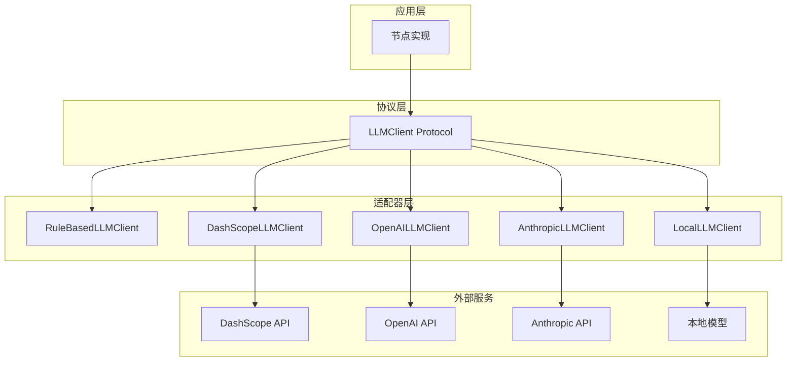
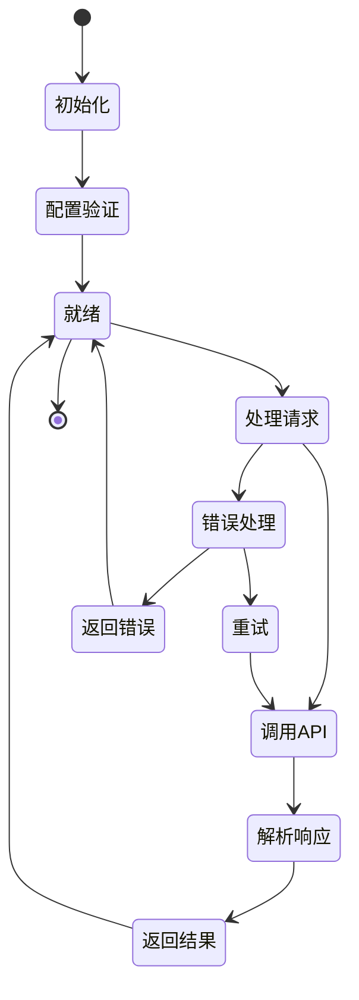

# 第4章 自定义LLM适配器

## 4.1 问题背景与设计动机

### 4.1.1 为什么需要自定义适配器

在构建深度研究系统时，LLM 适配器是核心组件之一。不同的场景需要不同的 LLM 提供商：

1. **成本敏感**：某些场景需要使用低成本的本地模型
2. **性能需求**：某些场景需要低延迟的云端模型
3. **合规要求**：某些场景需要使用特定地区的模型
4. **功能需求**：某些场景需要特定的模型能力（如长上下文、多模态等）

### 4.1.2 设计动机

自定义 LLM 适配器的设计动机源于以下需求：

1. **统一接口**：所有 LLM 提供商使用相同的接口
2. **易于切换**：可以在运行时切换不同的 LLM 提供商
3. **易于测试**：可以使用 mock 对象进行测试
4. **易于扩展**：可以轻松添加新的 LLM 提供商

## 4.2 方案对比表

### 4.2.1 LLM 提供商对比

| 提供商 | 模型 | 延迟 | 成本 | 特点 |
|--------|------|------|------|------|
| **DashScope** | Qwen 系列 | 100-500ms | 低 | 中文优化 |
| **OpenAI** | GPT 系列 | 200-1000ms | 中 | 多语言支持 |
| **Anthropic** | Claude 系列 | 200-800ms | 中 | 长上下文 |
| **本地模型** | Llama 等 | 50-200ms | 免费 | 离线可用 |
| **RuleBased** | 规则引擎 | < 1ms | 免费 | 确定性输出 |

### 4.2.2 适配器实现对比

| 特性 | RuleBasedLLMClient | DashScopeLLMClient | OpenAILLMClient |
|------|--------------------|--------------------|-----------------|
| 依赖 | 无 | dashscope | openai |
| 输出 | 确定性 | 随机性 | 随机性 |
| 能力 | 简单规则 | 复杂推理 | 复杂推理 |
| 成本 | 免费 | 按量付费 | 按量付费 |
| 延迟 | < 1ms | 100-1000ms | 200-1000ms |
| 测试 | 简单 | 需要 mock | 需要 mock |

## 4.3 架构图

### 4.3.1 适配器模式架构



### 4.3.2 适配器生命周期



## 4.4 核心实现详解

### 4.4.1 LLMClient Protocol 详解

**Protocol 定义** `research_agents/adapters/llm.py`：
```python
from typing import Protocol, Any


class LLMClient(Protocol):
    """LLM 客户端协议
    
    定义了与 LLM 交互的 7 个核心方法。所有 LLM 适配器必须实现此协议。
    
    使用方法:
        class MyLLMClient:
            def classify_intent(self, query: str) -> str:
                # 实现意图分类
                ...
            
            # 实现其他方法...
        
        # 使用
        client = MyLLMClient()
        intent = client.classify_intent("What is RAG?")
    """
    
    def classify_intent(self, query: str) -> str:
        """分类用户意图
        
        将用户查询分类为 "direct"（直接回答）或 "research"（需要研究）。
        
        Args:
            query: 用户查询字符串
            
        Returns:
            意图分类，"direct" 或 "research"
            
        Example:
            >>> client.classify_intent("What is the capital of France?")
            "direct"
            >>> client.classify_intent("Compare RAG and multi-agent workflows")
            "research"
        """
        ...
    
    def answer_direct(self, query: str, memory_context: str = "") -> str:
        """直接回答简单问题
        
        对于简单问题，直接返回答案，不需要研究流程。
        
        Args:
            query: 用户查询
            memory_context: 内存上下文，包含历史对话信息
            
        Returns:
            直接回答文本
            
        Example:
            >>> client.answer_direct("What is Python?")
            "Python is a high-level programming language..."
        """
        ...
    
    def plan_research(self, query: str) -> dict:
        """生成研究计划
        
        为复杂查询生成研究计划，包括子问题和搜索策略。
        
        Args:
            query: 用户查询
            
        Returns:
            研究计划字典，包含:
            - summary: 计划摘要
            - sub_questions: 子问题列表
            - search_plan: 搜索计划列表，每个包含 query、source、reason
            
        Example:
            >>> plan = client.plan_research("Compare RAG and multi-agent workflows")
            >>> print(plan["sub_questions"])
            ["What is RAG?", "What are multi-agent workflows?", ...]
        """
        ...
    
    def judge_evidence(self, query: str, records: list[dict]) -> list[dict]:
        """判断证据相关性
        
        评估收集到的证据与查询的相关性，并添加评分和支持的声明。
        
        Args:
            query: 用户查询
            records: 原始证据列表，每个证据是字典
            
        Returns:
            评估后的证据列表，每个证据添加:
            - relevance_score: 相关性评分 (0.0-1.0)
            - supports: 支持的声明列表
            
        Example:
            >>> evidence = [{"title": "RAG paper", "content": "..."}]
            >>> judged = client.judge_evidence("What is RAG?", evidence)
            >>> print(judged[0]["relevance_score"])
            0.85
        """
        ...
    
    def analyze(self, query: str, evidence: list[dict]) -> dict:
        """分析证据
        
        基于收集到的证据进行分析，提取发现和信息缺口。
        
        Args:
            query: 用户查询
            evidence: 证据列表
            
        Returns:
            分析结果字典，包含:
            - findings: 发现列表，每个包含 claim、supporting_source_ids、confidence
            - missing_gaps: 信息缺口列表
            
        Example:
            >>> result = client.analyze("What is RAG?", evidence)
            >>> print(result["findings"][0]["claim"])
            "RAG combines retrieval with generation..."
        """
        ...
    
    def reflect(self, query: str, missing_gaps: list[str]) -> list[dict]:
        """反思缺失信息
        
        基于信息缺口生成补充查询。
        
        Args:
            query: 用户查询
            missing_gaps: 信息缺口列表
            
        Returns:
            补充查询列表，每个包含 query、source、reason
            
        Example:
            >>> gaps = ["No evidence for performance comparison"]
            >>> queries = client.reflect("Compare RAG and agents", gaps)
            >>> print(queries[0]["query"])
            "RAG vs agents performance benchmarks"
        """
        ...
    
    def write_report(self, query: str, findings: list[dict], sources: list[dict]) -> str:
        """生成最终报告
        
        基于发现和来源生成最终研究报告。
        
        Args:
            query: 用户查询
            findings: 发现列表
            sources: 来源列表
            
        Returns:
            最终报告文本，支持 Markdown 格式
            
        Example:
            >>> report = client.write_report("What is RAG?", findings, sources)
            >>> print(report[:100])
            "# Research Report: What is RAG?\n\n## Executive Summary..."
        """
        ...
```

**关键点说明**：
1. **7 个方法**：覆盖了研究流程的所有环节
2. **类型注解**：每个方法都有完整的类型注解
3. **文档字符串**：每个方法都有详细的文档说明
4. **示例代码**：每个方法都有使用示例

### 4.4.2 RuleBasedLLMClient 详解

**完整实现** `research_agents/adapters/llm.py`：
```python
class RuleBasedLLMClient:
    """基于规则的 LLM 客户端
    
    使用规则引擎实现 LLMClient 协议，不需要任何 API 密钥。
    适用于学习、测试和原型开发。
    
    特点:
        - 确定性输出：相同输入总是产生相同输出
        - 零依赖：不需要任何外部服务
        - 快速响应：延迟 < 1ms
    
    使用方法:
        client = RuleBasedLLMClient()
        intent = client.classify_intent("What is RAG?")  # 返回 "direct"
    """
    
    def classify_intent(self, query: str) -> str:
        """使用关键词匹配分类意图
        
        分类逻辑:
        1. 将查询转换为小写
        2. 检查是否包含研究相关关键词
        3. 如果包含，返回 "research"，否则返回 "direct"
        
        研究关键词: research, compare, market, trend, evidence, 
                   sources, report, analysis, strategy
        """
        lowered = query.lower()
        research_markers = {
            "research", "compare", "market", "trend",
            "evidence", "sources", "report", "analysis", "strategy"
        }
        return "research" if any(marker in lowered for marker in research_markers) else "direct"
    
    def answer_direct(self, query: str, memory_context: str = "") -> str:
        """生成直接回答模板
        
        返回格式化的模板回答，包含查询和可选的内存上下文。
        """
        context = f"\n\nMemory context:\n{memory_context}" if memory_context else ""
        return f"Direct scaffold response for: {query}{context}"
    
    def plan_research(self, query: str) -> dict:
        """生成固定的研究计划模板
        
        返回包含以下内容的固定模板:
        - summary: 计划摘要
        - sub_questions: 3 个子问题
        - search_plan: 3 个搜索任务（hybrid、web、local）
        """
        return {
            "summary": f"Research plan for: {query}",
            "sub_questions": [
                f"What is the current context for {query}?",
                f"What evidence supports the main claims about {query}?",
                f"What risks or tradeoffs should be considered for {query}?",
            ],
            "search_plan": [
                {"query": query, "source": "hybrid", "reason": "original user question"},
                {"query": f"{query} evidence sources", "source": "web", "reason": "external evidence"},
                {"query": f"{query} internal notes", "source": "local", "reason": "local knowledge"},
            ],
        }
    
    def judge_evidence(self, query: str, records: list[dict]) -> list[dict]:
        """为每个证据添加默认评分
        
        处理逻辑:
        1. 遍历所有证据记录
        2. 为每个证据添加 source_id（如果缺失）
        3. 设置默认相关性评分为 0.75
        4. 设置支持的声明为查询本身
        """
        judged = []
        for idx, record in enumerate(records, 1):
            item = dict(record)
            item.setdefault("source_id", f"SRC-{idx}")
            item["relevance_score"] = 0.75
            item["supports"] = [query]
            judged.append(item)
        return judged
    
    def analyze(self, query: str, evidence: list[dict]) -> dict:
        """基于证据数量生成分析结果
        
        分析逻辑:
        1. 如果有证据，生成一个中等置信度的发现
        2. 如果没有证据，生成一个低置信度的发现
        3. 如果没有证据，添加 "No evidence was collected" 作为信息缺口
        """
        findings = [
            {
                "claim": f"Initial scaffold finding for: {query}",
                "supporting_source_ids": [item.get("source_id") for item in evidence[:3]],
                "confidence": "medium" if evidence else "low",
            }
        ]
        missing_gaps = [] if evidence else ["No evidence was collected"]
        return {"findings": findings, "missing_gaps": missing_gaps}
    
    def reflect(self, query: str, missing_gaps: list[str]) -> list[dict]:
        """基于信息缺口生成补充查询
        
        反思逻辑:
        1. 如果没有信息缺口，返回空列表
        2. 如果有信息缺口，生成一个补充查询
        """
        if not missing_gaps:
            return []
        return [
            {
                "query": f"{query} missing evidence",
                "source": "hybrid",
                "reason": "; ".join(missing_gaps),
            }
        ]
    
    def write_report(self, query: str, findings: list[dict], sources: list[dict]) -> str:
        """生成 Markdown 格式的报告
        
        报告结构:
        1. 标题：Research Result: {query}
        2. Findings 部分：列出所有发现
        3. Sources 部分：列出所有来源
        """
        lines = [f"# Research Result: {query}", ""]
        lines.append("## Findings")
        if findings:
            for idx, finding in enumerate(findings, 1):
                source_ids = ", ".join(str(item) for item in finding.get("supporting_source_ids", []) if item)
                suffix = f" [{source_ids}]" if source_ids else ""
                lines.append(f"{idx}. {finding.get('claim', 'Finding')}{suffix}")
        else:
            lines.append("- No findings were produced.")
        lines.extend(["", "## Sources"])
        if sources:
            for source in sources:
                lines.append(f"- {source.get('source_id')}: {source.get('label')} ({source.get('locator')})")
        else:
            lines.append("- No sources.")
        return "\n".join(lines)
```

**关键点说明**：
1. **确定性输出**：相同输入总是产生相同输出
2. **零依赖**：不需要任何外部服务或 API 密钥
3. **完整实现**：实现了 LLMClient 协议的所有 7 个方法
4. **详细文档**：每个方法都有详细的文档说明

### 4.4.3 DashScopeLLMClient 实现

**完整实现** `research_agents/adapters/dashscope_llm.py`：
```python
from __future__ import annotations

import json
import os
from typing import Any

import dashscope
from dashscope import Generation

from .llm import LLMClient


class DashScopeLLMClient:
    """DashScope LLM 客户端
    
    集成阿里云 DashScope 服务，支持 Qwen 系列模型。
    
    配置:
        - DASHSCOPE_API_KEY: API 密钥
        - DASHSCOPE_MODEL: 模型名称（默认 qwen-turbo）
    
    使用方法:
        client = DashScopeLLMClient()
        intent = client.classify_intent("What is RAG?")
    """
    
    def __init__(self, api_key: str | None = None, model: str | None = None):
        """初始化 DashScope 客户端
        
        Args:
            api_key: DashScope API 密钥，默认从环境变量读取
            model: 模型名称，默认从环境变量读取或使用 qwen-turbo
        """
        self.api_key = api_key or os.getenv("DASHSCOPE_API_KEY")
        if not self.api_key:
            raise ValueError(
                "DASHSCOPE_API_KEY is required. "
                "Get it from https://dashscope.console.aliyun.com/"
            )
        self.model = model or os.getenv("DASHSCOPE_MODEL", "qwen-turbo")
        dashscope.api_key = self.api_key
    
    def classify_intent(self, query: str) -> str:
        """使用 LLM 分类意图"""
        prompt = f"""Classify the following query as either "direct" or "research".

- "direct": Simple factual questions that can be answered directly
  Examples: "What is the capital of France?", "How to install Python?"

- "research": Complex questions requiring research, comparison, or analysis
  Examples: "Compare RAG and multi-agent workflows", "Analyze market trends for AI"

Query: {query}

Classification:"""
        
        response = self._call_llm(prompt, max_tokens=50)
        return "research" if "research" in response.lower() else "direct"
    
    def answer_direct(self, query: str, memory_context: str = "") -> str:
        """直接回答"""
        prompt = f"""Answer the following question directly and concisely.
{f"Context: {memory_context}" if memory_context else ""}

Question: {query}

Answer:"""
        
        return self._call_llm(prompt, max_tokens=500)
    
    def plan_research(self, query: str) -> dict:
        """生成研究计划"""
        prompt = f"""Create a research plan for the following query.

Query: {query}

Return a JSON object with:
- summary: Brief summary of the research plan
- sub_questions: List of sub-questions to investigate (3-5 items)
- search_plan: List of search tasks, each with:
  - query: Search query string
  - source: "web", "local", or "hybrid"
  - reason: Why this search is needed

JSON:"""
        
        response = self._call_llm(prompt, max_tokens=1000)
        return self._parse_json(response, fallback={
            "summary": f"Research plan for: {query}",
            "sub_questions": [query],
            "search_plan": [{"query": query, "source": "hybrid", "reason": "original question"}],
        })
    
    def judge_evidence(self, query: str, records: list[dict]) -> list[dict]:
        """判断证据相关性"""
        if not records:
            return []
        
        prompt = f"""Evaluate the relevance of the following evidence for the query.

Query: {query}

Evidence (first 10 items):
{json.dumps(records[:10], ensure_ascii=False, indent=2)}

For each evidence item, add:
- relevance_score: Float between 0.0 and 1.0
- supports: List of claims this evidence supports

Return the enhanced evidence list as JSON array:"""
        
        response = self._call_llm(prompt, max_tokens=2000)
        result = self._parse_json(response, fallback=None)
        
        if isinstance(result, list) and len(result) > 0:
            return result
        
        # Fallback: add default scores
        for idx, record in enumerate(records):
            record["relevance_score"] = 0.75
            record["supports"] = [query]
        return records
    
    def analyze(self, query: str, evidence: list[dict]) -> dict:
        """分析证据"""
        prompt = f"""Analyze the following evidence and extract findings.

Query: {query}

Evidence:
{json.dumps(evidence[:10], ensure_ascii=False, indent=2)}

Return a JSON object with:
- findings: List of findings, each with:
  - claim: The main claim or insight
  - supporting_source_ids: List of source IDs that support this claim
  - confidence: "high", "medium", or "low"
- missing_gaps: List of information gaps that need to be filled

JSON:"""
        
        response = self._call_llm(prompt, max_tokens=1500)
        return self._parse_json(response, fallback={
            "findings": [{"claim": f"Analysis for: {query}", "supporting_source_ids": [], "confidence": "low"}],
            "missing_gaps": ["Failed to parse analysis"],
        })
    
    def reflect(self, query: str, missing_gaps: list[str]) -> list[dict]:
        """反思缺失信息"""
        if not missing_gaps:
            return []
        
        prompt = f"""Create follow-up search queries to fill the following information gaps.

Query: {query}

Missing gaps:
{chr(10).join(f"- {gap}" for gap in missing_gaps)}

Return a JSON array of search tasks, each with:
- query: Search query string
- source: "web", "local", or "hybrid"
- reason: How this search fills the gap

JSON:"""
        
        response = self._call_llm(prompt, max_tokens=1000)
        result = self._parse_json(response, fallback=None)
        
        if isinstance(result, list) and len(result) > 0:
            return result
        
        # Fallback
        return [{"query": f"{query} missing evidence", "source": "hybrid", "reason": "; ".join(missing_gaps)}]
    
    def write_report(self, query: str, findings: list[dict], sources: list[dict]) -> str:
        """生成最终报告"""
        prompt = f"""Write a comprehensive research report based on the following findings and sources.

Query: {query}

Findings:
{json.dumps(findings, ensure_ascii=False, indent=2)}

Sources:
{json.dumps(sources, ensure_ascii=False, indent=2)}

Structure the report with:
1. # Title: Research topic
2. ## Executive Summary: Brief overview
3. ## Key Findings: Main insights with evidence
4. ## Detailed Analysis: In-depth discussion
5. ## Conclusion: Summary and recommendations
6. ## References: List of sources

Write in clear, professional Markdown format.

Report:"""
        
        return self._call_llm(prompt, max_tokens=3000)
    
    def _call_llm(self, prompt: str, max_tokens: int = 2000, temperature: float = 0.7) -> str:
        """调用 DashScope API
        
        Args:
            prompt: 提示词
            max_tokens: 最大生成 token 数
            temperature: 温度参数，控制随机性
            
        Returns:
            生成的文本
            
        Raises:
            RuntimeError: API 调用失败
        """
        try:
            response = Generation.call(
                model=self.model,
                prompt=prompt,
                max_tokens=max_tokens,
                temperature=temperature,
                top_p=0.8,
            )
            
            if response.status_code == 200:
                return response.output.text
            else:
                raise RuntimeError(
                    f"DashScope API error: {response.code} - {response.message}"
                )
        except Exception as e:
            raise RuntimeError(f"Failed to call DashScope: {e}")
    
    def _parse_json(self, text: str, fallback: Any = None) -> Any:
        """解析 JSON 响应
        
        尝试从文本中提取 JSON，支持以下格式:
        1. 纯 JSON
        2. 包含在 ```json ... ``` 中的 JSON
        3. 包含在 { ... } 或 [ ... ] 中的 JSON
        
        Args:
            text: 包含 JSON 的文本
            fallback: 解析失败时的默认值
            
        Returns:
            解析后的对象，或 fallback
        """
        # 尝试直接解析
        try:
            return json.loads(text)
        except json.JSONDecodeError:
            pass
        
        # 尝试提取 ```json ... ```
        if "```json" in text:
            start = text.index("```json") + 7
            end = text.index("```", start)
            try:
                return json.loads(text[start:end].strip())
            except json.JSONDecodeError:
                pass
        
        # 尝试提取 { ... } 或 [ ... ]
        for start_char, end_char in [("{", "}"), ("[", "]")]:
            if start_char in text:
                start = text.index(start_char)
                # 找到匹配的结束字符
                depth = 0
                for i, char in enumerate(text[start:], start):
                    if char == start_char:
                        depth += 1
                    elif char == end_char:
                        depth -= 1
                        if depth == 0:
                            try:
                                return json.loads(text[start:i + 1])
                            except json.JSONDecodeError:
                                break
        
        return fallback
```

**关键点说明**：
1. **完整实现**：实现了 LLMClient 协议的所有 7 个方法
2. **错误处理**：包含完善的错误处理和降级逻辑
3. **JSON 解析**：支持多种 JSON 格式的解析
4. **配置灵活**：支持通过环境变量或构造函数配置

### 4.4.4 OpenAILLMClient 实现

**完整实现** `research_agents/adapters/openai_llm.py`：
```python
from __future__ import annotations

import json
import os
from typing import Any

from openai import OpenAI

from .llm import LLMClient


class OpenAILLMClient:
    """OpenAI LLM 客户端
    
    集成 OpenAI 服务，支持 GPT 系列模型。
    
    配置:
        - OPENAI_API_KEY: API 密钥
        - OPENAI_MODEL: 模型名称（默认 gpt-4o-mini）
        - OPENAI_BASE_URL: 自定义 API 端点（可选）
    
    使用方法:
        client = OpenAILLMClient()
        intent = client.classify_intent("What is RAG?")
    """
    
    def __init__(
        self,
        api_key: str | None = None,
        model: str | None = None,
        base_url: str | None = None,
    ):
        """初始化 OpenAI 客户端
        
        Args:
            api_key: OpenAI API 密钥，默认从环境变量读取
            model: 模型名称，默认从环境变量读取或使用 gpt-4o-mini
            base_url: 自定义 API 端点，用于兼容 OpenAI API 的其他服务
        """
        self.api_key = api_key or os.getenv("OPENAI_API_KEY")
        if not self.api_key:
            raise ValueError(
                "OPENAI_API_KEY is required. "
                "Get it from https://platform.openai.com/api-keys"
            )
        self.model = model or os.getenv("OPENAI_MODEL", "gpt-4o-mini")
        self.base_url = base_url or os.getenv("OPENAI_BASE_URL")
        
        self.client = OpenAI(
            api_key=self.api_key,
            base_url=self.base_url,
        )
    
    def classify_intent(self, query: str) -> str:
        """使用 LLM 分类意图"""
        response = self.client.chat.completions.create(
            model=self.model,
            messages=[
                {"role": "system", "content": "You are a helpful assistant that classifies user queries."},
                {"role": "user", "content": f"""Classify the following query as either "direct" or "research".

- "direct": Simple factual questions that can be answered directly
- "research": Complex questions requiring research, comparison, or analysis

Query: {query}

Classification:"""}
            ],
            max_tokens=50,
            temperature=0,
        )
        
        result = response.choices[0].message.content.strip().lower()
        return "research" if "research" in result else "direct"
    
    def answer_direct(self, query: str, memory_context: str = "") -> str:
        """直接回答"""
        messages = [
            {"role": "system", "content": "You are a helpful assistant. Answer questions directly and concisely."}
        ]
        
        if memory_context:
            messages.append({"role": "user", "content": f"Context:\n{memory_context}"})
        
        messages.append({"role": "user", "content": query})
        
        response = self.client.chat.completions.create(
            model=self.model,
            messages=messages,
            max_tokens=500,
            temperature=0.7,
        )
        
        return response.choices[0].message.content
    
    def plan_research(self, query: str) -> dict:
        """生成研究计划"""
        response = self.client.chat.completions.create(
            model=self.model,
            messages=[
                {"role": "system", "content": "You are a research planning assistant."},
                {"role": "user", "content": f"""Create a research plan for the following query.

Query: {query}

Return a JSON object with:
- summary: Brief summary of the research plan
- sub_questions: List of sub-questions to investigate (3-5 items)
- search_plan: List of search tasks, each with:
  - query: Search query string
  - source: "web", "local", or "hybrid"
  - reason: Why this search is needed

JSON:"""}
            ],
            max_tokens=1000,
            temperature=0.7,
        )
        
        content = response.choices[0].message.content
        return self._parse_json(content, fallback={
            "summary": f"Research plan for: {query}",
            "sub_questions": [query],
            "search_plan": [{"query": query, "source": "hybrid", "reason": "original question"}],
        })
    
    def judge_evidence(self, query: str, records: list[dict]) -> list[dict]:
        """判断证据相关性"""
        if not records:
            return []
        
        response = self.client.chat.completions.create(
            model=self.model,
            messages=[
                {"role": "system", "content": "You are an evidence evaluation assistant."},
                {"role": "user", "content": f"""Evaluate the relevance of the following evidence for the query.

Query: {query}

Evidence (first 10 items):
{json.dumps(records[:10], ensure_ascii=False, indent=2)}

For each evidence item, add:
- relevance_score: Float between 0.0 and 1.0
- supports: List of claims this evidence supports

Return the enhanced evidence list as JSON array:"""}
            ],
            max_tokens=2000,
            temperature=0,
        )
        
        content = response.choices[0].message.content
        result = self._parse_json(content, fallback=None)
        
        if isinstance(result, list) and len(result) > 0:
            return result
        
        # Fallback
        for idx, record in enumerate(records):
            record["relevance_score"] = 0.75
            record["supports"] = [query]
        return records
    
    def analyze(self, query: str, evidence: list[dict]) -> dict:
        """分析证据"""
        response = self.client.chat.completions.create(
            model=self.model,
            messages=[
                {"role": "system", "content": "You are a research analysis assistant."},
                {"role": "user", "content": f"""Analyze the following evidence and extract findings.

Query: {query}

Evidence:
{json.dumps(evidence[:10], ensure_ascii=False, indent=2)}

Return a JSON object with:
- findings: List of findings, each with:
  - claim: The main claim or insight
  - supporting_source_ids: List of source IDs that support this claim
  - confidence: "high", "medium", or "low"
- missing_gaps: List of information gaps that need to be filled

JSON:"""}
            ],
            max_tokens=1500,
            temperature=0,
        )
        
        content = response.choices[0].message.content
        return self._parse_json(content, fallback={
            "findings": [{"claim": f"Analysis for: {query}", "supporting_source_ids": [], "confidence": "low"}],
            "missing_gaps": ["Failed to parse analysis"],
        })
    
    def reflect(self, query: str, missing_gaps: list[str]) -> list[dict]:
        """反思缺失信息"""
        if not missing_gaps:
            return []
        
        response = self.client.chat.completions.create(
            model=self.model,
            messages=[
                {"role": "system", "content": "You are a research planning assistant."},
                {"role": "user", "content": f"""Create follow-up search queries to fill the following information gaps.

Query: {query}

Missing gaps:
{chr(10).join(f"- {gap}" for gap in missing_gaps)}

Return a JSON array of search tasks, each with:
- query: Search query string
- source: "web", "local", or "hybrid"
- reason: How this search fills the gap

JSON:"""}
            ],
            max_tokens=1000,
            temperature=0.7,
        )
        
        content = response.choices[0].message.content
        result = self._parse_json(content, fallback=None)
        
        if isinstance(result, list) and len(result) > 0:
            return result
        
        return [{"query": f"{query} missing evidence", "source": "hybrid", "reason": "; ".join(missing_gaps)}]
    
    def write_report(self, query: str, findings: list[dict], sources: list[dict]) -> str:
        """生成最终报告"""
        response = self.client.chat.completions.create(
            model=self.model,
            messages=[
                {"role": "system", "content": "You are a professional report writer."},
                {"role": "user", "content": f"""Write a comprehensive research report based on the following findings and sources.

Query: {query}

Findings:
{json.dumps(findings, ensure_ascii=False, indent=2)}

Sources:
{json.dumps(sources, ensure_ascii=False, indent=2)}

Structure the report with:
1. # Title: Research topic
2. ## Executive Summary: Brief overview
3. ## Key Findings: Main insights with evidence
4. ## Detailed Analysis: In-depth discussion
5. ## Conclusion: Summary and recommendations
6. ## References: List of sources

Write in clear, professional Markdown format.

Report:"""}
            ],
            max_tokens=3000,
            temperature=0.7,
        )
        
        return response.choices[0].message.content
    
    def _parse_json(self, text: str, fallback: Any = None) -> Any:
        """解析 JSON 响应"""
        # 尝试直接解析
        try:
            return json.loads(text)
        except json.JSONDecodeError:
            pass
        
        # 尝试提取 ```json ... ```
        if "```json" in text:
            start = text.index("```json") + 7
            end = text.index("```", start)
            try:
                return json.loads(text[start:end].strip())
            except json.JSONDecodeError:
                pass
        
        # 尝试提取 { ... } 或 [ ... ]
        for start_char, end_char in [("{", "}"), ("[", "]")]:
            if start_char in text:
                start = text.index(start_char)
                depth = 0
                for i, char in enumerate(text[start:], start):
                    if char == start_char:
                        depth += 1
                    elif char == end_char:
                        depth -= 1
                        if depth == 0:
                            try:
                                return json.loads(text[start:i + 1])
                            except json.JSONDecodeError:
                                break
        
        return fallback
```

**关键点说明**：
1. **Chat Completions API**：使用 OpenAI 的 Chat Completions API
2. **消息格式**：使用标准的消息格式（system、user、assistant）
3. **自定义端点**：支持通过 base_url 使用兼容 OpenAI API 的其他服务
4. **JSON 解析**：支持多种 JSON 格式的解析

## 4.5 关键点说明

### 4.5.1 适配器模式的优势

1. **统一接口**：所有适配器使用相同的接口，便于切换
2. **易于测试**：可以使用 mock 对象进行测试
3. **易于扩展**：可以轻松添加新的适配器
4. **关注点分离**：每个适配器只负责与特定 LLM 服务交互

### 4.5.2 错误处理策略

1. **重试机制**：对于临时性错误，可以自动重试
2. **降级处理**：当主服务不可用时，可以降级到备用服务
3. **超时控制**：设置合理的超时时间，避免长时间等待
4. **错误记录**：记录所有错误，便于排查问题

### 4.5.3 性能优化策略

1. **缓存结果**：缓存频繁调用的结果，减少 API 调用
2. **批量处理**：批量调用 API，减少请求次数
3. **异步调用**：使用异步调用，提高并发性能
4. **连接池**：使用连接池，复用 HTTP 连接

## 4.6 最佳实践

### 4.6.1 适配器选择指南

| 场景 | 推荐适配器 | 原因 |
|------|------------|------|
| 学习/测试 | RuleBasedLLMClient | 零依赖，确定性输出 |
| 中文场景 | DashScopeLLMClient | 中文优化，成本低 |
| 多语言场景 | OpenAILLMClient | 多语言支持，能力强 |
| 离线场景 | LocalLLMClient | 离线可用，无成本 |
| 高并发场景 | AsyncLLMClient | 异步调用，高并发 |

### 4.6.2 测试策略

**单元测试示例**：
```python
import pytest
from unittest.mock import Mock, patch

from research_agents.adapters.llm import RuleBasedLLMClient


class TestRuleBasedLLMClient:
    """RuleBasedLLMClient 单元测试"""
    
    def setup_method(self):
        """测试前准备"""
        self.client = RuleBasedLLMClient()
    
    def test_classify_intent_direct(self):
        """测试直接意图分类"""
        assert self.client.classify_intent("What is Python?") == "direct"
        assert self.client.classify_intent("How to install Python?") == "direct"
    
    def test_classify_intent_research(self):
        """测试研究意图分类"""
        assert self.client.classify_intent("Compare Python and Java") == "research"
        assert self.client.classify_intent("Analyze market trends") == "research"
    
    def test_answer_direct(self):
        """测试直接回答"""
        result = self.client.answer_direct("What is Python?")
        assert "Python" in result
    
    def test_plan_research(self):
        """测试研究计划生成"""
        plan = self.client.plan_research("Compare Python and Java")
        assert "summary" in plan
        assert "sub_questions" in plan
        assert "search_plan" in plan
        assert len(plan["sub_questions"]) > 0
        assert len(plan["search_plan"]) > 0
    
    def test_judge_evidence(self):
        """测试证据判断"""
        evidence = [{"title": "Test", "content": "Content"}]
        result = self.client.judge_evidence("Test query", evidence)
        assert len(result) == 1
        assert "relevance_score" in result[0]
        assert "supports" in result[0]
    
    def test_analyze(self):
        """测试分析"""
        result = self.client.analyze("Test query", [])
        assert "findings" in result
        assert "missing_gaps" in result
    
    def test_reflect(self):
        """测试反思"""
        result = self.client.reflect("Test query", ["Gap 1", "Gap 2"])
        assert len(result) > 0
        assert "query" in result[0]
    
    def test_write_report(self):
        """测试报告生成"""
        report = self.client.write_report("Test", [], [])
        assert "Research Result" in report
        assert "Findings" in report
        assert "Sources" in report


class TestDashScopeLLMClient:
    """DashScopeLLMClient 单元测试（使用 mock）"""
    
    @patch("research_agents.adapters.dashscope_llm.dashscope")
    def test_classify_intent(self, mock_dashscope):
        """测试意图分类（mock）"""
        # Mock API 响应
        mock_response = Mock()
        mock_response.status_code = 200
        mock_response.output.text = "research"
        mock_dashscope.Generation.call.return_value = mock_response
        
        from research_agents.adapters.dashscope_llm import DashScopeLLMClient
        client = DashScopeLLMClient(api_key="test-key")
        result = client.classify_intent("Compare Python and Java")
        
        assert result == "research"
        mock_dashscope.Generation.call.assert_called_once()
```

### 4.6.3 部署建议

1. **环境变量管理**：使用环境变量管理 API 密钥
2. **配置管理**：使用配置文件管理模型参数
3. **监控告警**：监控 API 调用延迟和错误率
4. **成本控制**：设置 API 调用预算和告警

## 4.7 总结

本章详细介绍了如何自定义 LLM 适配器：

1. **LLMClient Protocol**：7 个核心方法，覆盖研究流程的所有环节
2. **RuleBasedLLMClient**：规则引擎实现，适用于学习和测试
3. **DashScopeLLMClient**：阿里云 DashScope 实现，适用于中文场景
4. **OpenAILLMClient**：OpenAI 实现，适用于多语言场景

通过本章的学习，你应该能够：
- 理解 LLMClient Protocol 的设计原理
- 实现自定义的 LLM 适配器
- 为适配器编写单元测试
- 选择合适的适配器用于不同场景

适配器模式是 `deep_research_scaffold` 的核心设计模式之一，它使得系统具有高度的可扩展性和可维护性。
