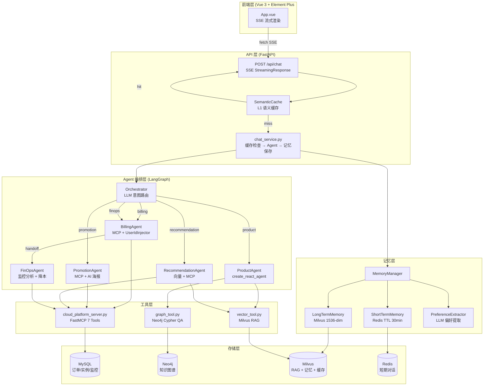
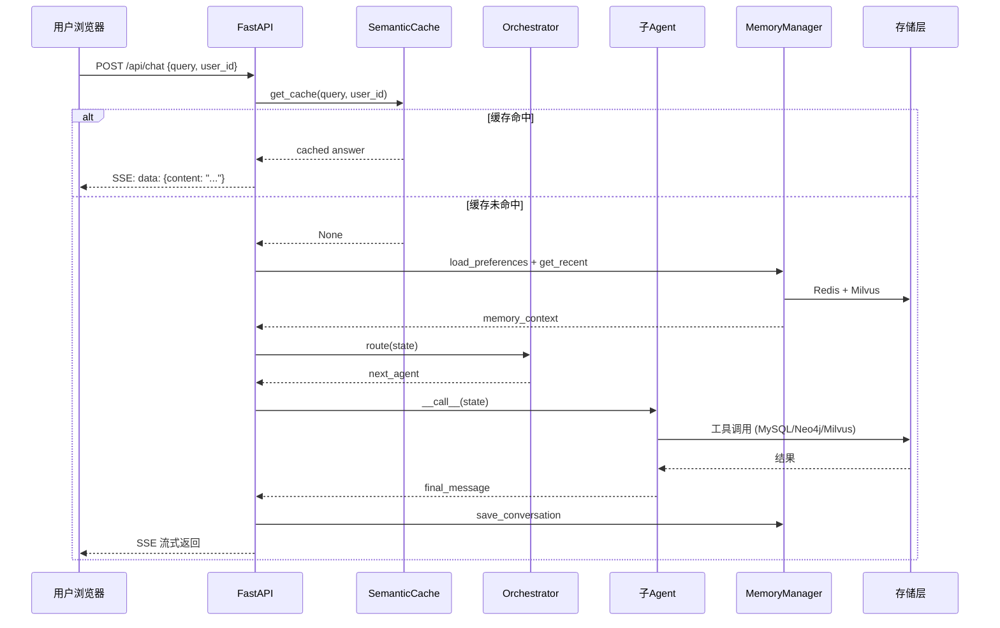
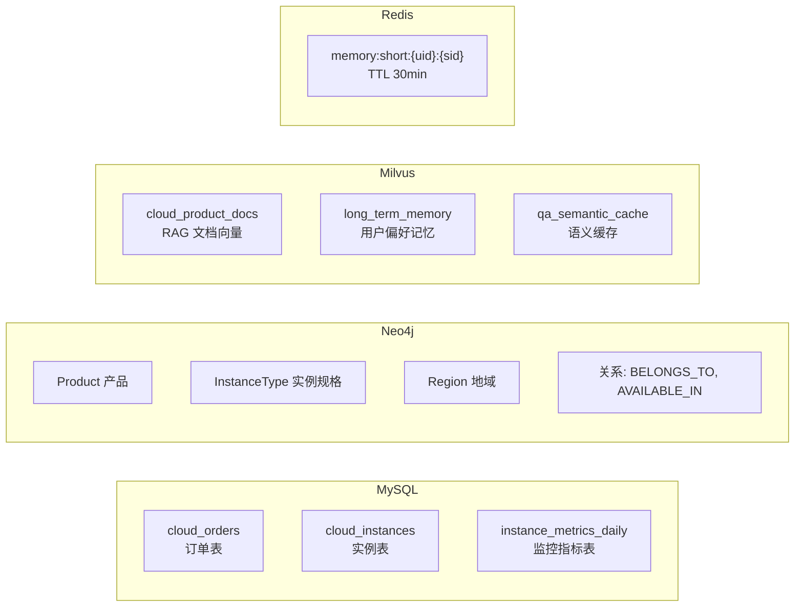
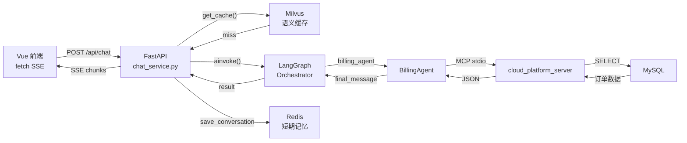

# 第一章：项目概述与系统架构

## 1.1 问题背景与设计动机

### 1.1.1 业务场景

在云计算行业高速发展的今天，云平台客服面临着前所未有的挑战：用户咨询量激增、问题类型多样化（产品选型、账单查询、成本优化、营销推广），传统单一客服机器人已无法满足复杂多变的业务需求。

**核心痛点：**

| 痛点 | 传统方案 | 本项目方案 |
|------|----------|------------|
| 用户问题类型多样，单一模型难以覆盖 | 单一意图分类 + 规则路由 | 多智能体编排，专业 Agent 各司其职 |
| 个人资产查询存在越权风险 | 后端接口鉴权 | MCP 拦截器强制注入 user_id |
| 高频问题重复消耗 LLM Token | 无缓存 | L1 语义缓存（Milvus 向量相似度） |
| 用户偏好无法跨会话记忆 | Cookie/Session | 短期 Redis + 长期 Milvus 双层记忆 |
| 产品知识结构化程度低 | 关键词搜索 | Neo4j 知识图谱 + RAG 向量检索 |

### 1.1.2 项目定位

`cloud_agent` 是一个面向云平台的**多智能体客服系统**，基于 LangGraph 编排框架，整合了知识图谱（Neo4j）、向量数据库（Milvus）、关系数据库（MySQL）和缓存（Redis）四大存储引擎，实现了从意图识别、智能路由、工具调用到记忆管理的完整闭环。

---

## 1.2 系统架构总览

### 1.2.1 架构图



### 1.2.2 请求处理流程



---

## 1.3 技术栈详解

### 1.3.1 技术栈对照表

| 层级 | 技术 | 版本 | 用途 |
|------|------|------|------|
| **前端** | Vue 3 | 3.5.x | 响应式 UI 框架 |
| | Element Plus | 2.13.x | 企业级组件库 |
| | marked.js | 18.x | Markdown 实时渲染 |
| | Vite | 8.x | 构建工具 |
| **后端 API** | FastAPI | - | 异步 Web 框架，SSE 支持 |
| | uvicorn | - | ASGI 服务器 |
| **Agent 框架** | LangGraph | - | 多智能体状态图编排 |
| | LangChain | - | LLM 调用、工具链 |
| | langchain-mcp-adapters | 0.1.x | MCP 工具集成 |
| **MCP 服务** | FastMCP | - | MCP 工具服务器框架 |
| **LLM** | 通义千问 qwen-plus | - | 对话推理（DashScope API） |
| | text-embedding-v2 | - | 1536 维向量嵌入 |
| | qwen-image-2.0 | - | AI 文生图（海报生成） |
| **数据库** | MySQL | 8.x | 订单、实例、监控指标 |
| | Neo4j | 5.x | 知识图谱（Cypher 查询） |
| | Milvus | 2.6.x | 向量数据库（RAG + 记忆 + 缓存） |
| | Redis | 7.x | 短期对话缓存 |

### 1.3.2 四大存储引擎职责



---

## 1.4 项目目录结构

```
cloud_agent/
├── agent/                          # Agent 核心模块
│   ├── agents/                     # 智能体实现
│   │   ├── orchestrator.py         # 中心路由节点
│   │   ├── product_agent.py        # 产品咨询 Agent
│   │   ├── billing_agent.py        # 账单查询 Agent
│   │   ├── promotion_agent.py      # 推广营销 Agent
│   │   ├── recommendation_agent.py # 智能推荐 Agent
│   │   └── finops_agent.py         # 成本优化 Agent
│   ├── core/
│   │   ├── workflow/
│   │   │   ├── graph_manager.py    # LangGraph 状态图组装
│   │   │   └── state.py            # AgentState 全局状态定义
│   │   ├── memory/
│   │   │   ├── memory_manager.py   # 统一记忆管理器
│   │   │   ├── short_term.py       # Redis 短期记忆
│   │   │   ├── long_term.py        # Milvus 长期记忆
│   │   │   └── preference_extractor.py  # LLM 偏好提取
│   │   └── graph/
│   │       ├── models.py           # 知识图谱实体模型
│   │       ├── parser.py           # LLM 文档解析器
│   │       ├── ingestor.py         # Neo4j 数据摄入
│   │       └── client.py           # Neo4j 异步客户端
│   ├── tools/
│   │   ├── vector_tool.py          # Milvus 向量检索工具
│   │   └── graph_tool.py           # Neo4j 图谱查询工具
│   ├── mcp_servers/
│   │   └── cloud_platform_server.py # FastMCP 7 个工具
│   ├── database/
│   │   └── init_mock_data.sql      # MySQL 初始化脚本
│   ├── config/                     # MCP 服务器配置
│   ├── main.py                     # CLI 交互入口
│   └── .env                        # 环境变量
├── app/                            # FastAPI 后端
│   ├── app_main.py                 # FastAPI 应用入口
│   ├── router/chat.py              # SSE 路由
│   ├── service/chat_service.py     # 缓存+Agent+记忆服务
│   ├── infra/cache.py              # L1 语义缓存
│   ├── preload_cache.py            # 缓存预热脚本
│   └── schemas/                    # 请求/响应模型
├── front/cloud_agent/              # Vue 3 前端
│   ├── src/App.vue                 # 主界面（552 行）
│   └── package.json
└── mock_data/                      # 知识库文档
    ├── ecs_product_info.md         # ECS 产品信息
    ├── ecs_network_security.md     # 网络安全
    ├── billing_and_refund_policy.md # 账单退款政策
    ├── rds_product_info.md         # RDS 产品信息
    └── ...
```

---

## 1.5 Mock 数据结构

### 1.5.1 MySQL 模拟数据

系统使用三张核心表模拟云平台数据（参见 `agent/database/init_mock_data.sql`）：

**cloud_orders 表（订单表）：**

| 字段 | 类型 | 说明 |
|------|------|------|
| order_id | VARCHAR(50) PK | 订单唯一 ID |
| user_id | VARCHAR(50) | 用户 ID（索引） |
| product_name | VARCHAR(100) | 产品名称 |
| billing_mode | VARCHAR(20) | 计费模式 |
| amount | DECIMAL(10,2) | 订单金额 |
| status | VARCHAR(20) | Paid/Unpaid/Refunded |

**cloud_instances 表（实例表）：**

| 字段 | 类型 | 说明 |
|------|------|------|
| instance_id | VARCHAR(50) PK | 实例唯一 ID |
| user_id | VARCHAR(50) | 所属用户 |
| instance_type | VARCHAR(100) | 实例规格 |
| region_id / zone_id | VARCHAR(50) | 地域/可用区 |
| status | VARCHAR(20) | Running/Stopped |
| public_ip | VARCHAR(20) | 公网 IP |

**instance_metrics_daily 表（监控指标表）：**

| 字段 | 类型 | 说明 |
|------|------|------|
| instance_id | VARCHAR(50) | 实例 ID |
| metric_date | DATE | 统计日期 |
| avg_cpu_usage_percent | DECIMAL(5,2) | CPU 利用率 |
| avg_memory_usage_percent | DECIMAL(5,2) | 内存利用率 |
| max_network_out_mbps | DECIMAL(8,2) | 出口带宽峰值 |

**测试用户设计：**
- `user_1001`：高净值客户，购买企业级实例（g8a.4xlarge），CPU 极低（~2%），用于 FinOps 降本场景
- `user_1002`：个人开发者，购买经济型实例（c7.large），CPU 中等（~40%）

### 1.5.2 知识库文档（mock_data/）

| 文件名 | 内容 | 用途 |
|--------|------|------|
| `ecs_product_info.md` | ECS 产品介绍、规格族、地域 | ProductAgent RAG |
| `ecs_network_security.md` | 安全组、VPC、网卡限制 | ProductAgent 图谱 |
| `billing_and_refund_policy.md` | 退款规则、计费说明 | ProductAgent RAG |
| `rds_product_info.md` | RDS MySQL 产品信息 | ProductAgent RAG |
| `ticket_and_support_guide.md` | 工单系统使用指南 | ProductAgent RAG |
| `ecs_troubleshooting_guide.md` | ECS 故障排查手册 | ProductAgent RAG |

### 1.5.3 知识库 JSON 数据（mock_data/）

除了 Markdown 文档，`mock_data/` 目录还包含对应的 JSON 结构化数据，用于知识图谱构建：

```json
// mock_data/ecs_product_info.json 示例结构
{
  "products": [
    {
      "id": "ecs",
      "name": "云服务器 ECS",
      "category": "计算",
      "description": "弹性计算服务",
      "features": ["弹性伸缩", "多种实例规格", "按量付费"],
      "use_cases": ["Web 应用", "大数据", "AI 训练"]
    }
  ],
  "instance_types": [
    {
      "id": "ecs.g8a.xlarge",
      "name": "通用型 g8a.xlarge",
      "product_id": "ecs",
      "vcpu": 4,
      "memory_gb": 16,
      "bandwidth_gbps": 10,
      "storage_type": "ESSD",
      "price_per_hour": 0.42
    }
  ],
  "regions": [
    {
      "id": "cn-beijing",
      "name": "华北2（北京）",
      "region_type": "domestic",
      "availability_zones": ["cn-beijing-k", "cn-beijing-l"]
    }
  ]
}
```

---

## 1.6 数据流转全景

### 1.6.1 一次完整请求的数据流

以用户提问"帮我查一下我最近的订单"为例：



---

## 1.7 关键点说明

1. **多智能体 vs 单一 Agent**：项目选择 LangGraph 多 Agent 编排而非单一 ReAct Agent，是因为不同业务场景需要不同的工具集和安全策略（如 BillingAgent 需要 UserIdInjector，ProductAgent 不需要）。

2. **四大存储引擎各司其职**：MySQL 存储结构化业务数据，Neo4j 存储产品知识图谱，Milvus 承载向量检索（RAG + 记忆 + 缓存三合一），Redis 提供低延迟短期缓存。

3. **SSE 流式通信**：选择 Server-Sent Events 而非 WebSocket，因为客服场景是单向推送（服务端→客户端），SSE 更简单且天然支持重连。

4. **Mock 数据驱动**：整个系统使用模拟数据运行，无需真实云平台后端，便于开发调试和教学演示。

---

## 1.7 最佳实践

1. **环境隔离**：使用 `.env` 文件管理所有敏感配置（API Key、数据库密码），绝不硬编码。
2. **优雅降级**：所有存储后端（Redis、Milvus、Neo4j）在不可用时自动降级为无操作，不影响核心流程。
3. **sys.path 管理**：在 `main.py` 和 `app_main.py` 中统一设置 `sys.path.insert`，避免模块导入混乱。
4. **UTF-8 兼容**：在 macOS/Linux 终端中显式配置 stdin/stdout 编码，修复中文输入问题。
5. **单例模式**：`vector_tool.py` 和 `graph_tool.py` 使用全局单例避免重复连接数据库。
