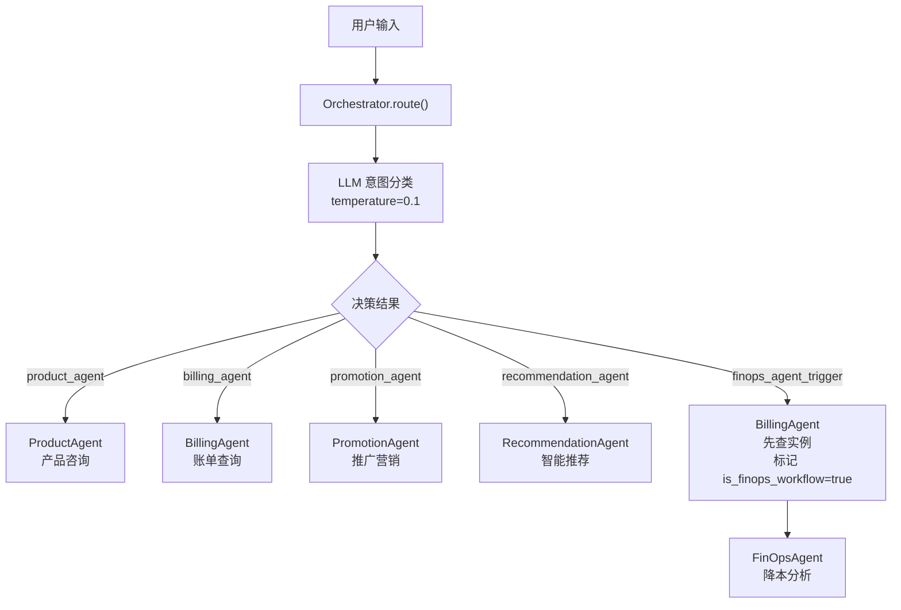
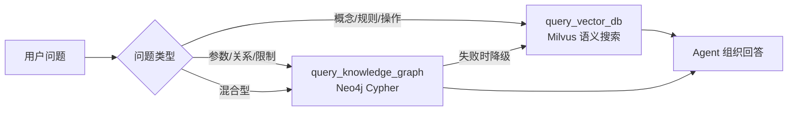
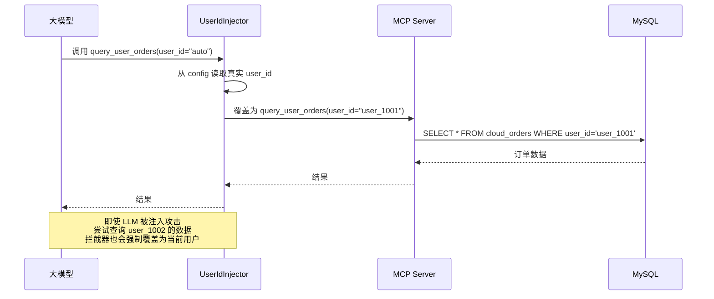
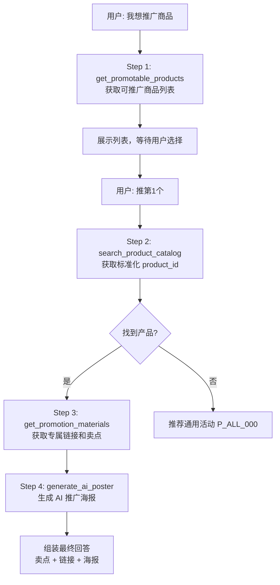
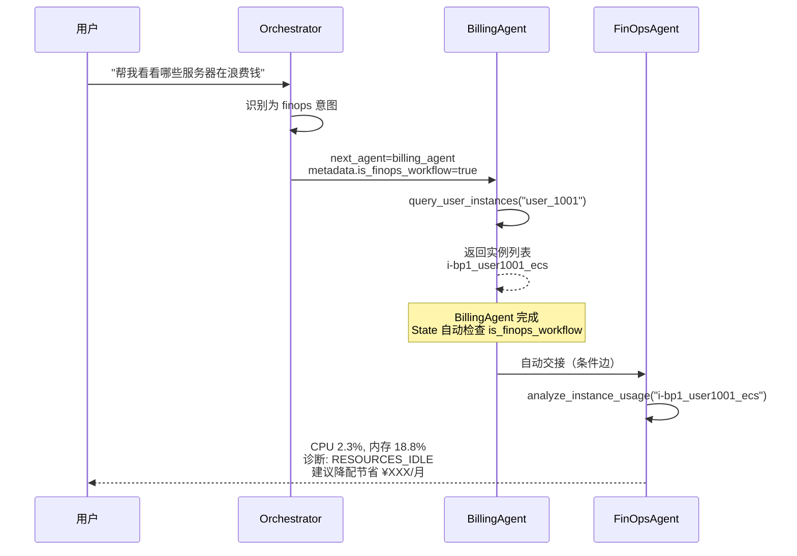
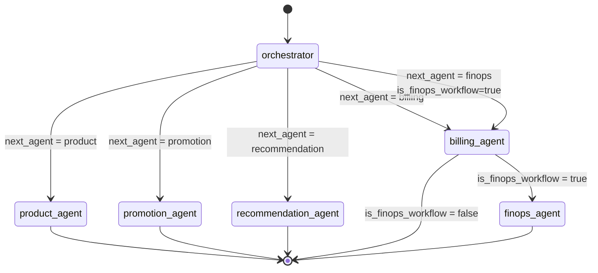

# 第二章：多智能体路由与编排

## 2.1 问题背景与设计动机

### 2.1.1 为什么需要多智能体编排？

在云平台客服场景中，不同类型的问题需要调用不同的工具集、遵循不同的安全策略。单一 Agent 无法高效处理所有场景：

| 场景 | 工具需求 | 安全要求 | 特殊逻辑 |
|------|----------|----------|----------|
| 产品咨询 | 向量检索 + 图谱查询 | 无敏感数据 | 需要组合双工具 |
| 账单查询 | MCP: query_user_orders | 强制 user_id 注入 | 防越权 |
| 推广营销 | MCP: 4 个营销工具 | user_id 注入 | 多步骤工作流 |
| 智能推荐 | 向量 + MCP 商品库 | user_id 注入 | 需生成购买链接 |
| 成本优化 | MCP: 实例 + 监控 | user_id 注入 | 跨 Agent 状态交接 |

**方案对比：**

| 方案 | 优点 | 缺点 | 适用场景 |
|------|------|------|----------|
| 单一 ReAct Agent | 简单，无需编排 | 工具过多时 LLM 选择困难 | 工具 < 5 个 |
| LangGraph 多 Agent | 专业分工，安全隔离 | 需要路由逻辑 | 本项目采用 |
| AutoGen 对话式 | 灵活的 Agent 间对话 | 调试困难，延迟高 | 研究场景 |

---

## 2.2 全局状态定义

### 2.2.1 AgentState 结构

所有 Agent 共享同一个状态对象，定义在 `agent/core/workflow/state.py:5-24`：

```python
class AgentState(TypedDict):
    """
    LangGraph 全局状态。
    负责在 Router、各个子 Agent 以及 Memory 之间传递信息。
    """
    # 消息记录，使用 operator.add 将新消息追加到列表末尾
    messages: Annotated[Sequence[BaseMessage], operator.add]
    
    # 决定下一步走向哪个节点的路由标记
    next_agent: str
    
    # 用户信息，用于鉴权和记忆隔离
    user_id: str
    session_id: str
    
    # 注入的记忆信息 (长短期记忆提取出的背景上下文)
    memory_context: str
    
    # 工具调用的附带信息或元数据
    metadata: dict[str, Any]
```

**关键设计：**
- `messages` 使用 `operator.add` 注解，LangGraph 会自动将新消息追加而非覆盖
- `metadata` 用于跨 Agent 传递特殊标记，如 `is_finops_workflow`

---

## 2.3 Orchestrator 路由节点

### 2.3.1 路由决策逻辑

Orchestrator 是系统的"大脑"，负责分析用户意图并路由到正确的 Agent。实现在 `agent/agents/orchestrator.py:14-97`：



### 2.3.2 核心实现

```python
# agent/agents/orchestrator.py:31-97
async def route(self, state: AgentState) -> Dict[str, Any]:
    """根据用户的最新输入，决定路由走向。"""
    # 获取最新的一条用户消息
    messages = state.get("messages", [])
    if not messages:
        last_message = ""
    else:
        last_msg_obj = messages[-1]
        if isinstance(last_msg_obj, tuple):
            last_message = last_msg_obj[1]
        elif hasattr(last_msg_obj, "content"):
            last_message = last_msg_obj.content
        else:
            last_message = str(last_msg_obj)
    
    memory_context = state.get("memory_context", "")

    system_prompt = f"""你是一个智能客服系统的总路由（Orchestrator）。
你的任务是根据用户的提问，决定将问题分发给哪个专业的 Agent 处理。

当前可用的子 Agent 有：
1. "product_agent" : 负责云产品介绍、资源规格说明、概念解释、操作指南等。
2. "billing_agent" : 负责查询用户个人的云资源实例状态、订单记录、账单明细等。
3. "promotion_agent" : 负责处理分享产品、推广返佣、获取海报等营销类需求。
4. "recommendation_agent" : 负责根据业务需求提供专业的云产品选型与推荐。
5. "finops_agent_trigger" : 当用户表达"账单太贵"、"需要降本增效"等意图时选择。

【背景记忆】：
{memory_context}

请仅输出你要路由到的名称，不要输出任何其他解释性文字。
"""

    response = await self.llm.ainvoke([
        SystemMessage(content=system_prompt),
        HumanMessage(content=last_message)
    ])
    
    decision = response.content.strip().lower()
    if "finops" in decision:
        next_node = "billing_agent"  # FinOps 第一步：交给 Billing 查实例
        state["metadata"]["is_finops_workflow"] = True
    elif "billing" in decision:
        next_node = "billing_agent"
        state["metadata"]["is_finops_workflow"] = False
    elif "promotion" in decision:
        next_node = "promotion_agent"
    elif "recommendation" in decision:
        next_node = "recommendation_agent"
    else:
        next_node = "product_agent"  # 默认路由
    
    return {"next_agent": next_node, "metadata": state.get("metadata", {})}
```

**关键点说明：**
1. **LLM 路由 vs 规则路由**：使用 `temperature=0.1` 的低随机性 LLM 做意图分类，比硬编码关键词匹配更灵活（能理解"帮我看看哪台机器在空转"→finops_agent_trigger）
2. **memory_context 注入**：将用户历史偏好注入路由 prompt，帮助 LLM 做更准确的判断
3. **FinOps 特殊处理**：finops_agent_trigger 并非直接路由到 FinOpsAgent，而是先路由到 BillingAgent 获取实例数据，通过 `metadata.is_finops_workflow` 标记触发后续交接

---

## 2.4 子 Agent 实现

### 2.4.1 ProductAgent — ReAct 自主决策

ProductAgent 使用 LangGraph 的 `create_react_agent` 预构建，让 LLM 自主决定调用哪个工具。实现在 `agent/agents/product_agent.py:18-86`：

```python
class ProductAgentNode:
    def __init__(self):
        self.llm = ChatOpenAI(
            api_key=os.getenv("DASHSCOPE_API_KEY"),
            model=os.getenv("MODEL", "qwen-plus"),
            temperature=0.1,
        )
        # 组合向量检索和图谱查询两个工具
        self.tools = [query_vector_db, query_knowledge_graph]

    async def __call__(self, state: AgentState) -> Dict[str, Any]:
        memory_context = state.get("memory_context", "")
        system_prompt = f"""你是一个专业的云服务平台【产品咨询Agent】。
你有两个强大的检索工具：
1. `query_vector_db` - 适用于概念解释、操作步骤、规则政策
2. `query_knowledge_graph` - 适用于架构关系、配置数值、限制条件

工作要求：
- 如果问题偏结构化参数，优先尝试 `query_knowledge_graph`
- 如果图谱查询超时或失败，自动降级为 `query_vector_db`
- 答案来源只能引用工具原始返回中明确出现的来源名

【系统提供的用户记忆/背景上下文】:
{memory_context if memory_context else "暂无背景上下文。"}
"""
        inner_agent = create_react_agent(
            model=self.llm,
            tools=self.tools,
            prompt=system_prompt
        )
        result = await inner_agent.ainvoke({"messages": state["messages"]})
        final_message = result["messages"][-1]
        return {"messages": [final_message]}
```

**工具选择策略：**



### 2.4.2 BillingAgent — MCP 工具 + 安全拦截

BillingAgent 是安全敏感度最高的 Agent，使用 MCP 工具查询用户个人数据。核心安全机制是 `UserIdInjector` 拦截器，实现在 `agent/agents/billing_agent.py:17-40`：

```python
class UserIdInjector(ToolCallInterceptor):
    """
    拦截器：在真正调用 MCP 工具前，强制将 user_id 注入到参数中。
    防止 LLM 被 Prompt Injection 攻击后查询其他用户的数据。
    """
    async def __call__(
        self,
        request: MCPToolCallRequest,
        handler: Callable[[MCPToolCallRequest], Awaitable[MCPToolCallResult]],
    ) -> MCPToolCallResult:
        # 从 LangGraph 的 runtime config 中获取系统级 user_id
        user_id = None
        if hasattr(request.runtime, 'config'):
            config = request.runtime.config
            user_id = config.get("configurable", {}).get("user_id")
            
        if user_id:
            new_args = dict(request.args)
            new_args["user_id"] = user_id  # 强制覆盖
            print(f"🔒 [安全拦截] 已强制注入 user_id={user_id} 到工具 {request.name}")
            new_request = request.override(args=new_args)
            return await handler(new_request)
            
        return await handler(request)
```

**安全机制流程：**



**BillingAgent 工具白名单：**
```python
# agent/agents/billing_agent.py:102-103
allowed_tool_names = {"query_user_orders", "query_user_instances"}
tools = [tool for tool in all_tools if tool.name in allowed_tool_names]
```

### 2.4.3 PromotionAgent — 多步骤营销工作流

PromotionAgent 通过精心设计的 prompt 引导 LLM 执行多步骤工作流，实现在 `agent/agents/promotion_agent.py:17-93`：



**工具集：**
```python
# agent/agents/promotion_agent.py:49
target_tools = [
    "get_promotable_products",    # 获取可推广商品列表
    "search_product_catalog",     # 模糊搜索商品
    "get_promotion_materials",    # 获取推广物料和链接
    "generate_ai_poster",         # AI 生成推广海报
]
```

### 2.4.4 RecommendationAgent — 向量 + MCP 混合

RecommendationAgent 结合向量检索（了解产品特性）和 MCP 工具（获取真实商品），实现在 `agent/agents/recommendation_agent.py:17-91`：

```python
# 组合向量工具与 MCP 工具
tools = [query_vector_db] + mcp_tools

# 工作流程：
# 1. get_promotable_products 获取真实商品列表
# 2. query_vector_db 检索产品技术特性
# 3. 精选 1-3 款推荐
# 4. get_promotion_materials 获取购买链接
```

### 2.4.5 FinOpsAgent — 成本优化专家

FinOpsAgent 负责分析实例监控数据，给出降本建议。实现在 `agent/agents/finops_agent.py:17-84`：

**资源诊断算法（定义在 `cloud_platform_server.py:369-374`）：**

```python
# 资源诊断逻辑
if cpu < 10 and memory < 30:
    diagnosis = "RESOURCES_IDLE"      # 资源闲置
elif cpu > 70 or memory > 80:
    diagnosis = "RESOURCES_TIGHT"     # 资源紧张
else:
    diagnosis = "RESOURCES_NORMAL"    # 资源正常
```

---

## 2.5 跨 Agent 状态交接 (State Handoff)

### 2.5.1 Billing → FinOps 协同

这是本系统最核心的跨 Agent 协同场景：用户说"帮我优化成本"，系统需要先查询用户的实例（BillingAgent），再分析监控数据（FinOpsAgent）。

实现在 `agent/core/workflow/graph_manager.py:35-43`：

```python
def _billing_post_condition(self, state: AgentState) -> str:
    """
    BillingAgent 节点执行完后的条件判断：
    如果是在执行 FinOps 工作流，就把接力棒交给 FinOps Agent；
    如果是普通账单查询，直接结束。
    """
    if state.get("metadata", {}).get("is_finops_workflow"):
        return "finops_agent"
    return END
```

**交接流程图：**



---

## 2.6 LangGraph 状态图组装

### 2.6.1 GraphManager 完整实现

图管理器负责将所有 Agent 组装成一个可执行的状态图，实现在 `agent/core/workflow/graph_manager.py:18-89`：

```python
class AgentGraphManager:
    """负责组装 LangGraph 多 Agent 编排。"""

    def __init__(self):
        self.orchestrator = OrchestratorAgent()
        self.product_node = ProductAgentNode()
        self.billing_node = BillingAgentNode()
        self.promotion_node = PromotionAgentNode()
        self.recommendation_node = RecommendationAgent()
        self.finops_node = FinOpsAgentNode()

    def _route_condition(self, state: AgentState) -> str:
        """根据 Orchestrator 的决策决定走向哪个 Agent。"""
        return state.get("next_agent", "product_agent")

    def build_graph(self) -> StateGraph:
        builder = StateGraph(AgentState)

        # 1. 添加节点
        builder.add_node("orchestrator", self.orchestrator.route)
        builder.add_node("product_agent", self.product_node)
        builder.add_node("billing_agent", self.billing_node)
        builder.add_node("promotion_agent", self.promotion_node)
        builder.add_node("recommendation_agent", self.recommendation_node)
        builder.add_node("finops_agent", self.finops_node)

        # 2. 定义边
        builder.add_edge(START, "orchestrator")

        # Orchestrator 之后的条件路由
        builder.add_conditional_edges(
            "orchestrator",
            self._route_condition,
            {
                "product_agent": "product_agent",
                "billing_agent": "billing_agent",
                "promotion_agent": "promotion_agent",
                "recommendation_agent": "recommendation_agent"
            }
        )

        # 3. 跨 Agent 协同边 (Billing → FinOps)
        builder.add_conditional_edges(
            "billing_agent",
            self._billing_post_condition,
            {
                "finops_agent": "finops_agent",
                END: END
            }
        )

        # 4. 各子 Agent 执行完毕后结束
        builder.add_edge("product_agent", END)
        builder.add_edge("promotion_agent", END)
        builder.add_edge("recommendation_agent", END)
        builder.add_edge("finops_agent", END)

        return builder.compile()
```

### 2.6.2 完整状态图



---

## 2.7 关键点说明

1. **路由 temperature=0.1**：路由决策需要高度确定性，设置极低的 temperature 避免随机路由。
2. **UserIdInjector 是安全核心**：即使 LLM 被 prompt injection 攻击，拦截器也会在工具调用前强制覆盖 user_id。
3. **FinOps 两阶段执行**：通过 `metadata.is_finops_workflow` 标记实现"先查实例、再分析监控"的跨 Agent 协同。
4. **工具白名单**：每个 Agent 只能访问其职责范围内的 MCP 工具，减少 LLM 选择错误的概率。
5. **create_react_agent**：ProductAgent 和 FinOpsAgent 使用 LangGraph 预构建的 ReAct 模式，LLM 自主决定工具调用顺序。

---

## 2.8 最佳实践

1. **路由 prompt 要简洁明确**：Orchestrator 的 system prompt 列出了所有可能的路由目标和路由细则，避免 LLM 产生歧义。
2. **拦截器优于后端校验**：UserIdInjector 在工具调用前拦截，比在 MCP Server 内部校验更安全（即使 MCP Server 有 bug，拦截器也能兜底）。
3. **条件边优于硬编码边**：BillingAgent 的后置条件边允许同一节点在不同上下文中走向不同的下游，提高了图的灵活性。
4. **每个 Agent 独立初始化 LLM**：避免共享 LLM 实例导致的并发问题。
5. **metadata 传递上下文**：使用 state 的 metadata 字段在 Agent 间传递标记，避免污染 messages 列表。
