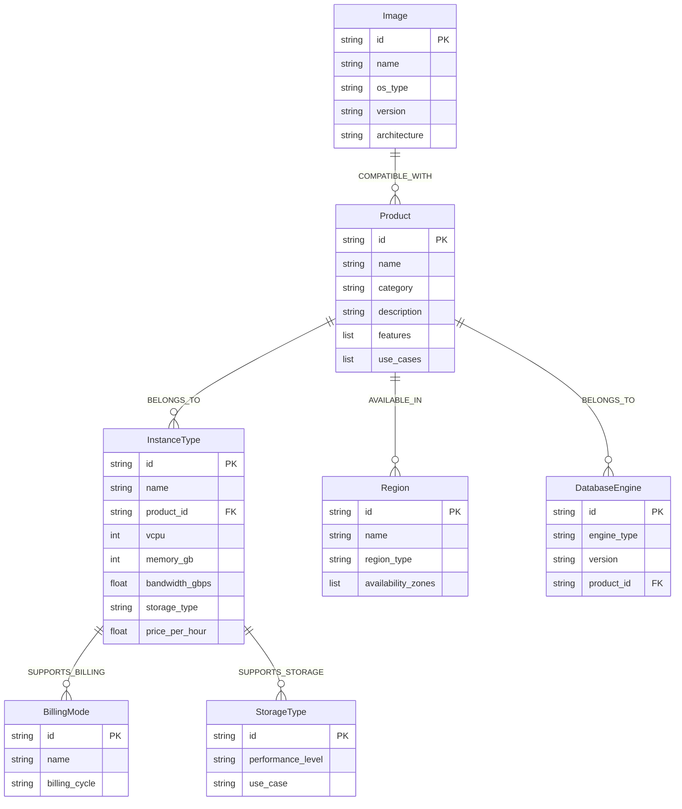
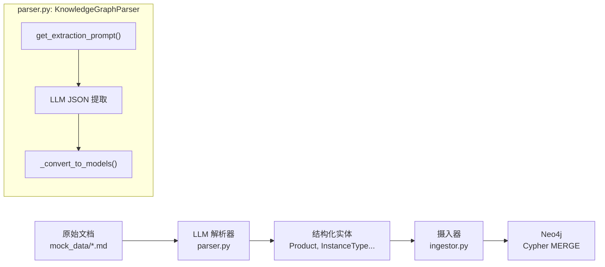
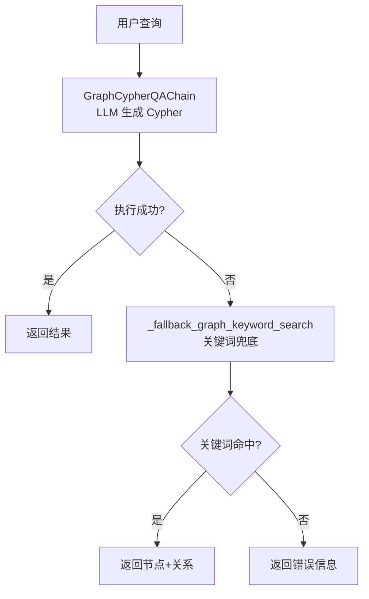
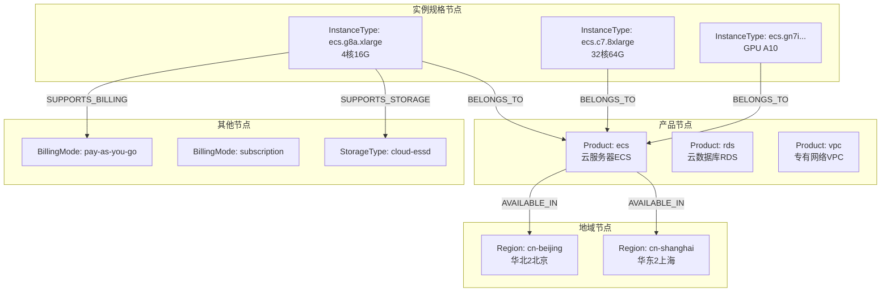

# 第三章：知识图谱与 RAG 系统

## 3.1 问题背景与设计动机

### 3.1.1 云产品知识的复杂性

云平台产品知识具有高度结构化和关联性特征，传统纯文本 RAG 难以胜任：

| 查询类型 | 示例 | 纯文本 RAG | 知识图谱 |
|----------|------|------------|----------|
| 概念解释 | "什么是 VPC？" | ✅ 擅长 | ⚠️ 一般 |
| 结构化参数 | "ecs.g8a.4xlarge 能挂几块网卡？" | ❌ 难以精确提取 | ✅ 属性查询 |
| 关系查询 | "华北2有哪些实例规格族？" | ❌ 需要多跳推理 | ✅ 图遍历 |
| 组合查询 | "支持 ESSD 的计算型实例有哪些？" | ❌ 交叉过滤困难 | ✅ 关系过滤 |

**方案对比：**

| 方案 | 优点 | 缺点 |
|------|------|------|
| 纯向量 RAG | 实现简单，语义匹配强 | 无法处理结构化关系 |
| 纯知识图谱 | 精确的关系查询 | 构建成本高，不擅长模糊语义 |
| **RAG + KG 混合** | 互补优势，覆盖全场景 | 架构复杂度增加 |

本项目采用 **RAG + KG 混合方案**，让 ProductAgent 自主决定使用哪个工具或组合使用。

---

## 3.2 知识图谱实体模型

### 3.2.1 数据模型定义

定义在 `agent/core/graph/models.py:1-90`，包含 7 种实体和 5 种关系：



### 3.2.2 实体模型代码

```python
# agent/core/graph/models.py:7-15
@dataclass
class Product:
    """云产品实体。"""
    id: str
    name: str
    category: str           # 计算/数据库/存储/网络
    description: str
    features: list[str] = field(default_factory=list)
    use_cases: list[str] = field(default_factory=list)

# agent/core/graph/models.py:18-29
@dataclass
class InstanceType:
    """实例规格实体。"""
    id: str                  # 如 ecs.g7.large
    name: str
    product_id: str          # 所属产品 ID
    vcpu: int
    memory_gb: int
    bandwidth_gbps: float
    storage_type: str        # ESSD/SSD/高效云盘
    price_per_hour: float

# agent/core/graph/models.py:78-90
@dataclass
class Relation:
    """实体间的关系。"""
    source_id: str
    target_id: str
    relation_type: Literal[
        "BELONGS_TO",          # 实例属于产品
        "AVAILABLE_IN",        # 产品可用地域
        "SUPPORTS_BILLING",    # 实例支持计费模式
        "COMPATIBLE_WITH",     # 镜像兼容产品
        "SUPPORTS_STORAGE",    # 规格支持存储类型
    ]
    properties: dict = field(default_factory=dict)
```

---

## 3.3 知识图谱构建流水线

### 3.3.1 整体流程



### 3.3.2 LLM 文档解析器

实现在 `agent/core/graph/parser.py:26-113`，使用 LLM 从非结构化文档中提取实体和关系：

```python
# agent/core/graph/parser.py:26-113
def get_extraction_prompt(document_content: str) -> str:
    """获取带有文档内容的提取提示词。"""
    return f"""你是一个专业的云产品知识抽取助手。请从以下产品文档中提取实体和关系，输出为JSON格式。

## 实体类型
1. **Product**（产品）- id, name, category, description, features, use_cases
2. **InstanceType**（实例规格）- id, name, product_id, vcpu, memory_gb, bandwidth_gbps, storage_type, price_per_hour
3. **Region**（地域）- id, name, region_type, availability_zones
4. **Image**（镜像）- id, name, os_type, version, architecture
5. **BillingMode**（计费模式）- id, name, description, billing_cycle
6. **DatabaseEngine**（数据库引擎）- id, name, engine_type, version, product_id
7. **StorageType**（存储类型）- id, name, performance_level, use_case

## 关系类型
- BELONGS_TO, AVAILABLE_IN, SUPPORTS_BILLING, COMPATIBLE_WITH, SUPPORTS_STORAGE

## 待解析文档
{document_content}

请只输出JSON，不要有任何其他文字说明。"""

class KnowledgeGraphParser:
    async def parse_text(self, text: str) -> dict[str, list[Any]]:
        """解析文档文本并提取实体。"""
        prompt = get_extraction_prompt(text)
        response = await self.llm.ainvoke(prompt)
        content = response.content
        
        # 从响应中提取 JSON
        if "```json" in content:
            json_str = content.split("```json")[1].split("```")[0].strip()
        else:
            json_str = content.strip()
        
        data = json.loads(json_str)
        return self._convert_to_models(data)
```

### 3.3.3 Neo4j 数据摄入器

实现在 `agent/core/graph/ingestor.py:21-437`，使用 Cypher MERGE 语句实现幂等摄入：

```python
# agent/core/graph/ingestor.py:49-90
async def ingest_products(self, products: list[Product]) -> int:
    """摄入产品实体。"""
    query = """
    UNWIND $products AS product
    MERGE (p:Product {id: product.id})          -- 幂等：存在则更新
    SET p.name = product.name,
        p.category = product.category,
        p.description = product.description,
        p.features = product.features,
        p.use_cases = product.use_cases,
        p.updated_at = datetime()
    RETURN count(p) AS count
    """
    params = {
        "products": [
            {
                "id": p.id, "name": p.name, "category": p.category,
                "description": p.description, "features": p.features,
                "use_cases": p.use_cases,
            }
            for p in products
        ]
    }
    result = await self.client.execute_query(query, params)
    return result[0]["count"] if result else 0

# agent/core/graph/ingestor.py:92-139
async def ingest_instance_types(self, instances: list[InstanceType]) -> int:
    """摄入实例规格实体，并建立与 Product 的关系。"""
    query = """
    UNWIND $instances AS inst
    MERGE (i:InstanceType {id: inst.id})
    SET i.name = inst.name,
        i.vcpu = inst.vcpu,
        i.memory_gb = inst.memory_gb,
        i.bandwidth_gbps = inst.bandwidth_gbps,
        i.storage_type = inst.storage_type,
        i.price_per_hour = inst.price_per_hour,
        i.updated_at = datetime()
    WITH i, inst
    MATCH (p:Product {id: inst.product_id})     -- 查找父产品
    MERGE (i)-[:BELONGS_TO]->(p)                -- 建立关系
    RETURN count(i) AS count
    """
```

**关系摄入（按类型分组批量处理）：**

```python
# agent/core/graph/ingestor.py:342-391
async def ingest_relations(self, relations: list[Relation]) -> int:
    """摄入实体间的关系。"""
    relations_by_type: dict[str, list[Relation]] = {}
    for rel in relations:
        relations_by_type.setdefault(rel.relation_type, []).append(rel)
    
    for rel_type, rels in relations_by_type.items():
        query = f"""
        UNWIND $relations AS rel
        MATCH (a {{id: rel.source_id}})
        MATCH (b {{id: rel.target_id}})
        MERGE (a)-[r:{rel_type}]->(b)
        SET r += rel.properties, r.updated_at = datetime()
        RETURN count(r) AS count
        """
        # ... 执行查询
```

### 3.3.4 Neo4j 异步客户端

实现在 `agent/core/graph/client.py:13-150`：

```python
# agent/core/graph/client.py:13-58
class Neo4jClient:
    """用于知识图谱操作的异步 Neo4j 客户端。"""
    
    def __init__(self, uri=None, user=None, password=None, database=None):
        settings = get_settings()
        self.uri = uri or settings.neo4j_uri
        self.user = user or settings.neo4j_user
        self.password = password or settings.neo4j_password
        self._driver: AsyncDriver | None = None
    
    async def connect(self) -> None:
        """建立到 Neo4j 的连接。"""
        self._driver = AsyncGraphDatabase.driver(
            self.uri, auth=(self.user, self.password)
        )
        await self._driver.verify_connectivity()

    async def execute_query(self, query, parameters=None) -> list[dict]:
        """执行 Cypher 查询。"""
        async with self._driver.session(database=self.database) as session:
            result = await session.run(query, parameters or {})
            return await result.data()

    async def create_constraints(self) -> None:
        """为实体 ID 创建唯一性约束。"""
        constraints = [
            ("Product", "id"), ("InstanceType", "id"),
            ("Region", "id"), ("Image", "id"),
            ("BillingMode", "id"), ("DatabaseEngine", "id"),
            ("StorageType", "id"),
        ]
        for label, prop in constraints:
            query = (
                f"CREATE CONSTRAINT {label.lower()}_{prop} "
                f"IF NOT EXISTS FOR (n:{label}) "
                f"REQUIRE n.{prop} IS UNIQUE"
            )
            await self.execute_query(query)
```

---

## 3.4 图谱查询工具 (GraphCypherQAChain)

### 3.4.1 双层查询策略

实现在 `agent/tools/graph_tool.py:1-165`，采用"LLM 生成 Cypher + 关键词兜底"双层策略：



### 3.4.2 GraphCypherQAChain 配置

```python
# agent/tools/graph_tool.py:18-72
def _get_graph_chain():
    """获取 GraphCypherQAChain 单例"""
    graph = Neo4jGraph(
        url=os.getenv("NEO4J_URI"),
        username=os.getenv("NEO4J_USER"),
        password=os.getenv("NEO4J_PASSWORD"),
    )
    graph.refresh_schema()  # 自动获取图谱 schema

    CYPHER_GENERATION_TEMPLATE = """Task:Generate Cypher statement to query a graph database.
Schema:
{schema}

Important Rules:
1. 节点标签: Region, Zone, InstanceTypeFamily, InstanceType, Storage, BillingRule 等。
2. 注意属性访问: RETURN 语句返回属性时，必须在 MATCH 中给节点赋予变量名！
   错误: MATCH (:InstanceType {{id: "g8a"}}) RETURN vcpu
   正确: MATCH (i:InstanceType {{id: "ecs.g8a.4xlarge"}}) RETURN i.vcpu
3. 注意实体层级: g8a 是 InstanceTypeFamily，ecs.g8a.xlarge 才是 InstanceType。

The question is:
{question}"""

    return GraphCypherQAChain.from_llm(
        llm=llm,
        graph=graph,
        cypher_prompt=PromptTemplate(template=CYPHER_GENERATION_TEMPLATE, ...),
        verbose=False,
        allow_dangerous_requests=True,  # 允许生成 Cypher
    )
```

### 3.4.3 关键词兜底搜索

当 LLM 生成的 Cypher 执行失败时，使用关键词模糊匹配作为兜底（`agent/tools/graph_tool.py:86-148`）：

```python
# agent/tools/graph_tool.py:74-148
def _extract_keywords(query: str) -> list[str]:
    """从查询中提取关键词（英文 token + 中文词组）。"""
    lower_query = query.lower()
    tokens = re.findall(r"[a-z0-9._-]+", lower_query)      # 英文/数字
    cn_tokens = re.findall(r"[\u4e00-\u9fff]{2,}", query)   # 中文词组
    keywords = []
    for token in tokens + cn_tokens:
        if len(token.strip()) >= 2:
            keywords.append(token.strip())
    return keywords[:8]

def _fallback_graph_keyword_search(query: str) -> str:
    """关键词兜底搜索：在节点 id/name/description 上做 CONTAINS 匹配。"""
    keywords = _extract_keywords(query)
    
    # 构建 WHERE 子句：每个关键词匹配 id/name/description
    where_clauses = []
    for k in keywords:
        where_clauses.append(
            f"toLower(coalesce(n.id, '')) CONTAINS '{k}' "
            f"OR toLower(coalesce(n.name, '')) CONTAINS '{k}' "
            f"OR toLower(coalesce(n.description, '')) CONTAINS '{k}'"
        )
    node_where = " OR ".join(where_clauses)
    
    node_cypher = f"""
    MATCH (n)
    WHERE {node_where}
    RETURN labels(n) AS labels, coalesce(n.id, n.name, '') AS node_key, 
           properties(n) AS props
    LIMIT 8
    """
    
    # 同样搜索关系
    rel_cypher = f"""
    MATCH (a)-[r]->(b)
    WHERE {" OR ".join(...)}
    RETURN labels(a), a.id, type(r), labels(b), b.id
    LIMIT 8
    """
    
    nodes = graph.query(node_cypher)
    relations = graph.query(rel_cypher)
    # 格式化输出...
```

### 3.4.4 工具入口

```python
# agent/tools/graph_tool.py:150-165
@tool
def query_knowledge_graph(query: str) -> str:
    """
    查询云产品知识图谱。
    当用户询问云产品的架构、包含关系、配置限制时使用。
    """
    try:
        chain = _get_graph_chain()
        result = chain.invoke({"query": query})
        return result.get('result', "未找到相关图谱信息。")
    except Exception as e:
        # 降级到关键词搜索
        fallback_result = _fallback_graph_keyword_search(query)
        if fallback_result and "失败" not in fallback_result:
            return fallback_result
        return f"查询图谱时发生错误: {str(e)}"
```

---

## 3.5 Milvus 向量 RAG

### 3.5.1 向量检索工具

实现在 `agent/tools/vector_tool.py:1-80`：

```python
# agent/tools/vector_tool.py:34-57
def _get_milvus_store():
    """获取 Milvus 向量存储单例。"""
    embeddings = DashScopeEmbeddings(
        dashscope_api_key=api_key,
        model="text-embedding-v2"    # 1536 维向量
    )
    return Milvus(
        embedding_function=embeddings,
        connection_args={"uri": f"http://{milvus_host}:{milvus_port}"},
        collection_name="cloud_product_docs",
        auto_id=True,
        drop_old=False
    )

# agent/tools/vector_tool.py:59-80
@tool
def query_vector_db(query: str) -> str:
    """
    通过语义搜索查询云产品的说明文档（RAG）。
    适用于概念解释、操作步骤、规则政策等模糊语义匹配。
    """
    store = _get_milvus_store()
    results = store.similarity_search_with_score(query, k=3)
    
    if not results:
        return "未在文档中检索到相关信息。"

    formatted_results = []
    for i, (doc, score) in enumerate(results):
        source = os.path.basename(doc.metadata.get('source', 'Unknown'))
        content = doc.page_content.strip()
        formatted_results.append(f"【来源: {source}】\n{content}")
        
    return "\n\n".join(formatted_results)
```

### 3.5.2 pymilvus 兼容性修复

项目遇到并解决了 pymilvus 2.6.x 与 langchain-milvus 0.3.x 的兼容性问题（`agent/tools/vector_tool.py:12-26`）：

```python
# agent/tools/vector_tool.py:12-26
# 修复 pymilvus 2.6.x 与 langchain-milvus 0.3.x 之间的兼容性问题
original_fetch = connections._fetch_handler
def patched_fetch(alias):
    try:
        return original_fetch(alias)
    except Exception:
        from pymilvus.client.connection_manager import ConnectionManager
        mgr = ConnectionManager.get_instance()
        for mc in mgr._registry.values():
            if f"cm-{id(mc.handler)}" == alias:
                return mc.handler
        for mc in mgr._dedicated.values():
            if f"cm-{id(mc.handler)}" == alias:
                return mc.handler
        raise
connections._fetch_handler = patched_fetch
```

---

## 3.6 知识图谱可视化

### 3.6.1 Neo4j 中的图谱结构



---

## 3.7 关键点说明

1. **MERGE vs CREATE**：使用 `MERGE` 而非 `CREATE` 实现幂等摄入，重复执行不会创建重复节点。
2. **约束先行**：`ingest_all()` 方法首先调用 `create_constraints()` 创建唯一性约束，保证数据完整性。
3. **实体-关系分离摄入**：先创建所有节点，再创建关系，避免 MATCH 找不到节点的问题。
4. **双层查询降级**：GraphCypherQAChain 失败时自动降级到关键词搜索，保证可用性。
5. **单例模式**：`_graph_chain_instance` 和 `_milvus_instance` 使用全局单例，避免重复连接。

---

## 3.8 最佳实践

1. **Prompt 中明确 Schema 规则**：Cypher 生成 prompt 中详细说明了节点标签层级和属性访问规则，减少 LLM 生成错误 Cypher 的概率。
2. **关键词提取策略**：同时提取英文 token 和中文词组，覆盖中英文混合的云产品查询场景。
3. **向量维度选择**：使用 `text-embedding-v2`（1536 维）在检索精度和计算成本间取得平衡。
4. **索引类型选择**：使用 `IVF_FLAT` 索引 + `COSINE` 距离度量，适合中小规模数据集的精确检索。
5. **错误隔离**：图谱查询和向量查询相互独立，一个失败不影响另一个。
