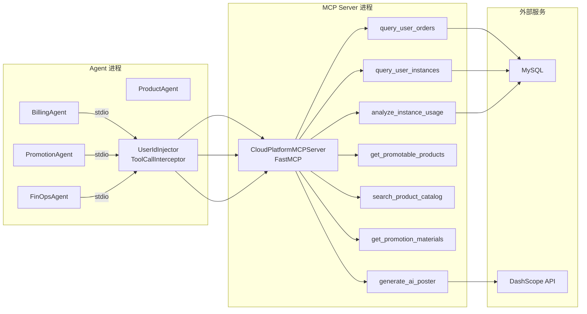
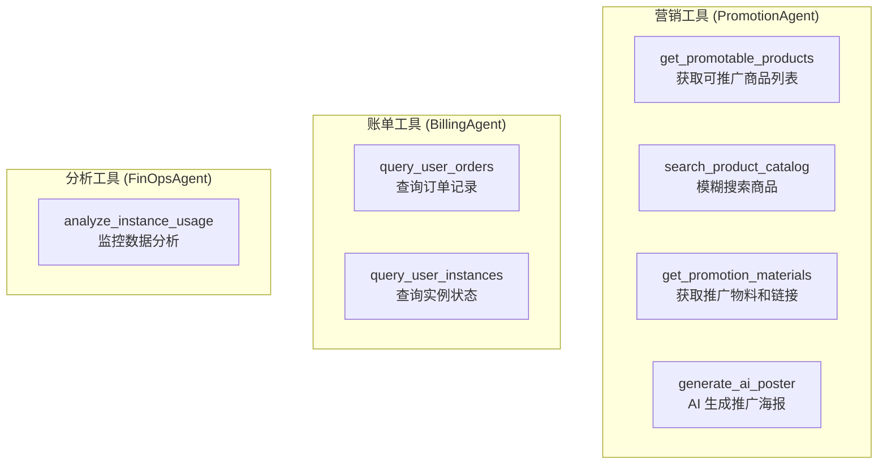
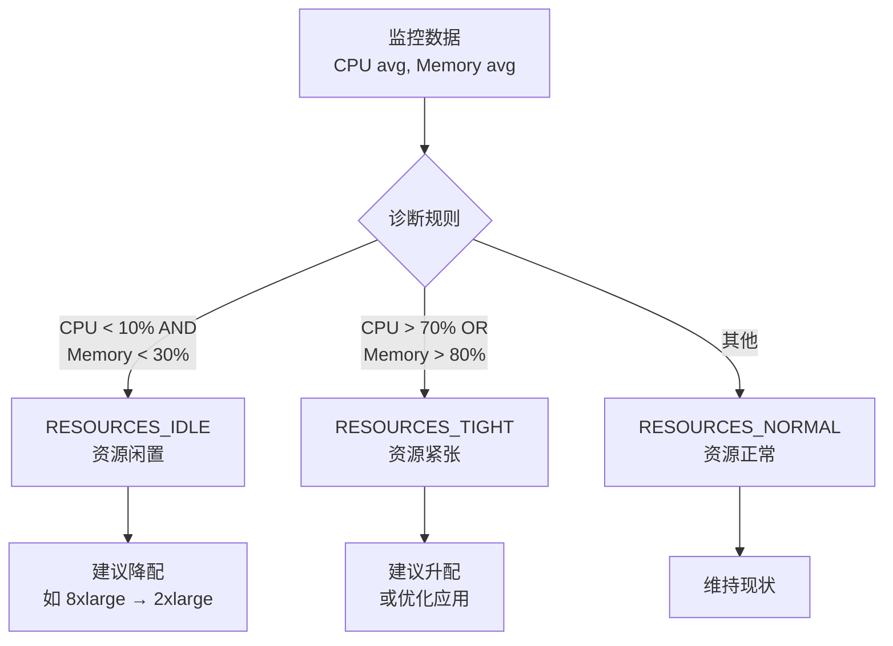

# 第四章：MCP 工具服务器

## 4.1 问题背景与设计动机

### 4.1.1 为什么需要 MCP？

在多智能体系统中，Agent 需要调用外部工具（查数据库、调用 API 等）来完成任务。传统的工具集成方式存在以下问题：

| 方案 | 优点 | 缺点 |
|------|------|------|
| 直接在 Agent 代码中写工具函数 | 简单直接 | 工具与 Agent 耦合，无法复用 |
| LangChain @tool 装饰器 | 标准化接口 | 仅限 Python，无法跨语言 |
| **MCP (Model Context Protocol)** | 标准协议，跨语言，可独立部署 | 需要额外的传输层配置 |

**MCP 核心优势：**
- **标准化协议**：Anthropic 提出的开放协议，工具定义与 Agent 实现解耦
- **独立部署**：MCP Server 可以独立运行，通过 stdio/SSE 与 Agent 通信
- **安全拦截**：支持 ToolCallInterceptor，在工具调用前注入安全逻辑
- **多 Agent 共享**：多个 Agent 可以共享同一个 MCP Server

---

## 4.2 MCP 协议概述

### 4.2.1 协议架构



### 4.2.2 传输方式对比

| 传输方式 | 优点 | 缺点 | 适用场景 |
|----------|------|------|----------|
| **stdio** | 简单，无网络开销 | 需要在同一台机器 | 本项目采用 |
| SSE (Server-Sent Events) | 支持远程部署 | 需要 HTTP 服务 | 分布式部署 |
| WebSocket | 双向通信 | 实现复杂 | 实时交互场景 |

---

## 4.3 FastMCP 框架

### 4.3.1 服务器初始化

实现在 `agent/mcp_servers/cloud_platform_server.py:1-22`：

```python
# agent/mcp_servers/cloud_platform_server.py:1-22
import os
import pymysql
from mcp.server.fastmcp import FastMCP
from dotenv import load_dotenv

dotenv_path = os.path.join(os.path.dirname(os.path.dirname(os.path.abspath(__file__))), '.env')
load_dotenv(dotenv_path)

# 初始化 FastMCP 服务器
# 这个 Server 可以独立运行，支持 SSE 或 stdio 协议
mcp = FastMCP("CloudPlatformMCPServer")

def get_db_connection():
    """获取远程 MySQL 连接。在生产环境中应使用连接池。"""
    return pymysql.connect(
        host=os.getenv("MYSQL_HOST"),
        port=int(os.getenv("MYSQL_PORT", 3306)),
        user=os.getenv("MYSQL_USER"),
        password=os.getenv("MYSQL_PASSWORD"),
        database=os.getenv("MYSQL_DATABASE", "cloud_platform"),
        cursorclass=pymysql.cursors.DictCursor  # 查询结果以字典形式返回
    )
```

### 4.3.2 MCP 配置文件

Agent 通过 `config/mcp_servers.json` 配置 MCP Server 连接：

```json
{
  "mcpServers": {
    "cloud_platform": {
      "command": "python",
      "args": ["mcp_servers/cloud_platform_server.py"],
      "transport": "stdio"
    }
  }
}
```

**Agent 加载配置：**
```python
# agent/agents/billing_agent.py:58-60
config_path = os.path.join(
    os.path.dirname(os.path.dirname(os.path.abspath(__file__))), 
    'config', 'mcp_servers.json'
)
with open(config_path, 'r', encoding='utf-8') as f:
    self.servers_config = json.load(f)
```

---

## 4.4 七大 MCP 工具详解

### 4.4.1 工具总览



### 4.4.2 get_promotable_products — 获取可推广商品

```python
# agent/mcp_servers/cloud_platform_server.py:43-69
# 模拟的云产品目录数据库
PRODUCT_CATALOG = {
    "P_ECS_G8A_XLARGE": {
        "name": "第八代企业级通用型实例 ecs.g8a.xlarge",
        "keywords": ["ecs", "云服务器", "通用型", "g8a", "4核16g", "amd"],
        "price": 299.0,
    },
    "P_ECS_C7_8XLARGE": {
        "name": "第七代企业级计算型实例 ecs.c7.8xlarge",
        "keywords": ["ecs", "云服务器", "计算型", "c7", "32核64g", "高并发"],
        "price": 1299.0,
    },
    "P_GPU_GN7I": {
        "name": "GPU 计算型实例 ecs.gn7i-c8g1.2xlarge",
        "keywords": ["gpu", "算力", "大模型", "a10", "深度学习"],
        "price": 3500.0,
    },
    "P_RDS_MYSQL_HA": {
        "name": "云数据库 RDS MySQL 高可用版",
        "keywords": ["rds", "mysql", "数据库", "高可用"],
        "price": 599.0,
    },
    "P_ESSD_PL1": {
        "name": "ESSD PL1 性能云盘",
        "keywords": ["云盘", "块存储", "essd", "pl1"],
        "price": 50.0,
    }
}

@mcp.tool()
def get_promotable_products() -> str:
    """获取系统当前所有支持推广、返佣的产品列表。"""
    promotable_list = []
    for pid, pinfo in PRODUCT_CATALOG.items():
        if pid != "P_ESSD_PL1":  # ESSD 不支持单独推广
            promotable_list.append({
                "product_id": pid,
                "product_name": pinfo["name"],
                "price": pinfo["price"]
            })
    return json.dumps({"status": "success", "data": promotable_list}, ensure_ascii=False)
```

### 4.4.3 search_product_catalog — 模糊搜索商品

```python
# agent/mcp_servers/cloud_platform_server.py:93-121
@mcp.tool()
def search_product_catalog(keyword: str) -> str:
    """
    根据用户的自然语言描述，模糊搜索并返回符合条件的产品信息及产品ID。
    """
    results = []
    kw_lower = keyword.lower()
    
    for pid, pinfo in PRODUCT_CATALOG.items():
        # 关键字匹配：产品名 + 关键词列表
        if kw_lower in pinfo["name"].lower() or any(kw_lower in k for k in pinfo["keywords"]):
            results.append({
                "product_id": pid,
                "product_name": pinfo["name"],
                "price": pinfo["price"]
            })
            
    if not results:
        return json.dumps({
            "status": "not_found", 
            "message": f"未找到精确匹配 '{keyword}' 的产品。",
            "recommendation": {"product_id": "P_ALL_000", "product_name": "全场通用云产品活动"}
        }, ensure_ascii=False)
        
    return json.dumps({"status": "success", "data": results}, ensure_ascii=False)
```

### 4.4.4 get_promotion_materials — 获取推广物料

```python
# agent/mcp_servers/cloud_platform_server.py:123-182
@mcp.tool()
def get_promotion_materials(product_id: str, user_id: str = "") -> str:
    """
    根据产品ID获取专属推广链接和返佣活动信息。
    user_id 由系统拦截器自动注入。
    """
    promotions = {
        "P_ECS_G8A_XLARGE": {
            "title": "ECS 第八代通用型 (g8a.xlarge) 开发者特惠",
            "desc": "基于 AMD EPYC 9004 处理器，4核16G。首年立享 8.5 折优惠！",
            "base_link": "https://promotion.cloud.com/ecs-g8a-special",
            "commission_rate": "15%"
        },
        # ... 其他产品
    }
    
    promo = promotions.get(product_id, promotions["P_ALL_000"])
    
    # 核心逻辑：使用注入的 user_id 生成专属裂变链接
    exclusive_link = f"{promo['base_link']}?inviter={user_id}&pid={product_id}"
    
    return json.dumps({
        "status": "success",
        "data": {
            "product_id": product_id,
            "activity_title": promo["title"],
            "selling_points": promo["desc"],
            "exclusive_link": exclusive_link,
            "commission_rate": promo["commission_rate"]
        }
    }, ensure_ascii=False)
```

### 4.4.5 generate_ai_poster — AI 生成海报

```python
# agent/mcp_servers/cloud_platform_server.py:184-252
@mcp.tool()
def generate_ai_poster(prompt: str) -> str:
    """
    调用千问文生图模型 qwen-image-2.0，根据提示词生成竖版推广海报。
    """
    api_key = os.getenv("DASHSCOPE_API_KEY")
    url = "https://dashscope.aliyuncs.com/api/v1/services/aigc/multimodal-generation/generation"
    
    payload = {
        "model": "qwen-image-2.0",
        "input": {
            "messages": [{"role": "user", "content": [{"text": prompt}]}]
        },
        "parameters": {
            "negative_prompt": "低分辨率，低画质，肢体畸形...",
            "prompt_extend": True,
            "watermark": False,
            "size": "1536*2688"   # 竖屏海报尺寸
        }
    }

    # 带重试的请求
    for attempt in range(1, 3):
        res = requests.post(url, json=payload, headers=headers, timeout=120)
        data = res.json()
        image_url = (
            data.get("output", {})
            .get("choices", [{}])[0]
            .get("message", {})
            .get("content", [{}])[0]
            .get("image")
        )
        if res.status_code == 200 and image_url:
            return json.dumps({
                "status": "success",
                "data": {"poster_url": image_url, "message": "海报生成成功"}
            }, ensure_ascii=False)
    
    return json.dumps({"status": "error", "message": f"生成失败: {last_error}"})
```

### 4.4.6 query_user_orders — 查询订单

```python
# agent/mcp_servers/cloud_platform_server.py:254-288
@mcp.tool()
def query_user_orders(user_id: str, limit: int = 5) -> str:
    """
    查询用户的云服务器订单和账单记录。
    user_id 由系统拦截器自动注入，LLM 传占位符即可。
    """
    try:
        connection = get_db_connection()
        with connection.cursor() as cursor:
            sql = """
                SELECT order_id, product_name, billing_mode, amount, status,
                       DATE_FORMAT(created_at, '%%Y-%%m-%%d %%H:%%i:%%s') as created_at
                FROM cloud_orders 
                WHERE user_id = %s 
                ORDER BY created_at DESC 
                LIMIT %s
            """
            cursor.execute(sql, (user_id, limit))
            results = cursor.fetchall()
            
            if not results:
                return json.dumps({"status": "success", "message": "该用户目前没有任何订单记录。"})
                
            for row in results:
                if 'amount' in row and row['amount'] is not None:
                    row['amount'] = float(row['amount'])
                    
            return json.dumps({"status": "success", "data": results}, ensure_ascii=False)
    finally:
        if 'connection' in locals() and connection.open:
            connection.close()
```

### 4.4.7 analyze_instance_usage — 监控数据分析

这是 FinOps 场景的核心工具，包含资源诊断算法：

```python
# agent/mcp_servers/cloud_platform_server.py:321-391
@mcp.tool()
def analyze_instance_usage(instance_id: str, user_id: str = "") -> str:
    """
    获取实例过去 7 天的平均 CPU/内存利用率和峰值带宽。
    用于架构诊断或成本优化 (FinOps) 场景。
    """
    try:
        connection = get_db_connection()
        with connection.cursor() as cursor:
            # 安全校验：确认实例属于当前用户
            auth_sql = """
                SELECT instance_id FROM cloud_instances
                WHERE instance_id = %s AND user_id = %s LIMIT 1
            """
            cursor.execute(auth_sql, (instance_id, user_id))
            if not cursor.fetchone():
                return json.dumps({
                    "status": "error", 
                    "message": "未找到该实例，或您无权查看该实例监控数据。"
                })

            # 查询近 7 天监控指标
            metrics_sql = """
                SELECT
                    ROUND(AVG(avg_cpu_usage_percent), 2) AS cpu_usage_percent,
                    ROUND(AVG(avg_memory_usage_percent), 2) AS memory_usage_percent,
                    ROUND(MAX(max_network_out_mbps), 2) AS network_out_bandwidth_mbps,
                    COUNT(*) AS days_count
                FROM instance_metrics_daily
                WHERE instance_id = %s AND user_id = %s
                  AND metric_date >= DATE_SUB(CURDATE(), INTERVAL 6 DAY)
            """
            cursor.execute(metrics_sql, (instance_id, user_id))
            agg = cursor.fetchone()

            cpu = float(agg["cpu_usage_percent"] or 0)
            memory = float(agg["memory_usage_percent"] or 0)
            bandwidth = float(agg["network_out_bandwidth_mbps"] or 0)

            # 资源诊断算法
            if cpu < 10 and memory < 30:
                diagnosis = "RESOURCES_IDLE"     # 资源闲置
            elif cpu > 70 or memory > 80:
                diagnosis = "RESOURCES_TIGHT"    # 资源紧张
            else:
                diagnosis = "RESOURCES_NORMAL"   # 资源正常

            return json.dumps({
                "status": "success",
                "data": {
                    "instance_id": instance_id,
                    "metrics_7d_avg": {
                        "cpu_usage_percent": cpu,
                        "memory_usage_percent": memory,
                        "network_out_bandwidth_mbps": bandwidth
                    },
                    "diagnosis": diagnosis
                }
            }, ensure_ascii=False)
    finally:
        if 'connection' in locals() and connection.open:
            connection.close()
```

**资源诊断算法图解：**



---

## 4.5 MCP 工具与 Agent 的集成

### 4.5.1 MultiServerMCPClient 使用

Agent 通过 `langchain_mcp_adapters` 的 `MultiServerMCPClient` 连接 MCP Server：

```python
# agent/agents/billing_agent.py:97-103
client = MultiServerMCPClient(
    connections=self.servers_config.get("mcpServers", {}),  # 从配置文件加载
    tool_interceptors=[UserIdInjector()]                     # 安全拦截器
)
all_tools = await client.get_tools()                         # 获取所有工具
allowed_tool_names = {"query_user_orders", "query_user_instances"}
tools = [tool for tool in all_tools if tool.name in allowed_tool_names]  # 白名单过滤
```

### 4.5.2 工具分配策略

| Agent | 可用工具 | 工具数量 |
|-------|----------|----------|
| ProductAgent | query_vector_db, query_knowledge_graph | 2 |
| BillingAgent | query_user_orders, query_user_instances | 2 |
| PromotionAgent | get_promotable_products, search_product_catalog, get_promotion_materials, generate_ai_poster | 4 |
| RecommendationAgent | query_vector_db, get_promotable_products, search_product_catalog, get_promotion_materials | 4 |
| FinOpsAgent | query_user_instances, analyze_instance_usage | 2 |

---

## 4.6 关键点说明

1. **UserIdInjector 是安全核心**：在 MCP 工具调用前强制注入 user_id，即使 LLM 被 prompt injection 攻击也无法越权。
2. **工具白名单**：每个 Agent 只能访问其职责范围内的工具，减少 LLM 选择错误的概率。
3. **双重校验**：`analyze_instance_usage` 在 MCP Server 内部再次校验 instance_id 是否属于当前用户。
4. **资源诊断算法**：基于 CPU 和内存的双维度阈值判断，CPU<10% AND 内存<30% 为闲置，CPU>70% OR 内存>80% 为紧张。
5. **Decimal 序列化**：MySQL 返回的 `DECIMAL` 类型需要转换为 `float` 才能 JSON 序列化。

---

## 4.7 最佳实践

1. **stdio 优于 SSE**：在同一台机器部署时，stdio 传输比 SSE 更简单、延迟更低。
2. **连接池**：生产环境应使用 `pymysql.pool` 连接池替代每次新建连接。
3. **错误隔离**：MCP 工具的错误不应暴露内部实现细节（如"数据库连接失败"），对用户只给业务友好表达。
4. **AI 生图重试**：`generate_ai_poster` 使用 2 次重试机制，因为文生图 API 偶尔超时。
5. **prompt_extend**：开启千问的 prompt 扩展功能，自动丰富生图提示词，提升海报质量。
