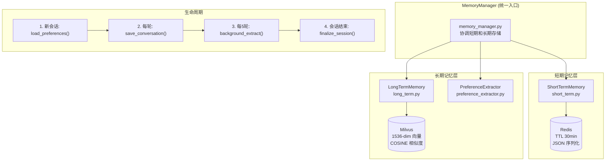
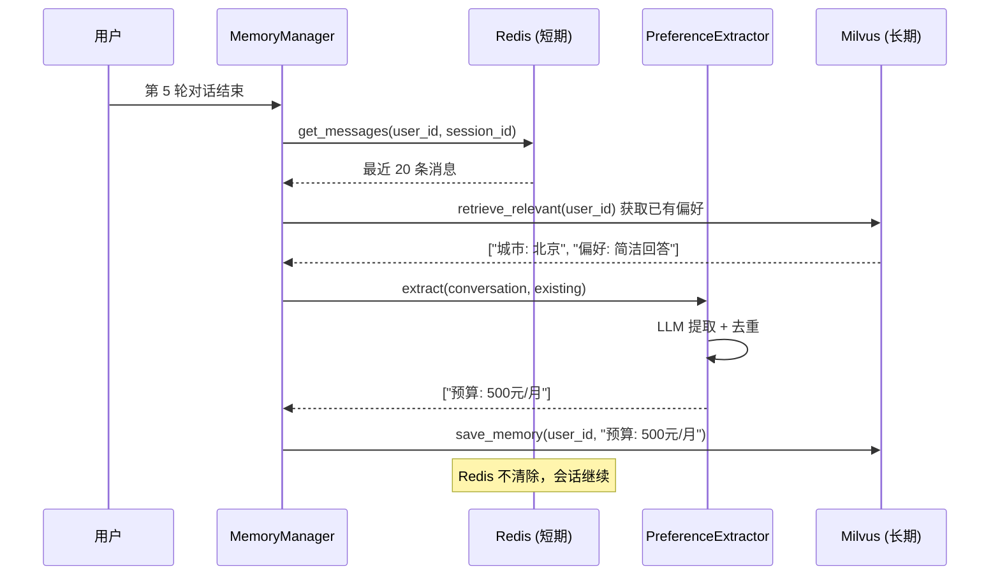
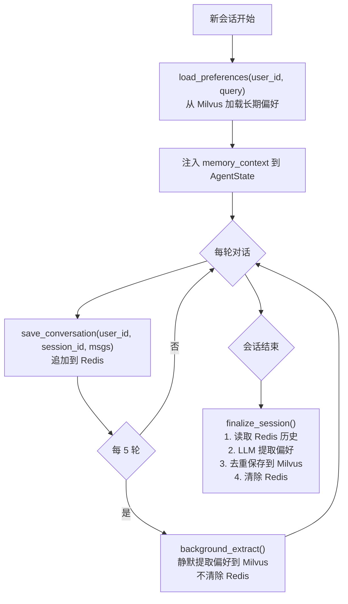
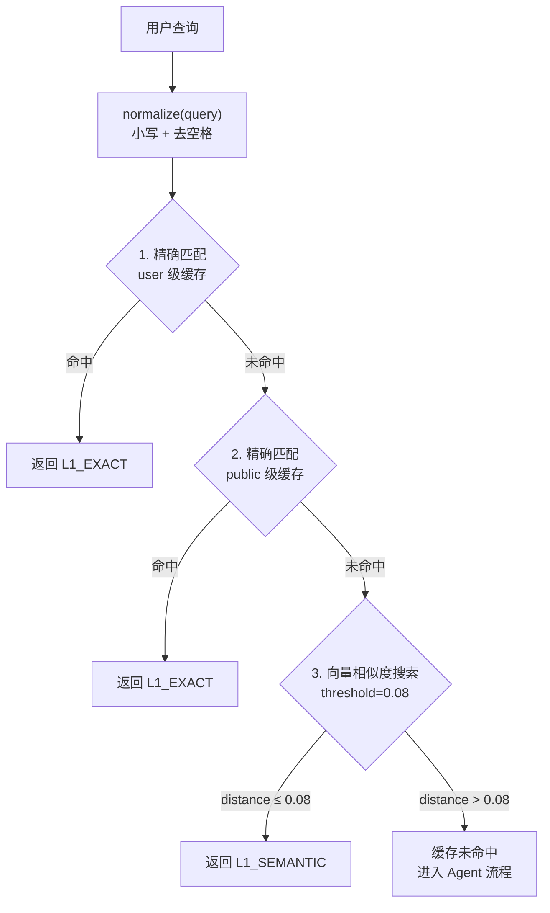

# 第五章：记忆与语义缓存

## 5.1 问题背景与设计动机

### 5.1.1 为什么需要记忆系统？

在云平台客服场景中，用户可能跨多轮对话表达偏好（"我喜欢简洁的回答"、"我在北京"、"预算 500 元/月"），这些信息对于个性化服务至关重要：

| 需求 | 无记忆 | 有记忆 |
|------|--------|--------|
| 用户说"帮我选个实例" | 需要重新询问业务类型 | 结合历史偏好直接推荐 |
| 用户说"查一下我的账单" | 每次都走完整 Agent 流程 | 高频问题命中缓存 |
| 用户跨会话回来 | 完全不认识用户 | 记住长期偏好 |

**方案对比：**

| 方案 | 优点 | 缺点 | 适用场景 |
|------|------|------|----------|
| 纯 Redis Session | 简单快速 | 无法语义检索 | 会话内短期记忆 |
| 纯向量记忆 | 语义检索强 | 延迟高 | 长期偏好 |
| **Redis + Milvus 双层** | 互补优势 | 架构复杂 | 本项目采用 |
| Mem0 框架 | 开箱即用 | 定制性差 | 快速集成 |

---

## 5.2 记忆系统架构

### 5.2.1 双层记忆架构



### 5.2.2 MemoryManager 统一入口

实现在 `agent/core/memory/memory_manager.py:34-347`：

```python
# agent/core/memory/memory_manager.py:34-78
class MemoryManager:
    """协调短期 Redis 内存和长期 Milvus 内存。"""

    def __init__(
        self,
        redis_url: str = "redis://localhost:6379",
        redis_ttl: int = 1800,           # 30 分钟
        milvus_host: str = "localhost",
        milvus_port: int = 19530,
        milvus_api_key: str | None = None,
        embedding_api_key: str | None = None,
    ) -> None:
        self.short_term = ShortTermMemory(redis_url=redis_url, ttl=redis_ttl)
        self.long_term = LongTermMemory(
            host=milvus_host, port=milvus_port,
            api_key=milvus_api_key, embedding_api_key=embedding_api_key,
        )

    async def initialize(self) -> None:
        """并发初始化两个存储后端。"""
        await asyncio.gather(
            self.short_term.initialize(),
            self.long_term.initialize(),
            return_exceptions=True,  # 一个失败不影响另一个
        )
```

---

## 5.3 短期记忆 (Redis)

### 5.3.1 实现细节

实现在 `agent/core/memory/short_term.py:18-158`：

```python
# agent/core/memory/short_term.py:14-15
COMPRESSION_THRESHOLD = 10  # 超过此数量时触发修剪
DEFAULT_TTL = 1800          # 30 分钟

class ShortTermMemory:
    """基于 Redis 的短期对话内存。"""
    
    def __init__(self, redis_url: str = "redis://localhost:6379", ttl: int = DEFAULT_TTL):
        self._redis_url = redis_url
        self._ttl = ttl
        self._client: Any = None
        self._available: bool = False

    async def initialize(self) -> None:
        """连接到 Redis；失败时设置 _available=False（不抛异常）。"""
        try:
            import redis.asyncio as aioredis
            self._client = aioredis.from_url(
                self._redis_url,
                decode_responses=True,
                socket_connect_timeout=2,
                socket_timeout=2,
                health_check_interval=30,
                retry_on_timeout=True,
            )
            await self._client.ping()
            self._available = True
        except Exception as exc:
            logger.warning("Redis unavailable – short-term memory disabled.")
            self._available = False

    async def save_messages(self, user_id: str, session_id: str, messages: list[dict]) -> None:
        """将消息持久化到 Redis，超过阈值时自动修剪。"""
        if not self._available:
            return
        try:
            if len(messages) > COMPRESSION_THRESHOLD:
                messages = self._trim(messages)
            await self._client.set(
                self._key(user_id, session_id),
                json.dumps(messages, ensure_ascii=False),
                ex=self._ttl,  # 自动过期
            )
        except Exception as exc:
            self._available = False

    async def get_messages(self, user_id: str, session_id: str) -> list[dict]:
        """获取存储的消息。Redis 不可用时返回空列表。"""
        if not self._available:
            return []
        try:
            data = await self._client.get(self._key(user_id, session_id))
            return json.loads(data) if data else []
        except Exception:
            self._available = False
            return []

    @staticmethod
    def _key(user_id: str, session_id: str) -> str:
        return f"memory:short:{user_id}:{session_id}"

    @staticmethod
    def _trim(messages: list[dict]) -> list[dict]:
        """保留系统消息 + 最近 6 条非系统消息。"""
        system_msgs = [m for m in messages if m.get("role") == "system"]
        other_msgs = [m for m in messages if m.get("role") != "system"]
        return system_msgs + other_msgs[-6:]
```

### 5.3.2 Redis 键结构

```
memory:short:{user_id}:{session_id}
│
├── 值: JSON 数组
│   [
│     {"role": "user", "content": "什么是VPC？"},
│     {"role": "assistant", "content": "VPC是..."},
│     {"role": "user", "content": "那安全组呢？"},
│     ...
│   ]
│
└── TTL: 1800 秒（30 分钟自动过期）
```

**压缩策略：** 当消息数超过 `COMPRESSION_THRESHOLD=10` 时，保留系统消息 + 最近 6 条非系统消息。

---

## 5.4 长期记忆 (Milvus)

### 5.4.1 向量存储实现

实现在 `agent/core/memory/long_term.py:16-211`：

```python
# agent/core/memory/long_term.py:12-13
COLLECTION_NAME = "long_term_memory"
EMBEDDING_DIM = 1536  # text-embedding-v2 维度

class LongTermMemory:
    """用于用户偏好和事实的基于 Milvus 的长期内存。"""
    
    async def initialize(self) -> None:
        """连接到 Milvus 并确保集合存在。"""
        from pymilvus import MilvusClient
        from langchain_community.embeddings import DashScopeEmbeddings

        self._client = MilvusClient(uri=f"http://{self._host}:{self._port}")
        self._embeddings = DashScopeEmbeddings(
            model="text-embedding-v2",
            dashscope_api_key=self._embedding_api_key,
        )
        self._ensure_collection()
        self._available = True

    async def save_memory(self, user_id: str, content: str, memory_type: str = "general"):
        """嵌入并存储记忆条目。"""
        if not self._available:
            return
        embedding = await self._embeddings.aembed_query(content)
        self._client.insert(
            collection_name=COLLECTION_NAME,
            data=[{
                "user_id": user_id,
                "content": content,
                "memory_type": memory_type,
                "embedding": embedding,
            }]
        )

    async def retrieve_relevant(self, user_id: str, query: str, top_k: int = 5) -> list[str]:
        """返回与查询最相关的 top-k 记忆条目。"""
        if not self._available:
            return []
        query_embedding = await self._embeddings.aembed_query(query)
        results = self._client.search(
            collection_name=COLLECTION_NAME,
            data=[query_embedding],
            filter=f'user_id == "{user_id}"',   # 按用户隔离
            limit=top_k,
            output_fields=["content", "memory_type"],
        )
        memories = []
        for hits in results:
            for hit in hits:
                memories.append(hit["entity"]["content"])
        return memories
```

### 5.4.2 Milvus Collection Schema

```python
# agent/core/memory/long_term.py:184-210
def _ensure_collection(self) -> None:
    """创建 Milvus 集合和索引（如果不存在）。"""
    from pymilvus import DataType

    if self._client.has_collection(COLLECTION_NAME):
        return

    schema = self._client.create_schema()
    schema.add_field("id", DataType.INT64, is_primary=True, auto_id=True)
    schema.add_field("user_id", DataType.VARCHAR, max_length=128)
    schema.add_field("content", DataType.VARCHAR, max_length=2048)
    schema.add_field("memory_type", DataType.VARCHAR, max_length=64)
    schema.add_field("embedding", DataType.FLOAT_VECTOR, dim=EMBEDDING_DIM)

    index_params = self._client.prepare_index_params()
    index_params.add_index(
        "embedding",
        index_type="IVF_FLAT",
        metric_type="COSINE",
        params={"nlist": 128},
    )

    self._client.create_collection(
        collection_name=COLLECTION_NAME,
        schema=schema,
        index_params=index_params,
    )
```

---

## 5.5 偏好提取器

### 5.5.1 LLM 偏好提取

实现在 `agent/core/memory/preference_extractor.py:39-120`：

```python
# agent/core/memory/preference_extractor.py:18-36
_PROMPT_TEMPLATE = """\
分析以下对话，提取用户的偏好、习惯和个人信息。
每条用单独一行，格式为"类别: 内容"。
只包含具体的、可操作的用户信息。
如果没有相关信息，就输出: 无
所有输出内容必须用中文。

提取示例：
  城市: 上海
  语言: 中文
  习惯: 每天早上查天气
  偏好: 回答简洁
  不喜欢: 长篇大论

对话内容：
{conversation}

提取结果（或"无"）："""

class PreferenceExtractor:
    def __init__(self, llm: Any, max_conversation_chars: int = 3000):
        self._llm = llm
        self._max_chars = max_conversation_chars

    async def extract(self, conversation_text: str, existing: list[str] | None = None) -> list[str]:
        """从对话文本中提取新偏好。"""
        truncated = conversation_text[:self._max_chars]
        prompt = _PROMPT_TEMPLATE.format(conversation=truncated)

        response = await self._llm.ainvoke([{"role": "user", "content": prompt}])
        raw = response.content.strip()

        if not raw or raw.strip() in ("NONE", "无", "无相关信息"):
            return []

        # 解析 "类别: 内容" 格式
        candidates = [line.strip() for line in raw.split("\n") if ":" in line]
        
        # 去重：跳过与已有偏好重叠的项
        if existing:
            existing_lower = [e.lower() for e in existing]
            new_items = []
            for item in candidates:
                item_lower = item.lower()
                if any(item_lower in ex or ex in item_lower for ex in existing_lower):
                    continue  # 跳过重复
                new_items.append(item)
            return new_items
        
        return candidates
```

### 5.5.2 偏好提取流程



---

## 5.6 记忆生命周期

### 5.6.1 完整生命周期



### 5.6.2 关键代码：会话结束处理

```python
# agent/core/memory/memory_manager.py:271-347
async def finalize_session(self, user_id: str, session_id: str, llm: Any) -> None:
    """会话结束：提取偏好然后清理。"""
    # 1. 从 Redis 加载最近对话
    messages = await self.short_term.get_messages(user_id, session_id)
    if len(messages) < 2:
        await self.short_term.clear(user_id, session_id)
        return

    # 2. 构建对话文本（限制最近 20 轮）
    recent = messages[-_MAX_HISTORY_TURNS:]
    conversation_text = "\n".join(f"{m['role']}: {m['content']}" for m in recent)

    # 3. LLM 提取偏好
    if self.long_term.available:
        extractor = PreferenceExtractor(llm=llm)
        existing = await self.load_preferences(user_id)
        new_items = await extractor.extract(
            conversation_text=conversation_text,
            existing=existing,
        )

        # 4. 保存新偏好到 Milvus
        for item in new_items:
            await self.long_term.save_memory(
                user_id=user_id, content=item, memory_type="preference",
            )

    # 5. 清除 Redis
    await self.short_term.clear(user_id, session_id)
```

---

## 5.7 L1 语义缓存

### 5.7.1 缓存架构

语义缓存是本系统的性能优化核心，实现在 `app/infra/cache.py:12-193`。它在 Milvus 中存储 QA 对，并通过向量相似度实现"语义命中"：



### 5.7.2 三级缓存查找

```python
# app/infra/cache.py:78-138
class SemanticCache:
    L1_SEMANTIC_DISTANCE_THRESHOLD = 0.08

    async def get_cache(self, query: str, user_id: str) -> dict[str, Any] | None:
        """三级缓存查找：精确用户 → 精确公共 → 向量相似度。"""
        normalized = self._normalize(query)
        safe_norm = normalized.replace('"', '\\"')
        safe_user = user_id.replace('"', '\\"')

        # 第 1 级：精确匹配 user 级缓存
        user_filter = (
            f'enabled == 1 and question_norm == "{safe_norm}" '
            f'and scope == "user" and user_id == "{safe_user}"'
        )
        user_exact = self._query_one(user_filter)
        if user_exact:
            return {
                "answer": user_exact["answer"],
                "matched_question": user_exact["question"],
                "level": "L1_EXACT",
                "distance": 0.0,
            }

        # 第 2 级：精确匹配 public 级缓存
        public_filter = (
            f'enabled == 1 and question_norm == "{safe_norm}" and scope == "public"'
        )
        public_exact = self._query_one(public_filter)
        if public_exact:
            return {
                "answer": public_exact["answer"],
                "matched_question": public_exact["question"],
                "level": "L1_EXACT",
                "distance": 0.0,
            }

        # 第 3 级：向量相似度搜索
        query_embedding = await self._embeddings.aembed_query(normalized)
        scoped_filter = (
            f'enabled == 1 and (scope == "public" or '
            f'(scope == "user" and user_id == "{safe_user}"))'
        )
        results = self._client.search(
            collection_name=COLLECTION_NAME,
            data=[query_embedding],
            filter=scoped_filter,
            limit=1,
            output_fields=["question", "answer", "scope", "user_id"],
        )
        
        if not results or not results[0]:
            return None
        
        hit = results[0][0]
        distance = float(hit.get("distance", 1.0))
        
        # 距离阈值过滤
        if distance > L1_SEMANTIC_DISTANCE_THRESHOLD:
            return None
        
        return {
            "answer": hit["entity"]["answer"],
            "matched_question": hit["entity"]["question"],
            "level": "L1_SEMANTIC",
            "distance": distance,
        }
```

### 5.7.3 缓存写入

```python
# app/infra/cache.py:40-76
async def set_cache(self, query: str, response: str, user_id: str | None = None, scope: str = "public"):
    """写入缓存：先删除同 key 旧数据，再插入新数据。"""
    normalized = self._normalize(query)
    owner = user_id or ""
    cache_scope = "user" if owner else scope
    
    embedding = await self._embeddings.aembed_query(normalized)
    
    # 删除旧缓存（upsert 语义）
    delete_filter = (
        f'question_norm == "{safe_norm}" and scope == "{safe_scope}" '
        f'and user_id == "{safe_owner}"'
    )
    self._client.delete(collection_name=COLLECTION_NAME, filter=delete_filter)
    
    # 插入新缓存
    self._client.insert(
        collection_name=COLLECTION_NAME,
        data=[{
            "question": query.strip(),
            "question_norm": normalized,
            "answer": response,
            "scope": cache_scope,
            "user_id": owner,
            "enabled": 1,
            "embedding": embedding,
        }]
    )
```

### 5.7.4 缓存预热

实现在 `app/preload_cache.py:1-47`：

```python
# app/preload_cache.py:13-30
PRESET_QA = [
    {
        "query": "云服务器ECS的退款规则是什么？",
        "response": "### ☁️ 云服务器 ECS 退款规则\n\n- **包年包月实例**：支持五天无理由退款..."
    },
    {
        "query": "退款要多久到账？",
        "response": "正常情况下，退款将在 **1-3 个工作日** 内原路退回..."
    },
    {
        "query": "VPC 专有网络怎么计费？",
        "response": "VPC 专有网络本身是**免费**的..."
    }
]

async def preload_cache():
    """预热 L1 语义缓存。"""
    await semantic_cache.initialize()
    for item in PRESET_QA:
        await semantic_cache.set_cache(item["query"], item["response"])
    print("✅ 缓存预热完成！")
```

---

## 5.8 语义缓存 Collection Schema

```python
# app/infra/cache.py:162-190
def _ensure_collection(self) -> None:
    schema = self._client.create_schema()
    schema.add_field("id", DataType.INT64, is_primary=True, auto_id=True)
    schema.add_field("question", DataType.VARCHAR, max_length=2048)
    schema.add_field("question_norm", DataType.VARCHAR, max_length=2048)
    schema.add_field("answer", DataType.VARCHAR, max_length=8192)
    schema.add_field("scope", DataType.VARCHAR, max_length=16)      # "user" or "public"
    schema.add_field("user_id", DataType.VARCHAR, max_length=128)
    schema.add_field("enabled", DataType.INT8)                       # 0 或 1
    schema.add_field("embedding", DataType.FLOAT_VECTOR, dim=1536)

    index_params = self._client.prepare_index_params()
    index_params.add_index(
        "embedding", index_type="IVF_FLAT", metric_type="COSINE",
        params={"nlist": 256},
    )
```

---

## 5.9 关键点说明

1. **优雅降级**：Redis 和 Milvus 任一不可用时，操作自动变为空操作，不影响核心流程。
2. **用户隔离**：长期记忆通过 `filter='user_id == "xxx"'` 实现每用户隔离。
3. **去重机制**：偏好提取器使用子串匹配去重，避免存储重复偏好。
4. **缓存阈值 0.08**：COSINE 距离阈值设为 0.08，平衡精确性和召回率。
5. **压缩策略**：Redis 消息超过 10 条时，保留系统消息 + 最近 6 条，控制内存使用。

---

## 5.10 最佳实践

1. **background_extract 优于 finalize_session**：每 5 轮静默提取偏好，比仅在会话结束时提取更及时。
2. **缓存预热**：高频问题（退款规则、计费说明）预先注入缓存，减少 LLM 调用。
3. **向量维度一致性**：长期记忆和语义缓存都使用 `text-embedding-v2`（1536 维），避免维度不匹配。
4. **TTL 设计**：短期记忆 30 分钟 TTL 平衡了会话连续性和内存使用。
5. **normalize 策略**：缓存查找前统一转小写、去多余空格，提高命中率。
