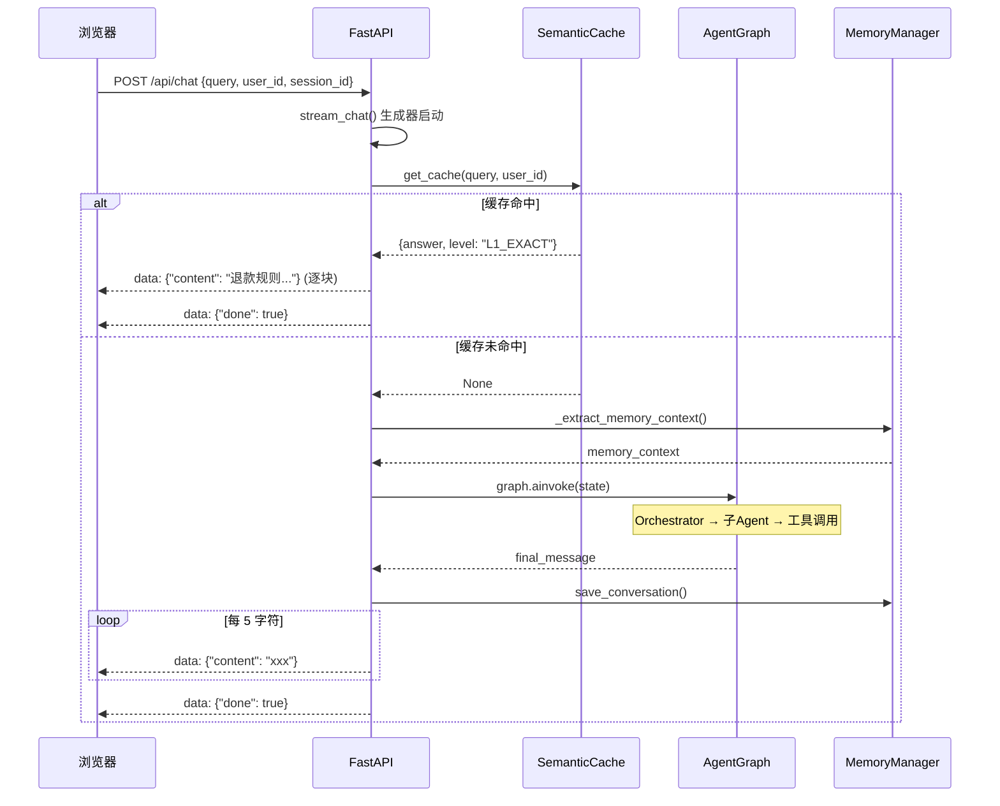
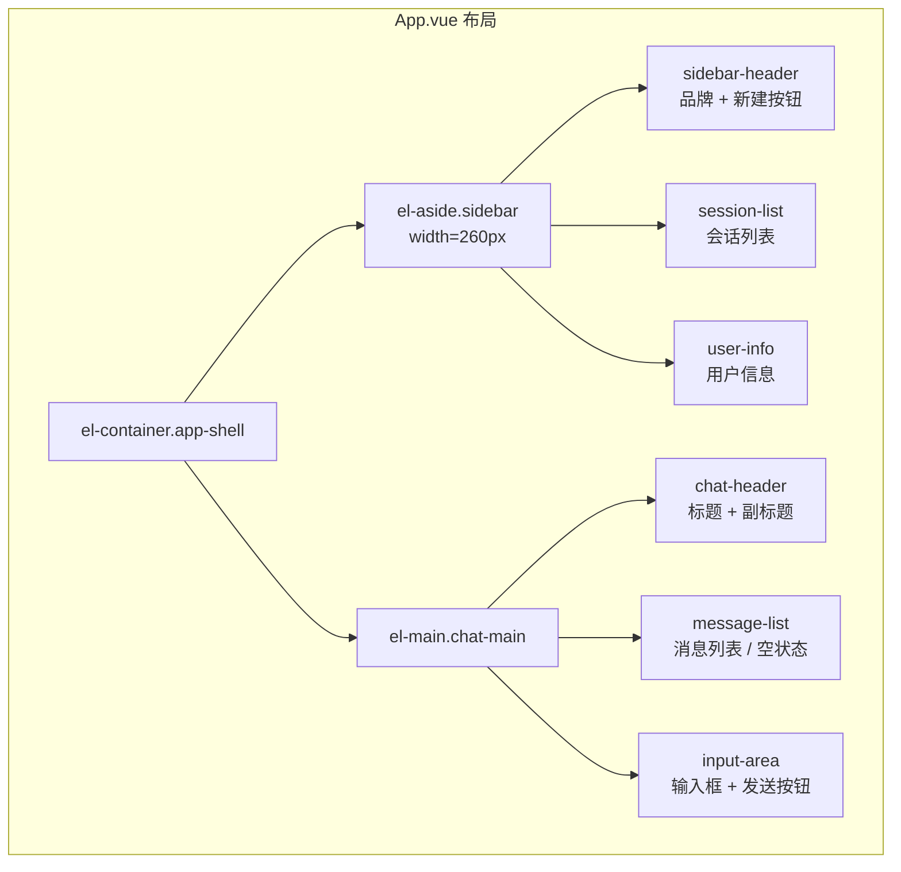

# 第六章：FastAPI 后端与前端

## 6.1 问题背景与设计动机

### 6.1.1 前后端分离架构

云平台智能客服系统采用前后端分离架构，后端提供 RESTful API + SSE 流式接口，前端通过 fetch API 接收流式响应并实时渲染：

| 组件 | 技术选型 | 职责 |
|------|----------|------|
| 后端 API | FastAPI + uvicorn | 缓存检查、Agent 编排、记忆管理 |
| 通信协议 | SSE (Server-Sent Events) | 流式推送 Agent 响应 |
| 前端框架 | Vue 3 + Element Plus | 响应式 UI、Markdown 渲染 |
| 构建工具 | Vite 8.x | 开发热更新、生产构建 |

**为什么选择 SSE 而非 WebSocket？**

| 方案 | 优点 | 缺点 | 适用场景 |
|------|------|------|----------|
| WebSocket | 双向通信 | 实现复杂，需心跳保活 | 聊天室、实时协作 |
| **SSE** | 简单、天然支持重连、HTTP/1.1 兼容 | 单向（服务端→客户端） | 本项目采用 |
| 长轮询 | 兼容性好 | 延迟高、资源浪费 | 兼容旧浏览器 |

---

## 6.2 FastAPI 后端

### 6.2.1 应用入口

实现在 `app/app_main.py:1-39`：

```python
# app/app_main.py:1-39
import sys
import os

# 将 agent 目录加入 sys.path
AGENT_DIR = os.path.join(os.path.dirname(os.path.dirname(os.path.abspath(__file__))), "agent")
sys.path.insert(0, AGENT_DIR)

from fastapi import FastAPI
from fastapi.middleware.cors import CORSMiddleware
from contextlib import asynccontextmanager

from router import chat
from service.chat_service import init_agent_system

@asynccontextmanager
async def lifespan(app: FastAPI):
    """应用生命周期管理：启动时初始化 Agent 系统。"""
    await init_agent_system()  # 初始化图编排 + 记忆 + 缓存
    yield
    # 关闭时清理（可选）

app = FastAPI(title="Multi-Agent Cloud Service API", lifespan=lifespan)

# 配置跨域（开发环境允许所有来源）
app.add_middleware(
    CORSMiddleware,
    allow_origins=["*"],
    allow_credentials=True,
    allow_methods=["*"],
    allow_headers=["*"],
)

# 注册路由
app.include_router(chat.router, prefix="/api")

if __name__ == "__main__":
    import uvicorn
    uvicorn.run("app_main:app", host="0.0.0.0", port=5000, reload=True)
```

**关键设计：**
- 使用 `lifespan` 上下文管理器在应用启动时初始化 Agent 系统（图编排、记忆、缓存）
- CORS 允许所有来源（生产环境应限制为具体域名）
- 监听 `0.0.0.0:5000`

### 6.2.2 SSE 路由

实现在 `app/router/chat.py:1-18`：

```python
# app/router/chat.py:1-18
from fastapi import APIRouter
from fastapi.responses import StreamingResponse
from schemas.chat import ChatRequest
from service.chat_service import stream_chat

router = APIRouter()

@router.post("/chat")
async def chat_endpoint(request: ChatRequest):
    """
    处理多智能体聊天请求，并使用 SSE 返回流式响应。
    如果命中 L1 语义缓存，将直接返回缓存结果。
    否则进入 Agent 图编排流程。
    """
    return StreamingResponse(
        stream_chat(request.query, request.user_id, request.session_id),
        media_type="text/event-stream"
    )
```

**请求模型：**
```python
# schemas/chat.py
from pydantic import BaseModel

class ChatRequest(BaseModel):
    query: str           # 用户问题
    user_id: str         # 用户 ID
    session_id: str      # 会话 ID
```

### 6.2.3 核心服务层

实现在 `app/service/chat_service.py:1-98`，整合缓存检查、Agent 执行、记忆保存：

```python
# app/service/chat_service.py:61-98
async def stream_chat(query: str, user_id: str, session_id: str):
    """流式聊天：缓存检查 → Agent 执行 → 记忆保存 → SSE 输出。"""
    
    # 1. L1 语义缓存检查
    cache_hit = await semantic_cache.get_cache(query, user_id)
    if cache_hit:
        response_text = cache_hit["answer"]
        print(f"⚡ 语义缓存命中: {cache_hit['level']} distance={cache_hit['distance']:.4f}")
    else:
        # 2. 进入 Agent 工作流
        print("🏃 进入 Agent 工作流推理...")
        mem_context = await _extract_memory_context(user_id, session_id, query)
        state = {
            "messages": [("user", query)],
            "user_id": user_id,
            "session_id": session_id,
            "memory_context": mem_context,
            "next_agent": "",
            "metadata": {}
        }
        config = {"configurable": {"user_id": user_id}}
        result = await graph.ainvoke(state, config=config)
        response_text = result["messages"][-1].content
    
    # 3. 保存短时记忆
    if memory and memory.short_term.available:
        turn = [
            {"role": "user", "content": query},
            {"role": "assistant", "content": response_text},
        ]
        await memory.save_conversation(user_id, session_id, turn)
        
    # 4. SSE 流式输出（模拟打字机效果）
    chunk_size = 5
    for i in range(0, len(response_text), chunk_size):
        chunk = response_text[i:i+chunk_size]
        yield f"data: {json.dumps({'content': chunk})}\n\n"
        await asyncio.sleep(0.02)  # 20ms 延迟模拟流式
        
    yield f"data: {json.dumps({'done': True})}\n\n"
```

### 6.2.4 请求处理流程图



---

## 6.3 Vue 3 前端

### 6.3.1 技术栈

| 依赖 | 版本 | 用途 |
|------|------|------|
| vue | 3.5.x | 响应式 UI 框架 |
| element-plus | 2.13.x | 企业级 UI 组件库 |
| @element-plus/icons-vue | 2.3.x | 图标库 |
| marked | 18.x | Markdown 解析渲染 |
| axios | 1.14.x | HTTP 客户端（备用） |
| vite | 8.x | 构建工具 |

### 6.3.2 页面布局

实现在 `front/cloud_agent/src/App.vue:1-552`：



### 6.3.3 四场景卡片

空状态时展示四个典型场景卡片（`App.vue:39-93`）：

```vue
<!-- App.vue:40-93 -->
<div class="scenario-container">
  <el-row :gutter="20">
    <el-col :span="12">
      <div class="scenario-card">
        <div class="card-header">
          <el-icon><Monitor /></el-icon>
          <span>产品咨询与推荐</span>
        </div>
        <div class="scenario-list">
          <div class="scenario-item" @click="sendQuery('云服务器ECS有哪些基本属性？')">
            云服务器ECS有哪些基本属性？
          </div>
          <div class="scenario-item" @click="sendQuery('我是Java接口服务+MySQL，8核16G够吗？')">
            Java服务+MySQL，推荐具体实例型号
          </div>
        </div>
      </div>
    </el-col>
    <el-col :span="12">
      <!-- 账单与实例查询 -->
    </el-col>
  </el-row>
  <el-row :gutter="20" style="margin-top: 20px;">
    <el-col :span="12">
      <!-- 资源优化与降本 -->
    </el-col>
    <el-col :span="12">
      <!-- 产品推广活动 -->
    </el-col>
  </el-row>
</div>
```

**四个场景卡片：**

| 场景 | 示例问题 | 对应 Agent |
|------|----------|------------|
| 产品咨询与推荐 | "云服务器ECS有哪些基本属性？" | ProductAgent |
| 账单与实例查询 | "帮我查一下我最近的订单记录" | BillingAgent |
| 资源优化与降本 | "获取近7天CPU/内存/带宽数据并做降本建议" | FinOpsAgent |
| 产品推广活动 | "我想推广云服务器ECS，有海报吗？" | PromotionAgent |

### 6.3.4 SSE 流式接收

前端使用 `fetch` + `ReadableStream` 接收 SSE 流（`App.vue:198-278`）：

```typescript
// App.vue:198-278
const sendQuery = async (query: string) => {
  if (!query.trim()) return
  
  const text = query.trim()
  inputQuery.value = ''
  
  // 添加用户消息
  messages.value.push({ role: 'user', content: text })
  scrollToBottom()
  
  isLoading.value = true
  
  // 预先创建空的助手消息，用于接收流式数据
  const assistantMessage: Message = { role: 'assistant', content: '' }
  messages.value.push(assistantMessage)
  const currentMsgIndex = messages.value.length - 1
  
  try {
    // 调用 FastAPI 后端接口
    const response = await fetch('http://127.0.0.1:5000/api/chat', {
      method: 'POST',
      headers: { 'Content-Type': 'application/json' },
      body: JSON.stringify({
        query: text,
        user_id: 'user_1001',
        session_id: currentSessionId.value
      })
    })
    
    if (!response.ok) throw new Error(`HTTP error! status: ${response.status}`)

    const reader = response.body?.getReader()
    const decoder = new TextDecoder('utf-8')
    isLoading.value = false  // 开始接收流，关闭 loading

    if (reader) {
      let buffer = ''
      while (true) {
        const { done, value } = await reader.read()
        if (done) break
        
        buffer += decoder.decode(value, { stream: true })
        const lines = buffer.split('\n')
        buffer = lines.pop() || ''  // 保留不完整的一行

        for (const line of lines) {
          if (line.startsWith('data: ')) {
            const dataStr = line.slice(6).trim()
            if (!dataStr || dataStr === '[DONE]') continue
            
            try {
              const data = JSON.parse(dataStr)
              if (data.content && messages.value[currentMsgIndex]) {
                messages.value[currentMsgIndex].content += data.content
                scrollToBottom()
              }
            } catch (e) {
              console.error('Error parsing SSE data:', e)
            }
          }
        }
      }
    }
  } catch (error) {
    console.error('API Error:', error)
    if (messages.value[currentMsgIndex]) {
      messages.value[currentMsgIndex].content = '❌ 请求失败，请检查后端服务是否启动。'
    }
  } finally {
    isLoading.value = false
    scrollToBottom()
  }
}
```

### 6.3.5 SSE 数据格式

```
data: {"content": "云服"}

data: {"content": "务器E"}

data: {"content": "CS是"}

data: {"content": "一种..."}

...

data: {"done": true}
```

### 6.3.6 Markdown 渲染

使用 `marked.js` 将 Agent 返回的 Markdown 实时渲染为 HTML：

```typescript
// App.vue:180-182
const renderMarkdown = (text: string) => {
  return marked(text)  // 将 Markdown 转为 HTML
}
```

```vue
<!-- App.vue:104 -->
<div class="message-bubble" v-html="renderMarkdown(msg.content)"></div>
```

**样式处理：**
```css
/* App.vue:533-537 */
.message-bubble :deep(p) { margin: 0 0 10px 0; }
.message-bubble :deep(p:last-child) { margin: 0; }
.message-bubble :deep(img) { max-width: 100%; border-radius: 8px; margin-top: 10px; }
.message-bubble :deep(pre) { background: #f4f4f5; padding: 10px; border-radius: 6px; overflow-x: auto; }
.message-bubble :deep(code) { font-family: monospace; }
```

---

## 6.4 前端样式设计

### 6.4.1 整体设计风格

```css
/* App.vue:282-297 */
.chat-container {
  height: 100vh;
  background: radial-gradient(circle at 10% 20%, #e6f0ff 0%, #eef5ff 35%, #f6f8fc 100%);
  padding: 16px;
}
.app-shell {
  border-radius: 20px;
  border: 1px solid #e7ebf3;
  box-shadow: 0 20px 50px rgba(15, 35, 95, 0.08);
  background: #fff;
}
```

### 6.4.2 消息气泡样式

```css
/* 用户消息：蓝色渐变背景 */
.message-row.user .message-bubble {
  background: linear-gradient(135deg, #3b82f6, #2563eb);
  color: #ffffff;
  border-top-right-radius: 0;  /* 右上角直角指向用户头像 */
}

/* AI 消息：白色背景 */
.message-row.assistant .message-bubble {
  background: #ffffff;
  border-top-left-radius: 0;   /* 左上角直角指向 AI 头像 */
}
```

---

## 6.5 关键点说明

1. **sys.path 管理**：`app_main.py` 在启动时将 `agent/` 目录加入 `sys.path`，确保能正确导入 Agent 模块。
2. **lifespan 生命周期**：使用 FastAPI 的 `lifespan` 上下文管理器在启动时初始化 Agent 系统，避免每次请求重复初始化。
3. **SSE 流式输出**：将完整的 Agent 响应按 5 字符分块，每块间隔 20ms，模拟打字机效果。
4. **buffer 处理**：前端使用 buffer 处理不完整的 SSE 数据行，避免 JSON 解析错误。
5. **v-html 渲染**：使用 `v-html` 渲染 marked.js 生成的 HTML，注意 XSS 防护（生产环境应使用 DOMPurify）。

---

## 6.6 最佳实践

1. **StreamingResponse 优于 WebSocket**：客服场景是单向推送，SSE 更简单且天然支持 HTTP/2 多路复用。
2. **缓存优先**：先检查语义缓存，命中则直接返回，避免不必要的 Agent 调用和 Token 消耗。
3. **自动滚动**：每次收到新内容时调用 `scrollToBottom()`，确保用户始终看到最新消息。
4. **错误处理**：fetch 失败时在消息气泡中显示友好的错误提示，而非崩溃。
5. **Shift+Enter 换行**：监听 `keydown.enter` 事件，Shift 按住时允许换行，否则发送消息。
