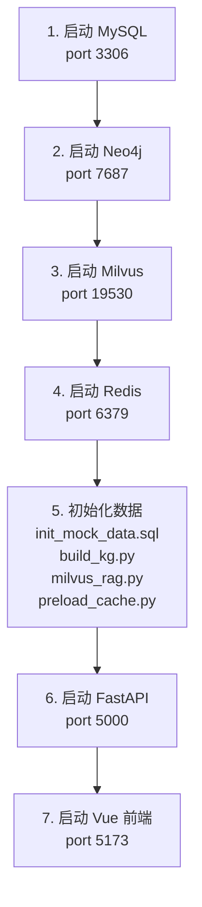
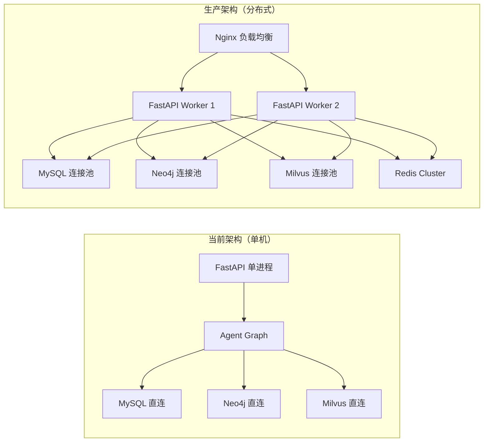

# 第七章：部署与运维

## 7.1 问题背景与设计动机

### 7.1.1 部署挑战

`cloud_agent` 系统依赖多个外部服务（MySQL、Neo4j、Milvus、Redis），部署过程需要协调多个组件的启动顺序和网络配置：

| 组件 | 默认端口 | 必需性 | 启动顺序 |
|------|----------|--------|----------|
| MySQL | 3306 | 必需（账单/实例数据） | 1 |
| Neo4j | 7687 (Bolt) / 7474 (HTTP) | 必需（知识图谱） | 2 |
| Milvus | 19530 | 必需（RAG + 记忆 + 缓存） | 3 |
| Redis | 6379 | 可选（短期记忆，自动降级） | 4 |
| Agent (FastAPI) | 5000 | 核心服务 | 5 |
| Vue 前端 | 5173 (Vite dev) | 开发环境 | 6 |

---

## 7.2 环境准备

### 7.2.1 系统要求

| 依赖 | 最低版本 | 推荐版本 | 说明 |
|------|----------|----------|------|
| Python | 3.11 | 3.12 | Agent + FastAPI |
| Node.js | 20.19 | 22.12+ | Vue 前端 |
| MySQL | 8.0 | 8.4 | 结构化数据 |
| Neo4j | 5.x | 5.20+ | 知识图谱 |
| Milvus | 2.6.x | 2.6.3 | 向量数据库 |
| Redis | 7.x | 7.4 | 短期缓存 |

### 7.2.2 Python 依赖

```bash
# Agent 核心依赖
pip install langgraph langchain langchain-openai langchain-mcp-adapters
pip install langchain-neo4j langchain-milvus langchain-community
pip install pymilvus neo4j pymysql redis
pip install python-dotenv

# FastAPI 后端依赖
pip install fastapi uvicorn pydantic
```

### 7.2.3 Node.js 依赖

```bash
cd front/cloud_agent
npm install
# 依赖包括: vue@3.5, element-plus@2.13, marked@18, vite@8
```

---

## 7.3 Mock 数据初始化

### 7.3.1 MySQL 初始化

执行 `agent/database/init_mock_data.sql` 创建表和测试数据：

```bash
# 连接 MySQL 并执行初始化脚本
mysql -h YOUR_HOST -u root -p < agent/database/init_mock_data.sql
```

**初始化内容：**
- `cloud_orders` 表：6 条订单（user_1001 高净值客户 3 条，user_1002 个人开发者 3 条）
- `cloud_instances` 表：3 个实例（含 Running/Stopped 状态）
- `instance_metrics_daily` 表：14 条监控数据（7 天 × 2 个实例）

```sql
-- agent/database/init_mock_data.sql:23-26
-- 用户 user_1001 的数据 (高净值客户)
INSERT INTO cloud_orders VALUES
('ORD-1001-001', 'user_1001', 'ecs.g8a.4xlarge', '包年包月', 12500.00, 'Paid', '2023-10-01 10:00:00'),
('ORD-1001-002', 'user_1001', 'rds.mysql.c1.large', '包年包月', 3600.00, 'Paid', '2023-10-05 14:30:00'),
('ORD-1001-003', 'user_1001', '共享带宽 100Mbps', '按量付费', 150.50, 'Paid', '2023-11-01 08:15:00');

-- 监控数据（user_1001 的实例 CPU 极低，用于 FinOps 降本演示）
INSERT INTO instance_metrics_daily VALUES
(1, 'i-bp1_user1001_ecs', 'user_1001', DATE_SUB(CURDATE(), INTERVAL 6 DAY), 2.10, 18.50, 1.20),
(2, 'i-bp1_user1001_ecs', 'user_1001', DATE_SUB(CURDATE(), INTERVAL 5 DAY), 2.50, 19.10, 1.60),
-- ... 共 7 天数据，CPU 平均 ~2.3%，内存 ~18.8%
```

### 7.3.2 Neo4j 知识图谱初始化

使用 `build_kg.py` 脚本构建知识图谱：

```bash
cd agent
python build_kg.py
```

**构建流程：**
1. 连接 Neo4j 数据库
2. 创建唯一性约束
3. 解析 `mock_data/` 目录下的文档
4. LLM 提取实体和关系
5. Cypher MERGE 摄入 Neo4j

### 7.3.3 Milvus RAG 数据初始化

使用 `milvus_rag.py` 脚本将文档向量化并存入 Milvus：

```bash
cd agent
python milvus_rag.py
```

**初始化内容：**
- 读取 `mock_data/*.md` 文档
- 使用 `text-embedding-v2` 生成 1536 维向量
- 存入 `cloud_product_docs` collection

### 7.3.4 语义缓存预热

```bash
cd app
python preload_cache.py
```

**预热内容（4 条高频 QA）：**
- "云服务器ECS的退款规则是什么？"
- "退款要多久到账？"
- "你们的云计算架构师课程有效期是多久？"
- "VPC 专有网络怎么计费？"

---

## 7.4 环境变量配置

### 7.4.1 .env 文件

```bash
# agent/.env

# ===== LLM 配置 =====
DASHSCOPE_API_KEY=sk-xxxxxxxxxxxxxxxxxxxxxxxx
MODEL=qwen-plus
BASE_URL=https://dashscope.aliyuncs.com/compatible-mode/v1

# ===== MySQL 配置 =====
MYSQL_HOST=localhost
MYSQL_PORT=3306
MYSQL_USER=root
MYSQL_PASSWORD=your_password
MYSQL_DATABASE=cloud_platform

# ===== Neo4j 配置 =====
NEO4J_URI=bolt://localhost:7687
NEO4J_USER=neo4j
NEO4J_PASSWORD=your_neo4j_password
NEO4J_DATABASE=neo4j

# ===== Milvus 配置 =====
MILVUS_HOST=localhost
MILVUS_PORT=19530
MILVUS_API_KEY=               # 可选，本地开发不需要

# ===== Redis 配置 =====
REDIS_URL=redis://localhost:6379
REDIS_TTL=1800                # 30 分钟

# ===== 日志配置 =====
LOG_LEVEL=INFO
```

---

## 7.5 启动流程

### 7.5.1 启动顺序



### 7.5.2 启动命令

```bash
# 终端 1：启动 FastAPI 后端
cd app
python app_main.py
# 或者
uvicorn app_main:app --host 0.0.0.0 --port 5000 --reload

# 终端 2：启动 Vue 前端
cd front/cloud_agent
npm run dev

# 终端 3（可选）：CLI 交互模式
cd agent
python main.py
python main.py --query "什么是VPC" --user user_1001
python main.py --debug  # 调试模式
```

### 7.5.3 健康检查

```bash
# 检查 FastAPI 是否启动
curl http://localhost:5000/docs
# 应返回 Swagger UI 页面

# 检查 Agent 系统
curl -X POST http://localhost:5000/api/chat \
  -H "Content-Type: application/json" \
  -d '{"query": "什么是VPC", "user_id": "user_1001", "session_id": "test"}'
# 应返回 SSE 流

# 检查各存储服务
mysql -h localhost -u root -p -e "SELECT COUNT(*) FROM cloud_platform.cloud_instances;"
# Neo4j Browser: http://localhost:7474
# Redis CLI: redis-cli ping
```

---

## 7.6 Docker Compose 部署

### 7.6.1 docker-compose.yml

```yaml
version: '3.8'

services:
  mysql:
    image: mysql:8.0
    container_name: cloud_agent_mysql
    environment:
      MYSQL_ROOT_PASSWORD: your_password
      MYSQL_DATABASE: cloud_platform
    ports:
      - "3306:3306"
    volumes:
      - mysql_data:/var/lib/mysql
      - ./agent/database/init_mock_data.sql:/docker-entrypoint-initdb.d/init.sql
    healthcheck:
      test: ["CMD", "mysqladmin", "ping", "-h", "localhost"]
      interval: 10s
      timeout: 5s
      retries: 5

  neo4j:
    image: neo4j:5.20
    container_name: cloud_agent_neo4j
    environment:
      NEO4J_AUTH: neo4j/your_neo4j_password
    ports:
      - "7474:7474"
      - "7687:7687"
    volumes:
      - neo4j_data:/data

  milvus:
    image: milvusdb/milvus:v2.6.3
    container_name: cloud_agent_milvus
    ports:
      - "19530:19530"
    volumes:
      - milvus_data:/var/lib/milvus
    command: ["milvus", "run", "standalone"]

  redis:
    image: redis:7-alpine
    container_name: cloud_agent_redis
    ports:
      - "6379:6379"
    volumes:
      - redis_data:/data

  agent-api:
    build:
      context: .
      dockerfile: Dockerfile
    container_name: cloud_agent_api
    ports:
      - "5000:5000"
    depends_on:
      mysql:
        condition: service_healthy
      neo4j:
        condition: service_started
      milvus:
        condition: service_started
      redis:
        condition: service_started
    env_file:
      - .env

volumes:
  mysql_data:
  neo4j_data:
  milvus_data:
  redis_data:
```

### 7.6.2 Dockerfile

```dockerfile
FROM python:3.12-slim

WORKDIR /app

# 安装系统依赖
RUN apt-get update && apt-get install -y --no-install-recommends \
    gcc g++ && rm -rf /var/lib/apt/lists/*

# 复制依赖文件
COPY requirements.txt .
RUN pip install --no-cache-dir -r requirements.txt

# 复制应用代码
COPY agent/ ./agent/
COPY app/ ./app/

# 暴露端口
EXPOSE 5000

# 启动命令
CMD ["uvicorn", "app.app_main:app", "--host", "0.0.0.0", "--port", "5000"]
```

---

## 7.7 生产环境注意事项

### 7.7.1 安全加固

| 配置项 | 开发环境 | 生产环境 |
|--------|----------|----------|
| CORS allow_origins | `["*"]` | `["https://your-domain.com"]` |
| MySQL 密码 | 简单密码 | 强密码 + 环境变量注入 |
| Neo4j 密码 | 默认密码 | 强密码 + 角色权限 |
| DashScope API Key | .env 文件 | 密钥管理服务（如 AWS Secrets Manager） |
| FastAPI debug | True | False |

### 7.7.2 性能优化



**优化建议：**

| 优化项 | 当前实现 | 生产建议 |
|--------|----------|----------|
| MySQL 连接 | 每次新建 | 使用 `pymysql.pool` 连接池 |
| FastAPI Worker | 单进程 | `uvicorn --workers 4` |
| Milvus 索引 | IVF_FLAT | HNSW（大数据量） |
| Redis | 单机 | Redis Sentinel/Cluster |
| 日志 | stdout | ELK/Loki 集中日志 |

### 7.7.3 监控指标

| 指标 | 说明 | 告警阈值 |
|------|------|----------|
| Agent 响应时间 | 从请求到首字节返回 | > 10s |
| 缓存命中率 | L1 语义缓存命中比例 | < 30% |
| LLM Token 消耗 | 每次请求的 Token 数 | > 4000 |
| Redis 连接数 | 活跃连接数 | > 100 |
| Milvus 查询延迟 | 向量搜索延迟 | > 500ms |

---

## 7.8 常见问题排查

### 7.8.1 问题排查表

| 问题 | 可能原因 | 解决方案 |
|------|----------|----------|
| `ModuleNotFoundError: No module named 'core'` | sys.path 未正确设置 | 检查 `main.py` 或 `app_main.py` 的 `sys.path.insert` |
| `pymilvus ConnectionRefusedError` | Milvus 未启动 | `docker ps` 检查 Milvus 容器 |
| `neo4j.exceptions.ServiceUnavailable` | Neo4j 未启动或端口错误 | 检查 `NEO4J_URI` 配置 |
| `redis.exceptions.ConnectionError` | Redis 不可用 | 系统会自动降级，不影响核心功能 |
| `SSE 流不返回数据` | CORS 未配置 | 检查 FastAPI CORS 中间件 |
| `LLM 返回乱码` | API Key 无效 | 检查 `DASHSCOPE_API_KEY` |
| `pymilvus 兼容性错误` | 版本不兼容 | `vector_tool.py` 已包含 patch 修复 |

### 7.8.2 日志查看

```bash
# FastAPI 日志（默认输出到 stdout）
uvicorn app_main:app --log-level debug

# Agent 日志（通过 logging 模块）
export LOG_LEVEL=DEBUG
python main.py --debug

# Milvus 日志
docker logs cloud_agent_milvus

# Neo4j 日志
docker logs cloud_agent_neo4j
```

---

## 7.9 关键点说明

1. **启动顺序很重要**：MySQL 和 Neo4j 必须先启动，Agent 初始化时会尝试连接所有存储服务。
2. **优雅降级**：Redis 和 Milvus 不可用时，系统自动降级（短期记忆和缓存功能失效，但核心 Agent 流程正常）。
3. **Mock 数据一致性**：`init_mock_data.sql` 使用 `TRUNCATE` 清空旧数据，确保可重复初始化。
4. **环境变量管理**：所有敏感配置通过 `.env` 文件管理，绝不硬编码到代码中。
5. **健康检查**：Docker Compose 使用 `healthcheck` 确保依赖服务就绪后再启动 Agent。

---

## 7.10 最佳实践

1. **Docker Compose 一键部署**：使用 `docker-compose up -d` 一键启动所有服务，简化部署流程。
2. **数据持久化**：使用 Docker Volume 持久化数据库数据，容器重建不丢数据。
3. **连接池**：生产环境必须使用连接池（MySQL、Redis、Neo4j），避免频繁创建/销毁连接。
4. **日志集中化**：使用 ELK 或 Loki 收集所有服务的日志，便于问题排查。
5. **灰度发布**：Agent 逻辑变更时，先在 `user_1002`（低价值用户）上验证，再全量发布。
